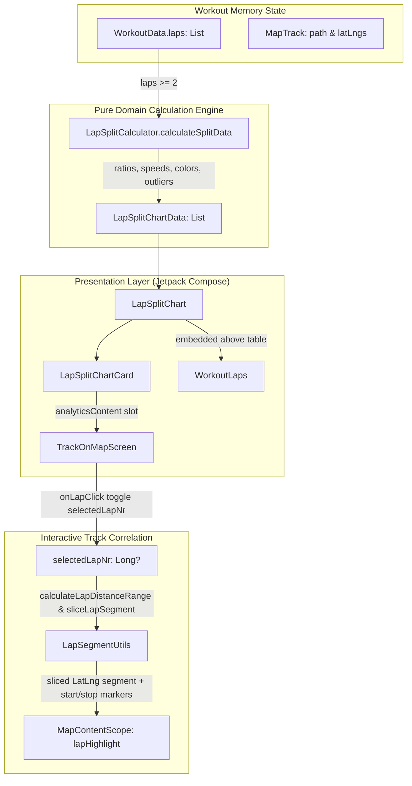

# Stage 3: Implementation Plan - ATT-1392: Aftermath: Compact Lap & Interval Split Chart

**Ticket**: [ATT-1392](https://atrainingtracker.atlassian.net/browse/ATT-1392)  
**Sub-task**: [ATT-1723](https://atrainingtracker.atlassian.net/browse/ATT-1723) (`[Plan]`)  
**Parent Epic**: [ATT-111](https://atrainingtracker.atlassian.net/browse/ATT-111) (*Aftermath: Compact Post-Workout Visual Analytics & Graphs*)  
**Target Release**: `V4.9.38`  
**Active Sprint**: `2026-40.5`  
**Requirement Mapping**: `REQ-UI-204` (*Aftermath Compact Lap & Interval Split Chart Architecture*)  
**Test Mapping**: `TST-UI-158`  
**Branch**: `feature/ATT-1392`  
**Author**: AI Agent 1 (Implementer)  
**Date**: 2026-09-30  

---

## 1. Problem Description & Background

In post-workout aftermath inspection (`TrackOnMapScreen.kt` / `MapDetailLayout.kt`), athletes currently view lap and interval data strictly as numeric table entries inside `WorkoutLaps.kt`. There is no visual split comparison chart showing pacing trends across laps, no visual indication of fastest and slowest intervals, and no spatial correlation connecting a specific lap to its physical course segment on the map.

Building upon the Visual Analytics pillar of Epic ATT-111, this feature delivers:
1. **Domain Models (`LapSplitModels.kt`)**: Structured, immutable representations of lap splits (`LapSplitItem`) and collection metadata (`LapSplitChartData`).
2. **Pure Mathematical Engine (`LapSplitCalculator.kt`)**: Deterministic, testable computation of relative bar ratios ($[0.25f, 1.0f]$), fastest/slowest outlier detection, 5-tier intensity color mapping (`TTColor.Zone1`..`Zone5`), and sport-aware pace vs speed formatting.
3. **Responsive Visual Components (`LapSplitChart.kt`, `LapSplitChartCard.kt`)**: Modern Jetpack Compose cards with horizontal proportional split bars, lap index badges, pace/speed labels, and animal performance indicators (🐇 fastest, 🦔 slowest).
4. **Interactive Map Track Correlation (`TrackOnMapScreen.kt`, `MapContentScope.kt`)**: Tapping a lap split bar in the chart highlights the corresponding physical course segment on the map using `LapSegmentUtils.calculateLapDistanceRange` and `LapSegmentUtils.sliceLapSegment`, rendering a prominent primary polyline with start/stop markers.
5. **Workout Summary Integration (`WorkoutLaps.kt`)**: Embedding `LapSplitChart` directly above the tabular rows when a session contains $\ge 2$ laps.
6. **100% 9-Language Localization Parity**: Exact localized headers across English, German, Spanish, French, Italian, Japanese, Dutch, Polish, and Portuguese (`aftermath_laps_splits_title`).

---

## 2. Traceability & Requirements Mapping

* **Primary Requirement**: `REQ-UI-204` (*Aftermath Compact Lap & Interval Split Chart Architecture*)
* **Test Mapping**: `TST-UI-158` (*Aftermath Compact Lap & Interval Split Chart Verification*)
* **Supporting Requirements**:
  - `REQ-UI-203`: Aftermath Cycling Power 5-Zone Distribution Bar Architecture.
  - `REQ-UI-202`: Aftermath Heart Rate 5-Zone Distribution Bar Architecture.
  - `REQ-UI-201`: Aftermath Synchronized Multi-Metric Scrubbing on Elevation Profile.
  - `REQ-UI-106`: 9-Language Localization Parity.
  - `REQ-PRO-001`: ASPICE Stage-Gated Life Cycle Governance.
  - `REQ-PRO-016`: Inviolable ASPICE Human Decision Gates.

---

## 3. System Invariants & Preserved Behavior

1. **Zero Degradation of Existing Screens**:
   - `analyticsContent` in `MapDetailLayout` / `TrackOnMapScreen` cleanly accommodates HR, Power, and Lap Split cards.
   - For sessions with $< 2$ laps, `LapSplitCalculator.calculateSplitData` returns `null` and consumes zero vertical space.
2. **Preservation of Lap Table & Bottom Sheet**:
   - Existing table rows, column layouts, and `LapEditBottomSheet` contracts in `WorkoutLaps.kt` remain 100% intact.
3. **Zero Additional SQLite Disk IO & Main Thread Safety**:
   - Lap data (`workoutData.laps`) is already pre-loaded into memory during workout loading. Track coordinate slicing utilizes in-memory polyline point and distance arrays without querying disk databases.
4. **Interactive Map DSL Extension**:
   - `MapContentScope` is extended with a non-breaking `lapHighlight(path: List<LatLng>, color: Color? = null)` DSL method, cleanly separating map drawing concerns from UI state.
5. **Color & Branding Consistency**:
   - Split bar intensity tiers map to established tokens `TTColor.Zone1` through `TTColor.Zone5`.
6. **Human Decision Gate**:
   - Subtask ATT-1723 transitions to `Erledigt` upon passing Gate audit via `freigabe`. Parent ATT-1392 transitions strictly to `Final Review (Human)`.

---

## 4. Proposed Architectural Changes



---

## 5. Step-by-Step Implementation Sequence

### Step 1: Domain Models (`LapSplitModels.kt`)
* **Path**: `app/src/main/java/com/atrainingtracker/trainingtracker/ui/aftermath/splits/LapSplitModels.kt`
* **Changes**:
  - Define `LapSplitItem(lapNr: Long, displayName: String, durationSec: Int, distanceMeters: Double, speedMps: Double, formattedPaceOrSpeed: String, relativeRatio: Float, isFastest: Boolean, isSlowest: Boolean, color: Color)`.
  - Define `LapSplitChartData(splits: List<LapSplitItem>, bSportType: BSportType, fastestLapNr: Long?, slowestLapNr: Long?)`.

### Step 2: Pure Calculation Engine (`LapSplitCalculator.kt`)
* **Path**: `app/src/main/java/com/atrainingtracker/trainingtracker/ui/aftermath/splits/LapSplitCalculator.kt`
* **Changes**:
  - Implement `calculateSplitData(laps: List<LapData>, bSportType: BSportType, paceFormatter: (Double) -> String, speedFormatter: (Double) -> String): LapSplitChartData?`.
  - Enforce $< 2$ laps $\implies$ returns `null`.
  - Filter valid speeds ($v > 0.001\text{ m/s}$) to determine $v_{\max}$ and $v_{\min}$.
  - Compute relative ratio: $r_i = 0.25f + 0.75f \times \frac{v_i - v_{\min}}{v_{\max} - v_{\min}}$ if $v_{\max} > v_{\min}$, else $1.0f$.
  - Map $r_i$ to 5 color zones (`TTColor.Zone1`..`Zone5`).
  - Flag `isFastest` and `isSlowest` when speeds differ.
  - Format pace for `BSportType.RUN` and speed for cycling/other sports.

### Step 3: MapContentScope Extension (`MapContentScope.kt`)
* **Path**: `app/src/main/java/com/atrainingtracker/trainingtracker/ui/map/MapContentScope.kt`
* **Changes**:
  - Add `fun lapHighlight(path: List<LatLng>, color: Color? = null)` to `MapContentScope`.
  - Implement in `MapContentScopeImpl` backing by `lapHighlightTracks = mutableStateListOf<Pair<List<LatLng>, Color?>>()`.
  - In `Render()`, draw `Polyline` with `points = path`, `color = color ?: MaterialTheme.colorScheme.primary`, `width = 10f`, `zIndex = 25f`.

### Step 4: Visual UI Components (`LapSplitChart.kt`, `LapSplitChartCard.kt`)
* **Path**: `app/src/main/java/com/atrainingtracker/trainingtracker/ui/aftermath/splits/LapSplitChart.kt`
* **Path**: `app/src/main/java/com/atrainingtracker/trainingtracker/ui/aftermath/splits/LapSplitChartCard.kt`
* **Changes**:
  - Create `LapSplitChart` rendering split rows with lap badge, proportional progress bar, duration/distance, formatted pace/speed, and animal indicators.
  - Support selection highlighting (`selectedLapNr`) with primary outline.
  - Create `LapSplitChartCard` conforming to Material 3 card styling, displaying icon `R.drawable.ic_lap_laps`, localized title `R.string.aftermath_laps_splits_title`, and summary chip.

### Step 5: Integration with TrackOnMapScreen (`TrackOnMapScreen.kt`)
* **Path**: `app/src/main/java/com/atrainingtracker/trainingtracker/ui/aftermath/TrackOnMapScreen.kt`
* **Changes**:
  - Add state `var selectedLapNr by rememberSaveable { mutableStateOf<Long?>(null) }`.
  - In `analyticsContent`, compute `splitChartData = remember(workoutData.laps, workoutData.bSportType) { LapSplitCalculator.calculateSplitData(...) }` and render `LapSplitChartCard` if non-null.
  - In `mapContent`, if `selectedLapNr != null`, slice coordinates using `LapSegmentUtils`, invoke `lapHighlight(lapSegment)`, and add start/stop markers.

### Step 6: Integration with Workout Summary (`WorkoutLaps.kt`)
* **Path**: `app/src/main/java/com/atrainingtracker/trainingtracker/ui/components/workoutlaps/WorkoutLaps.kt`
* **Changes**:
  - Compute `splitChartData` via `LapSplitCalculator`.
  - When `splitChartData != null`, render `LapSplitChart` above table rows with clean vertical spacing.

### Step 7: 9-Language Localization Parity
* **Paths**: `app/src/main/res/values*/strings.xml` (all 9 locales)
* **Changes**:
  - Add `aftermath_laps_splits_title` across `values`, `values-de`, `values-es`, `values-fr`, `values-it`, `values-ja`, `values-nl`, `values-pl`, `values-pt`.

### Step 8: Unit & Localization Testing
* **Paths**:
  - `app/src/test/java/com/atrainingtracker/trainingtracker/ui/aftermath/splits/LapSplitCalculatorTest.kt`
  - `app/src/test/java/com/atrainingtracker/trainingtracker/ui/aftermath/splits/LapSplitLocalizationTest.kt`
* **Target Tests**:
  - Relative ratio scaling ($0.25f \le r_i \le 1.0f$).
  - Fastest/slowest outlier detection and uniform speed handling.
  - Zone color mapping.
  - Single-lap / empty laps null return.
  - 9-language string resource existence and non-blank parity.

---

## 6. Targeted Verification Commands

```bash
# Run targeted unit tests for LapSplit components
./gradlew testDebugUnitTest --tests "com.atrainingtracker.trainingtracker.ui.aftermath.splits.*"

# Run full project regression
./gradlew testDebugUnitTest
```
