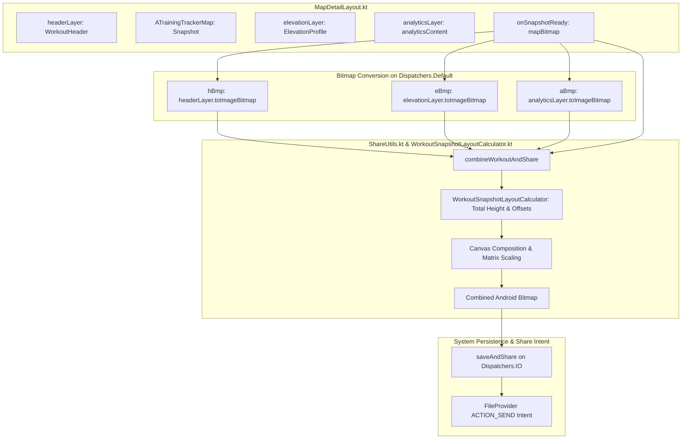

# Stage 3: Implementation Plan - ATT-1393: Aftermath: Enhanced Shareable Workout Snapshot with Zone Analytics

**Ticket**: [ATT-1393](https://atrainingtracker.atlassian.net/browse/ATT-1393)  
**Sub-task**: [ATT-1728](https://atrainingtracker.atlassian.net/browse/ATT-1728) (`[Plan]`)  
**Parent Epic**: [ATT-111](https://atrainingtracker.atlassian.net/browse/ATT-111) (*Aftermath: Compact Post-Workout Visual Analytics & Graphs*)  
**Target Release**: `V4.9.38`  
**Active Sprint**: `2026-40.5`  
**Requirement Mapping**: `REQ-UI-205` (*Aftermath Enhanced Shareable Workout Snapshot with Zone Analytics Architecture*)  
**Test Mapping**: `TST-UI-159`  
**Branch**: `feature/ATT-1393`  
**Author**: AI Agent 1 (Implementer)  
**Date**: 2026-09-30  

---

## 1. Problem Description & Background

In `aTrainingTracker`, workout sharing via `combineWorkoutAndShare` stitches together the slotted workout header, Google Map track, and elevation profile into a single PNG image. However, the visual analytics components delivered in Epic ATT-111 (`HeartRateZoneDistributionCard`, `PowerZoneDistributionCard`, and `LapSplitChartCard`) currently live in the `analyticsContent` slot in `MapDetailLayout.kt` and are omitted from the snapshot.

This feature completes Epic ATT-111 by:
1. Recording the `analyticsContent` slot into a Compose `GraphicsLayer` (`rememberGraphicsLayer()`).
2. Extracting an Android Bitmap when analytics content is present and non-empty.
3. Passing the analytics bitmap into `combineWorkoutAndShare` with an optional parameter, preserving full backward compatibility for existing 4-argument callers (`RouteOnMapScreen` and `SegmentOnMapScreen`).
4. Mathematically assembling the final image with pure layout calculation helpers (`WorkoutSnapshotLayoutCalculator.kt`), scaling the analytics bitmap to match map width and vertically stacking it above the branding footer.

---

## 2. Traceability & Requirements Mapping

* **Primary Requirement**: `REQ-UI-205` (*Aftermath Enhanced Shareable Workout Snapshot with Zone Analytics Architecture*)
* **Test Mapping**: `TST-UI-159` (*Aftermath Enhanced Shareable Workout Snapshot Verification*)
* **Supporting Requirements**:
  - `REQ-UI-204`: Aftermath Compact Lap & Interval Split Chart Architecture.
  - `REQ-UI-203`: Aftermath Cycling Power 5-Zone Distribution Bar Architecture.
  - `REQ-UI-202`: Aftermath Heart Rate 5-Zone Distribution Bar Architecture.
  - `REQ-UI-177`: Share Snapshot Theme Tokens & Dark Mode Architecture.
  - `REQ-PRO-001`: ASPICE Stage-Gated Life Cycle Governance.
  - `REQ-PRO-016`: Inviolable ASPICE Human Decision Gates.

---

## 3. System Invariants & Preserved Behavior

1. **Full Backward Compatibility**:
   - `combineWorkoutAndShare` retains its signature with an optional parameter `analytics: Bitmap? = null`. Existing callers in `RouteOnMapScreen.kt` and `SegmentOnMapScreen.kt` remain 100% untouched and functional.
2. **Graceful Collapse When Analytics Absent**:
   - When `analyticsContent` is empty or has zero height (e.g. activities without zones or laps), the layout calculation produces the exact previous dimensions without blank space.
3. **Thread Safety & Memory Confinement**:
   - GraphicsLayer extraction occurs within the coroutine launched in `onSnapshotReady`.
   - Canvas bitmap assembly executes strictly on `Dispatchers.Default`.
   - File saving and compression execute on `Dispatchers.IO`.
4. **Branding & Visual Integrity**:
   - Application logo, name, and theme-resolved footer colors (`ShareThemeResolver`) remain pixel-perfect.
5. **Human Decision Gate**:
   - Subtask ATT-1728 transitions to `Erledigt` upon passing Gate audit via `freigabe`. Parent ATT-1393 transitions strictly to `Final Review (Human)`.

---

## 4. Proposed Architectural Changes



---

## 5. Step-by-Step Implementation Sequence

### Step 1: Pure Layout Engine (`WorkoutSnapshotLayoutCalculator.kt`)
* **Path**: `app/src/main/java/com/atrainingtracker/trainingtracker/helpers/WorkoutSnapshotLayoutCalculator.kt`
* **Changes**:
  - Define `SnapshotSectionOffsets(val headerTop: Float, val mapTop: Float, val elevationTop: Float, val analyticsTop: Float, val footerTop: Float, val totalHeight: Int)`.
  - Implement `calculateTotalHeight(headerHeight: Int, mapHeight: Int, elevationHeight: Int, analyticsHeight: Int, footerHeight: Int = 125): Int`.
  - Implement `calculateScaleFactor(targetWidth: Int, componentWidth: Int): Float`.
  - Implement `calculateSectionOffsets(headerHeight: Int, mapHeight: Int, elevationHeight: Int, analyticsHeight: Int, footerHeight: Int = 125): SnapshotSectionOffsets`.

### Step 2: Snapshot Pipeline Assembly (`ShareUtils.kt`)
* **Path**: `app/src/main/java/com/atrainingtracker/trainingtracker/helpers/ShareUtils.kt`
* **Changes**:
  - Update `combineWorkoutAndShare` parameter list to add `analytics: Bitmap? = null`.
  - Ensure software bitmap conversion for `analytics`: `val sAnalytics = analytics?.let { ensureSoftwareBitmap(it) }`.
  - Calculate `totalHeight` and section offsets using `WorkoutSnapshotLayoutCalculator`.
  - Draw `sAnalytics` below `sElevation`, scaling horizontally if width differs from `totalWidth`.
  - Draw footer at `offsets.footerTop`.

### Step 3: GraphicsLayer Capture (`MapDetailLayout.kt`)
* **Path**: `app/src/main/java/com/atrainingtracker/trainingtracker/ui/map/MapDetailLayout.kt`
* **Changes**:
  - Declare `val analyticsLayer = rememberGraphicsLayer()`.
  - Wrap `analyticsContent()` container in `Modifier.drawWithContent { analyticsLayer.record { this@drawWithContent.drawContent() }; drawLayer(analyticsLayer) }`.
  - In `onSnapshotReady`, convert `analyticsLayer` to Android Bitmap if dimensions are positive.
  - Pass `aBmp` to `combineWorkoutAndShare(context, hBmp, mapBitmap, eBmp, aBmp)`.

### Step 4: Unit Testing (`WorkoutSnapshotLayoutCalculatorTest.kt`)
* **Path**: `app/src/test/java/com/atrainingtracker/trainingtracker/helpers/WorkoutSnapshotLayoutCalculatorTest.kt`
* **Changes**:
  - Implement unit test covering `TST-UI-159.1` (total height with all sections).
  - Implement unit test covering `TST-UI-159.2` (total height when analytics is omitted).
  - Implement unit test covering `TST-UI-159.3` (horizontal scale factor calculation).
  - Implement unit test covering `TST-UI-159.4` (sequential section offsets).

---

## 6. Targeted Verification Commands

```bash
# Run targeted unit tests
./gradlew testDebugUnitTest --tests "com.atrainingtracker.trainingtracker.helpers.WorkoutSnapshotLayoutCalculatorTest"

# Run full project regression
./gradlew testDebugUnitTest
```
