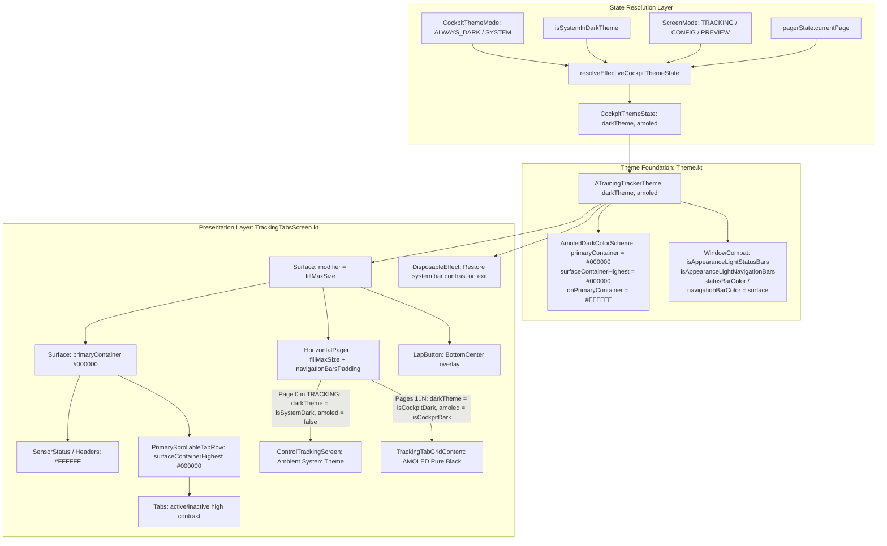

# Architectural Implementation Plan - ATT-1413: [Cockpit] Comprehensive Cockpit Dark Mode: Apply dark theme to Top Bar, Tab Row, and Navigation Bar

**Ticket**: [ATT-1413](https://rainerblind.atlassian.net/browse/ATT-1413)  
**Sub-tasks**: [ATT-1419](https://rainerblind.atlassian.net/browse/ATT-1419) (Analysis [Erledigt]), [ATT-1420](https://rainerblind.atlassian.net/browse/ATT-1420) (Test Spec [Erledigt]), [ATT-1421](https://rainerblind.atlassian.net/browse/ATT-1421) (Impl-Plan [In Bearbeitung]), `[Implementation]`, `[Test]`  
**Target Release**: `V4.9.38`  
**Active Sprint**: `2026-39.3`  
**Requirements**: `REQ-UI-170` (*Comprehensive Cockpit Dark Theme*), referencing `REQ-UI-168` (*Workout Cockpit Independent Theme Selector*) and `REQ-UI-169` (*AMOLED Pure Black Cockpit Theme*)  
**Test Spec ID**: `TST-UI-122`  
**Branch**: `feature/ATT-1413`  

---

## 1. Technical Architecture & Component Flow

The implementation unifies the entire workout cockpit under the AMOLED pure black theme (`#000000`) across top header, tab bar, grid content, and navigation bar when viewing telemetry pages, while maintaining strict ambient system theme isolation for Page 0 (Control Tracking) when the device is in light mode.



---

### Requirement Archaeology & Chesterton's Fence Audit

1. **Original Requirement ID & Target**: `REQ-UI-168` (*Workout Cockpit Independent Theme Selector*) and `REQ-UI-169` (*AMOLED Pure Black Cockpit Theme*).
2. **Historical Origin & Commit Trace**: `ATT-1267` introduced independent cockpit theme selection; `ATT-1263` introduced `AmoledDarkColorScheme` (#000000). Both originally scoped dark theme only around `TrackingTabGridContent` and `LapButton` inside the pager.
3. **Root Reason for Existing Formulation**: Scoping dark theme strictly around `TrackingTabGridContent` was an initial cautious approach to isolate telemetry views without touching the surrounding navigation and headers. However, on physical devices, this left the top bar and tab row light blue and the navigation bar white, breaking OLED battery savings and blinding athletes with glare in night/sunlight riding conditions (`cockpit_dark_mode_partial_top_bottom_light.png`).
4. **Preservation of Core Invariants**: Per user instruction, Page 0 (`ControlTrackingScreen`) remains in the ambient system theme when device is in light mode. Outer application destinations (Drawer, History, Periods, Settings Dialogs) remain in standard ambient theme. When leaving `TrackingTabsScreen`, system bar insets cleanly revert to the ambient system mode.

---

## 2. Harmonized Requirement Specification (`REQ-UI-170`)

---

## 3. Detailed Component Plan & File-by-File Changes

### 3.1 Theme Model: `CockpitThemeMode.kt`
* **File**: [CockpitThemeMode.kt](file:///home/rainer/AndroidStudioProjects/aTrainingTracker/app/src/main/java/com/atrainingtracker/trainingtracker/ui/theme/CockpitThemeMode.kt)
* **Changes**:
  1. Add data class `CockpitThemeState(val darkTheme: Boolean, val amoled: Boolean)`.
  2. Implement pure resolution function:
     ```kotlin
     fun resolveEffectiveCockpitThemeState(
         screenMode: com.atrainingtracker.trainingtracker.ui.tracking.ScreenMode,
         currentPage: Int,
         cockpitThemeMode: CockpitThemeMode,
         isSystemDark: Boolean
     ): CockpitThemeState {
         val isTelemetryTab = (screenMode != com.atrainingtracker.trainingtracker.ui.tracking.ScreenMode.TRACKING) || (currentPage > 0)
         val isCockpitDark = resolveEffectiveCockpitDarkTheme(cockpitThemeMode, isSystemDark)
         return if (isTelemetryTab) {
             CockpitThemeState(darkTheme = isCockpitDark, amoled = isCockpitDark)
         } else {
             CockpitThemeState(darkTheme = isSystemDark, amoled = false)
         }
     }
     ```

### 3.2 AMOLED Color Scheme & Window Insets: `Theme.kt`
* **File**: [Theme.kt](file:///home/rainer/AndroidStudioProjects/aTrainingTracker/app/src/main/java/com/atrainingtracker/trainingtracker/ui/theme/Theme.kt)
* **Changes**:
  1. Update `AmoledDarkColorScheme`:
     ```kotlin
     internal val AmoledDarkColorScheme = DarkColorScheme.copy(
         primaryContainer = Color(0xFF000000),
         onPrimaryContainer = Color(0xFFFFFFFF),
         background = AmoledBackground,
         surface = AmoledSurface,
         surfaceVariant = AmoledSurface,
         surfaceDim = AmoledSurface,
         surfaceBright = Color(0xFF1A1A1A),
         surfaceContainerLowest = AmoledSurface,
         surfaceContainerLow = AmoledSurface,
         surfaceContainer = AmoledSurface,
         surfaceContainerHigh = Color(0xFF121212),
         surfaceContainerHighest = Color(0xFF000000),
         outline = AmoledOutline,
         outlineVariant = AmoledOutlineVariant,
         onSurface = Color.White,
         onBackground = Color.White,
         onSurfaceVariant = Color(0xFFC4C6D0)
     )
     ```
  2. In `ATrainingTrackerTheme`, guard window access against finishing or destroyed activities, and configure navigation bar appearance:
     ```kotlin
     val view = LocalView.current
     if (!view.isInEditMode) {
         SideEffect {
             var context = view.context
             while (context is ContextWrapper) {
                 if (context is Activity) break
                 context = context.baseContext
             }
             val activity = context as? Activity
             if (activity != null && !activity.isFinishing && !activity.isDestroyed) {
                 activity.window?.let { window ->
                     window.statusBarColor = colorScheme.surface.toArgb()
                     window.navigationBarColor = colorScheme.surface.toArgb()
                     val insetsController = WindowCompat.getInsetsController(window, view)
                     insetsController.isAppearanceLightStatusBars = !darkTheme
                     insetsController.isAppearanceLightNavigationBars = !darkTheme
                 }
             }
         }
     }
     ```

### 3.3 Root Scoping & Inset Restoration: `TrackingTabsScreen.kt`
* **File**: [TrackingTabsScreen.kt](file:///home/rainer/AndroidStudioProjects/aTrainingTracker/app/src/main/java/com/atrainingtracker/trainingtracker/ui/tracking/trackingtabs/TrackingTabsScreen.kt)
* **Changes**:
  1. Compute dynamic theme state:
     ```kotlin
     val cockpitThemeState = resolveEffectiveCockpitThemeState(
         screenMode = screenMode,
         currentPage = pagerState.currentPage,
         cockpitThemeMode = cockpitThemeMode,
         isSystemDark = isSystemDark
     )
     ```
  2. Enclose root `Surface(modifier = Modifier.fillMaxSize())` within:
     ```kotlin
     ATrainingTrackerTheme(
         darkTheme = cockpitThemeState.darkTheme,
         amoled = cockpitThemeState.amoled
     ) {
         Surface(
             modifier = Modifier.fillMaxSize(),
         ) {
             Box(modifier = Modifier.fillMaxSize()) {
                 ...
             }
         }
     }
     ```
  3. Remove redundant nested `ATrainingTrackerTheme` calls around `TrackingTabGridContent` and `LapButton`.
  4. Register unmount cleanup via `DisposableEffect(context, isSystemDark)` to restore ambient status/navigation bar flags upon leaving `TrackingTabsScreen`:
     ```kotlin
     DisposableEffect(context, isSystemDark) {
         onDispose {
             var ctx = context
             while (ctx is ContextWrapper) {
                 if (ctx is Activity) break
                 ctx = ctx.baseContext
             }
             val activity = ctx as? Activity
             if (activity != null && !activity.isFinishing && !activity.isDestroyed) {
                 activity.window?.let { window ->
                     val insetsController = WindowCompat.getInsetsController(window, window.decorView)
                     insetsController.isAppearanceLightStatusBars = !isSystemDark
                     insetsController.isAppearanceLightNavigationBars = !isSystemDark
                 }
             }
         }
     }
     ```

---

## 4. Verification & Testing Strategy

### 4.1 Unit Test Suites
1. **`TrackingThemeResolutionTest.kt`** (New in `app/src/test/java/com/atrainingtracker/trainingtracker/ui/tracking/`):
   - Page 0 in TRACKING mode with `ALWAYS_DARK` and `isSystemDark = false`: `darkTheme = false`, `amoled = false`.
   - Page 1 in TRACKING mode with `ALWAYS_DARK` and `isSystemDark = false`: `darkTheme = true`, `amoled = true`.
   - Page 0 in TRACKING mode with `ALWAYS_DARK` and `isSystemDark = true`: `darkTheme = true`, `amoled = false`.
   - Page 1 in TRACKING mode with `SYSTEM` and `isSystemDark = false`: `darkTheme = false`, `amoled = false`.
   - Page 1 in TRACKING mode with `SYSTEM` and `isSystemDark = true`: `darkTheme = true`, `amoled = true`.
   - Page 0 in CONFIGURATION mode with `ALWAYS_DARK`: `darkTheme = true`, `amoled = true`.
   - Page 0 in PREVIEW mode with `ALWAYS_DARK`: `darkTheme = true`, `amoled = true`.
   - Rapid toggling sequence (0 -> 1 -> 0 -> 2) asserting deterministic resolution.
2. **`AmoledThemeTest.kt`** (Updated in `app/src/test/java/com/atrainingtracker/trainingtracker/ui/theme/`):
   - Assert `AmoledDarkColorScheme.primaryContainer == Color(0xFF000000)`.
   - Assert `AmoledDarkColorScheme.onPrimaryContainer == Color(0xFFFFFFFF)`.
   - Assert `AmoledDarkColorScheme.surfaceContainerHighest == Color(0xFF000000)`.
   - Assert `DarkColorScheme.primaryContainer == BabyBlueEyeInverse` (`Color(0xFF001A41)`).

### 4.2 Full Clean-Room Regression
- Execute `./gradlew testDebugUnitTest` ensuring 100% pass rate.

---

## 5. Rollback & Contingency Plan
If any visual regressions occur during fragment transitions or drawer navigation, the root wrapper can be reverted to inner scoping with zero persistence side-effects, as all preference keys and data entities remain completely untouched.
