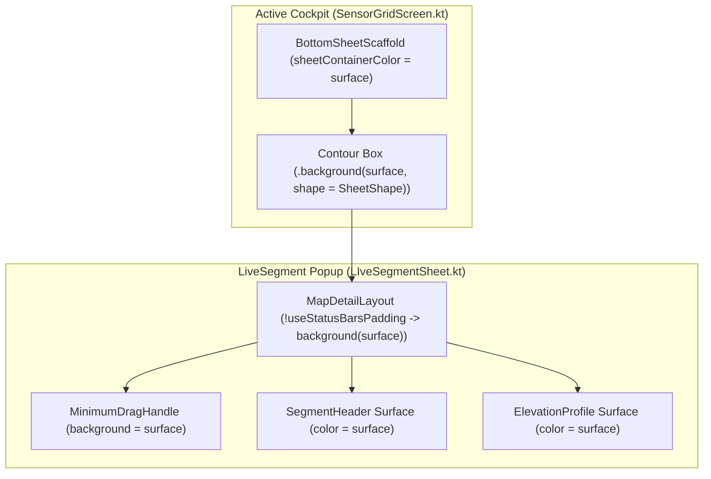

# Stage 3 Implementation Plan: ATT-1735

**Ticket**: [ATT-1735](https://atrainingtracker.atlassian.net/browse/ATT-1735)  
**Sub-task**: [ATT-1767](https://atrainingtracker.atlassian.net/browse/ATT-1767) (`[Impl-Plan]`)  
**Parent Epic**: [ATT-355](https://atrainingtracker.atlassian.net/browse/ATT-355) (*Good and consistent UI*)  
**Target Release**: `V4.9.38`  
**Active Sprint**: `2026-40.6`  
**Branch**: `feature/ATT-1735`  
**Author**: AI Agent 1 (Implementer)  
**Date**: 2026-10-01  

---

## 1. Traceability & Scope Matrix

* **Requirements Traced**: `REQ-UI-196` (*LiveSegment & Bottom Sheets: Refined Subtle Drag Handle, Harmonized Popup Spacing & Unified Surface Background*)
* **Tests Traced**: `TST-UI-150` (*MinimumDragHandle Dimensions, Unified Popup Surface and Customization Unit Test*)
* **Scope Definition**:
  1. In [SensorGridScreen.kt](file:///home/rainer/AndroidStudioProjects/aTrainingTracker/app/src/main/java/com/atrainingtracker/trainingtracker/ui/tracking/tracking/SensorGridScreen.kt), explicitly configure `sheetContainerColor = MaterialTheme.colorScheme.surface` on `BottomSheetScaffold`.
  2. In [SensorGridScreen.kt](file:///home/rainer/AndroidStudioProjects/aTrainingTracker/app/src/main/java/com/atrainingtracker/trainingtracker/ui/tracking/tracking/SensorGridScreen.kt), apply `.background(MaterialTheme.colorScheme.surface, shape = BottomSheetDesign.SheetShape)` to the sheet content `Box` modifier.
  3. In [MapDetailLayout.kt](file:///home/rainer/AndroidStudioProjects/aTrainingTracker/app/src/main/java/com/atrainingtracker/trainingtracker/ui/map/MapDetailLayout.kt), ensure the root `Column` applies `.background(MaterialTheme.colorScheme.surface)` when in bottom sheet mode (`!useStatusBarsPadding`), guaranteeing `MinimumDragHandle`, header, and elevation profile share a unified surface.
  4. In [LIveSegmentSheet.kt](file:///home/rainer/AndroidStudioProjects/aTrainingTracker/app/src/main/java/com/atrainingtracker/trainingtracker/ui/segments/LIveSegmentSheet.kt), verify that the header column continues to apply `MaterialTheme.colorScheme.surface`.
  5. In [LiveSegmentSheetLayoutTest.kt](file:///home/rainer/AndroidStudioProjects/aTrainingTracker/app/src/test/java/com/atrainingtracker/trainingtracker/ui/segments/LiveSegmentSheetLayoutTest.kt), add test cases verifying the unified surface background contracts across `SensorGridScreen.kt`, `MapDetailLayout.kt`, and `LIveSegmentSheet.kt`.
  6. Execute clean-room full test suite regression `./gradlew testDebugUnitTest` verifying 0 regressions.

---

## 2. Architectural Design & Call-Site Audit (SWE.2)

### 2.1 Component Hierarchy & Unified Surface


### 2.2 Call Sites Analysis
1. `SensorGridScreen.kt`:
   - Line 119: `BottomSheetScaffold` receives `sheetContainerColor = MaterialTheme.colorScheme.surface`.
   - Line 129: Sheet content `Box` receives `.background(MaterialTheme.colorScheme.surface, shape = BottomSheetDesign.SheetShape)`.
2. `MapDetailLayout.kt`:
   - Line 93: Root `Column` receives modifier extension `.then(if (!useStatusBarsPadding) Modifier.background(MaterialTheme.colorScheme.surface) else Modifier)`.
3. `LiveSegmentSheetLayoutTest.kt`:
   - Add unit tests verifying `sheetContainerColor` on `BottomSheetScaffold`, `background(MaterialTheme.colorScheme.surface)` on `MapDetailLayout`, and unified surface consistency.

---

## 3. Step-by-Step Atomic Implementation Tasks

### Task 1: Update `SensorGridScreen.kt` Sheet Container Styling
- File: [SensorGridScreen.kt](file:///home/rainer/AndroidStudioProjects/aTrainingTracker/app/src/main/java/com/atrainingtracker/trainingtracker/ui/tracking/tracking/SensorGridScreen.kt)
- Add `sheetContainerColor = MaterialTheme.colorScheme.surface` to `BottomSheetScaffold`.
- In `sheetContent`, update `Box` modifier:
  ```kotlin
  Box(
      modifier = Modifier
          .fillMaxWidth()
          .sheetContour()
          .background(MaterialTheme.colorScheme.surface, shape = BottomSheetDesign.SheetShape)
  )
  ```

### Task 2: Update `MapDetailLayout.kt` Root Column Background
- File: [MapDetailLayout.kt](file:///home/rainer/AndroidStudioProjects/aTrainingTracker/app/src/main/java/com/atrainingtracker/trainingtracker/ui/map/MapDetailLayout.kt)
- In the root `Column` modifier, chain:
  ```kotlin
  .then(
      if (!useStatusBarsPadding) Modifier.background(MaterialTheme.colorScheme.surface) else Modifier
  )
  ```

### Task 3: Unit Testing in `LiveSegmentSheetLayoutTest.kt`
- File: [LiveSegmentSheetLayoutTest.kt](file:///home/rainer/AndroidStudioProjects/aTrainingTracker/app/src/test/java/com/atrainingtracker/trainingtracker/ui/segments/LiveSegmentSheetLayoutTest.kt)
- Add `testLiveSegmentSheet_unifiedBackgroundContract`:
  - Verify `SensorGridScreen.kt` configures `sheetContainerColor = MaterialTheme.colorScheme.surface`.
  - Verify `MapDetailLayout.kt` applies `background(MaterialTheme.colorScheme.surface)` when in sheet mode (`!useStatusBarsPadding`).
  - Verify `LIveSegmentSheet.kt` maintains `background(MaterialTheme.colorScheme.surface)`.

### Task 4: Clean-Room Full Suite Regression Execution
- Command: `./gradlew testDebugUnitTest`
- Verify 100% test pass rate with 0 regressions.

---

## 4. Preserved Invariants & Boundary Verification

1. **Visual Dimensions**: Drag handle width (`32.dp`), height (`3.dp`), top padding (`8.dp`), and bottom padding (`4.dp`) are unaltered.
2. **Sheet Contour & Shape**: Top contour border stroke (`1.dp`) and `BottomSheetDesign.SheetShape` remain intact.
3. **Detail View Invariants**: Full-screen detail maps (`useStatusBarsPadding == true`) do not have unwanted background overriding their layout.
4. **Theme Parity**: Using `MaterialTheme.colorScheme.surface` guarantees dynamic theme adaptation across Light, Dark, and AMOLED modes.
5. **No Regressions**: Zero database, threading, or sensor telemetry changes.
