# Stage 3 Implementation Plan: ATT-1737

**Ticket**: [ATT-1737](https://atrainingtracker.atlassian.net/browse/ATT-1737)  
**Sub-task**: [ATT-1772](https://atrainingtracker.atlassian.net/browse/ATT-1772) (`[Impl-Plan]`)  
**Parent Epic**: [ATT-355](https://atrainingtracker.atlassian.net/browse/ATT-355) (*Good and consistent UI*)  
**Target Release**: `V4.9.38`  
**Active Sprint**: `2026-40.6`  
**Branch**: `feature/ATT-1737`  
**Author**: AI Agent 1 (Implementer)  
**Date**: 2026-10-01  

---

## 1. Traceability & Scope Matrix

* **Requirements Traced**: `REQ-UI-197` (*Elevation Profile Contextual Zoom Controls Visibility & Non-Overlapping Multi-Metric Scrubbing Badge Architecture*)
* **Tests Traced**: `TST-UI-151` (*Elevation Profile Contextual Zoom Controls Visibility and Non-Overlapping Multi-Metric Badge Layout Verification*)
* **Scope Definition**:
  1. In [ElevationProfile.kt](file:///home/rainer/AndroidStudioProjects/aTrainingTracker/app/src/main/java/com/atrainingtracker/trainingtracker/ui/map/ElevationProfile.kt):
     - Update `topPadding`: `val topPadding = if (showZoomControls) 72.dp else 16.dp` (increased by 28.dp from 44.dp to 72.dp).
     - Update `totalCanvasHeight`: `val totalCanvasHeight = if (showZoomControls) cachedData.adaptiveHeight + 48.dp else cachedData.adaptiveHeight` (increased by 28.dp from + 20.dp to + 48.dp), strictly preserving the exact drawable chart plotting height invariant (`(adaptiveHeight + 48.dp) - 72.dp - 24.dp = adaptiveHeight - 48.dp`).
     - Anchor `ScrubbingTelemetryBadge` with `Modifier.align(Alignment.TopCenter).padding(top = 28.dp)` (moved down from `top = 2.dp`), creating a clean, disjoint second layer below the controls row.
  2. In [ElevationProfileLayoutTest.kt](file:///home/rainer/AndroidStudioProjects/aTrainingTracker/app/src/test/java/com/atrainingtracker/trainingtracker/ui/map/ElevationProfileLayoutTest.kt):
     - Update `testElevationProfile_sourceCodeInspection_layoutSeparation` to verify `topPadding == 72.dp`, `totalCanvasHeight == + 48.dp`, and badge `top = 28.dp`.
     - Update `testVerticalLayoutGeometry_guaranteesNonOverlappingBounds` to verify the 3-layer vertical layout geometry with $\ge 2.0\text{dp}$ clearance between all adjacent layers.
  3. Ensure all existing invariants (zoom math, pan clamping, metric badge telemetry formatting, list preview zoom suppression) remain 100% intact.

---

## 2. Architectural Design & Layering (SWE.2)

### 2.1 Three-Layer Vertical Layout Geometry

```mermaid
graph TD
    subgraph BoxContainer["ElevationProfile Box (totalCanvasHeight = adaptiveHeight + 48dp)"]
        subgraph Layer1["Layer 1: Controls & Legend Row [2.0dp .. 26.0dp]"]
            ZCR["Zoom Controls Row (start = 50dp, top = 2dp, height = 24dp)"]
            LGI["Legend Info Button (end = 4dp, top = 2dp, height = 24dp)"]
        end

        subgraph Clearance1["Clearance 1: 2.0dp Separation [26.0dp .. 28.0dp]"]
            C1["Zero-overlap buffer: 28.0dp - 26.0dp = 2.0dp"]
        end

        subgraph Layer2["Layer 2: Multi-Metric Telemetry Badge [28.0dp .. 70.0dp]"]
            STB["ScrubbingTelemetryBadge (align = TopCenter, top = 28dp, height ~ 42dp)"]
        end

        subgraph Clearance2["Clearance 2: 2.0dp Separation [70.0dp .. 72.0dp]"]
            C2["Zero-overlap buffer: 72.0dp - 70.0dp = 2.0dp"]
        end

        subgraph Layer3["Layer 3: Canvas Chart Plotting [72.0dp .. (adaptiveHeight + 24dp)]"]
            CCP["Canvas Top Padding = 72.dp (Curve begins at y = 0 inside Canvas)"]
            CDH["Drawable Plotting Height = adaptiveHeight - 48.dp (Strict Invariant)"]
        end
    end

    Layer1 --> Clearance1
    Clearance1 --> Layer2
    Layer2 --> Clearance2
    Clearance2 --> Layer3
```


### 2.2 Mathematical Verification of Layer Disjointness & Height Invariant
1. **Layer 1 (Zoom Controls & Legend)**:
   - $y_{\text{start}} = 2.0\text{ dp}$
   - $\text{height} = 24.0\text{ dp}$
   - $y_{\text{end}} = 2.0\text{ dp} + 24.0\text{ dp} = 26.0\text{ dp}$
2. **Clearance 1**:
   - $\Delta y_1 = y_{\text{badge, start}} - y_{\text{controls, end}} = 28.0\text{ dp} - 26.0\text{ dp} = 2.0\text{ dp} \ge 2.0\text{ dp}$ (PASS)
3. **Layer 2 (Multi-Metric Telemetry Badge)**:
   - $y_{\text{start}} = 28.0\text{ dp}$
   - $\text{height} \approx 42.0\text{ dp}$ (maximum 2 rows: elevation/slope + telemetry metrics)
   - $y_{\text{end}} \approx 70.0\text{ dp}$
4. **Clearance 2**:
   - $\Delta y_2 = y_{\text{canvas, start}} - y_{\text{badge, end}} = 72.0\text{ dp} - 70.0\text{ dp} = 2.0\text{ dp} \ge 2.0\text{ dp}$ (PASS)
5. **Layer 3 (Canvas Chart Curve)**:
   - $y_{\text{start}} = 72.0\text{ dp}$
   - Plotting area height $H_{\text{plot}} = \text{totalCanvasHeight} - \text{topPadding} - \text{bottomPadding}$
   - Prior calculation: $(\text{adaptiveHeight} + 20\text{ dp}) - 44\text{ dp} - 24\text{ dp} = \text{adaptiveHeight} - 48\text{ dp}$
   - New calculation: $(\text{adaptiveHeight} + 48\text{ dp}) - 72\text{ dp} - 24\text{ dp} = \text{adaptiveHeight} - 48\text{ dp}$
   - Ratio: $\Delta H_{\text{plot}} = 0.0\text{ dp}$ (Exact drawable plotting height preserved 100%).

---

## 3. Step-by-Step Atomic Implementation Tasks

### Task 1: Update Vertical Offsets and Canvas Sizing in `ElevationProfile.kt`
- File: [ElevationProfile.kt](file:///home/rainer/AndroidStudioProjects/aTrainingTracker/app/src/main/java/com/atrainingtracker/trainingtracker/ui/map/ElevationProfile.kt)
- In line 359:
  ```kotlin
  val topPadding = if (showZoomControls) 72.dp else 16.dp
  val totalCanvasHeight = if (showZoomControls) cachedData.adaptiveHeight + 48.dp else cachedData.adaptiveHeight
  ```
- In line 677:
  ```kotlin
  ScrubbingTelemetryBadge(
      point = activePoint,
      bSportType = bSportType,
      altitude = interAlt,
      unit = unit,
      xAxisDomain = xAxisDomain,
      modifier = Modifier
          .align(Alignment.TopCenter)
          .padding(top = 28.dp)
  )
  ```

### Task 2: Update Source Contract & Geometry Verification in `ElevationProfileLayoutTest.kt`
- File: [ElevationProfileLayoutTest.kt](file:///home/rainer/AndroidStudioProjects/aTrainingTracker/app/src/test/java/com/atrainingtracker/trainingtracker/ui/map/ElevationProfileLayoutTest.kt)
- Update `testElevationProfile_sourceCodeInspection_layoutSeparation`:
  - Assert `val topPadding = if (showZoomControls) 72.dp else 16.dp`
  - Assert `val totalCanvasHeight = if (showZoomControls) cachedData.adaptiveHeight + 48.dp else cachedData.adaptiveHeight`
  - Assert `ScrubbingTelemetryBadge` has `padding(top = 28.dp)`.
- Update `testVerticalLayoutGeometry_guaranteesNonOverlappingBounds`:
  - Verify Layer 1 bounds: `[2.0, 26.0] dp`
  - Verify Layer 2 bounds: `[28.0, 70.0] dp`
  - Verify Layer 3 start: `72.0 dp`
  - Assert `clearance1 >= 2.0 dp` and `clearance2 >= 2.0 dp`.
  - Assert `drawableHeight` invariant equals `adaptiveHeight - 48.dp`.

### Task 3: Execute Unit Tests and Full Regression Suite
- Run targeted unit test:
  `./gradlew testDebugUnitTest --tests "com.atrainingtracker.trainingtracker.ui.map.ElevationProfileLayoutTest"`
- Run full clean-room suite:
  `./gradlew testDebugUnitTest`

---

## 4. System Invariants & Verification Checklist

* [x] **Zero Visual Collision**: Multi-metric scrubbing badge rendered at `top = 28.dp`, strictly below the `2.dp .. 26.dp` zoom controls row across all horizontal scrubbing positions.
* [x] **Exact Plotting Area Invariant**: Drawable plotting height equals `adaptiveHeight - 48.dp`, preserving elevation profile curve aspect ratio and grid lines.
* [x] **Preview Card Safety**: Compact list preview cards retain `topPadding = 16.dp` and `totalCanvasHeight = cachedData.adaptiveHeight`.
* [x] **Telemetry & Zoom Math Integrity**: Zero modifications to coordinate transformation, gesture recognition, or telemetry data extraction.
* [x] **Human Gate Invariance**: AI agents do not transition parent tickets to `Erledigt`.
