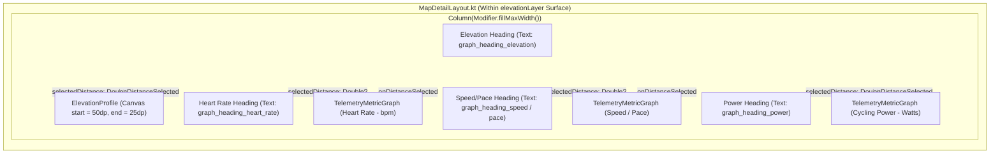

# Stage 3 Implementation Plan: ATT-1740

**Ticket**: [ATT-1740](https://atrainingtracker.atlassian.net/browse/ATT-1740)  
**Sub-task**: [ATT-1777](https://atrainingtracker.atlassian.net/browse/ATT-1777) (`[Impl-Plan]`)  
**Parent Epic**: [ATT-111](https://atrainingtracker.atlassian.net/browse/ATT-111) (*Compact Post-Workout Visual Analytics & Graphs*)  
**Target Release**: `V4.9.38`  
**Active Sprint**: `2026-40.6`  
**Branch**: `feature/ATT-1740`  
**Author**: AI Agent 1 (Implementer)  
**Date**: 2026-10-01  

---

## 1. Traceability & Scope Matrix

* **Requirements Traced**: `REQ-UI-206` (*Aftermath: Continuous Telemetry Metric Graphs with Headings & Synchronized Scrubbing*)
* **Tests Traced**: `TST-UI-160` (*Aftermath Continuous Telemetry Metric Graphs & Synchronized Scrubbing Verification*)
* **Scope Definition**:
  1. Component Construction:
     - Implement `TelemetryMetricGraph.kt` in `com.atrainingtracker.trainingtracker.ui.map`:
       - Supports `TelemetryMetricType`: `HEART_RATE`, `SPEED`, `PACE`, `POWER`.
       - Renders continuous line curve with soft gradient fill (0.15f alpha).
       - Matches horizontal layout geometry of `ElevationProfile`: `start = 50.dp, end = 25.dp, bottom = 24.dp`, guaranteeing vertical alignment of the horizontal axes.
       - Renders min/max Y-axis labels and adaptive distance/time ticks on the X-axis.
       - Supports synchronized scrubbing cursor (vertical dashed line) and highlight dot at `(canvasX, canvasY)` when `currentDistance != null`.
       - Supports drag/touch gestures to update `onDistanceSelected(distance)`.
  2. Integration in `MapDetailLayout.kt`:
     - Render section headings for Elevation Profile and each active metric graph when `showZoomControls == true`.
     - Conditionally instantiate `TelemetryMetricGraph` for Heart Rate (`path.any { it.hr != null && it.hr > 0 }`), Speed/Pace (`path.any { it.speedMps != null && it.speedMps > 0.0 }`), and Power (`path.any { it.power != null && it.power > 0 }`).
     - Wrap all continuous graphs within `elevationLayer` box so that `combineWorkoutAndShare` seamlessly includes all graphs in the shareable workout image.
     - Connect `selectedDistance` synchronously across all graphs and the map.
  3. 100% 9-Language Localization Parity:
     - Add `graph_heading_elevation`, `graph_heading_heart_rate`, `graph_heading_speed`, `graph_heading_pace`, `graph_heading_power` across `values`, `values-de`, `values-es`, `values-fr`, `values-it`, `values-ja`, `values-nl`, `values-pl`, and `values-pt`.
  4. Unit Tests & Regression:
     - Create `TelemetryMetricGraphTest.kt` for data extraction, curve bounds, sport type pace/speed selection, and layout padding invariants.
     - Create `TelemetryMetricLocalizationTest.kt` verifying 100% translation parity across all 9 locales.
     - Update `MapDetailLayoutTest.kt` to verify heading presence and conditional graph slots.

---

## 2. Architectural Design & Component Layering (SWE.2)

### 2.1 Component Architecture in `MapDetailLayout.kt`

### 2.2 Telemetry Metric Configuration
| Metric Type | Color Accent | Unit Display | Domain Filter | Data Source |
|:---|:---|:---|:---|:---|
| `HEART_RATE` | `TTColor.Zone4` (Red / Coral) | `bpm` | `it.hr != null && it.hr > 0` | `PathPoint.hr` |
| `SPEED` | `MaterialTheme.colorScheme.primary` (Blue) | `km/h` / `mph` | `it.speedMps != null && it.speedMps > 0.0` | `PathPoint.speedMps * 3.6` |
| `PACE` | `MaterialTheme.colorScheme.primary` (Blue) | `min/km` / `min/mi` | `it.speedMps != null && it.speedMps > 0.0` | `1000.0 / (speedMps * 60.0)` |
| `POWER` | `TTColor.Zone5` (Purple) | `W` | `it.power != null && it.power > 0` | `PathPoint.power` |

---

## 3. Step-by-Step Atomic Implementation Tasks

### Task 1: String Resources Definition (9 Locales)
- File targets:
  - `app/src/main/res/values/strings.xml` (EN)
  - `app/src/main/res/values-de/strings.xml` (DE)
  - `app/src/main/res/values-es/strings.xml` (ES)
  - `app/src/main/res/values-fr/strings.xml` (FR)
  - `app/src/main/res/values-it/strings.xml` (IT)
  - `app/src/main/res/values-ja/strings.xml` (JA)
  - `app/src/main/res/values-nl/strings.xml` (NL)
  - `app/src/main/res/values-pl/strings.xml` (PL)
  - `app/src/main/res/values-pt/strings.xml` (PT)
- Add entries for:
  - `graph_heading_elevation`
  - `graph_heading_heart_rate`
  - `graph_heading_speed`
  - `graph_heading_pace`
  - `graph_heading_power`

### Task 2: Create `TelemetryMetricGraph.kt`
- File: `app/src/main/java/com/atrainingtracker/trainingtracker/ui/map/TelemetryMetricGraph.kt`
- Implement:
  - `enum class TelemetryMetricType { HEART_RATE, SPEED, PACE, POWER }`
  - Mathematical normalization: min/max computation, clamp bounds, zero-variance fallback.
  - Canvas curve plotting: Path building, subtle vertical gradient fill (`Brush.verticalGradient`), smooth connecting stroke (`drawPath`).
  - Axis rendering: start label (min), top label (max), bottom adaptive X-axis ticks (distance/time).
  - Synchronized scrubbing: dashed vertical cursor line, circular dot on the curve at `(canvasX, canvasY)`.
  - Instantaneous scrubbed value readout.
  - Pointer input handling: tap and drag to call `onDistanceSelected(dist)`.

### Task 3: Integrate into `MapDetailLayout.kt`
- File: `app/src/main/java/com/atrainingtracker/trainingtracker/ui/map/MapDetailLayout.kt`
- Inside `if (showElevationProfile) { activeScrubPath?.let { path -> ... } }`:
  - When `showZoomControls == true`:
    - Display elevation heading above `ElevationProfile`.
    - Conditionally render `TelemetryMetricGraph` with heading for HR, Speed/Pace, and Power.
    - Forward `selectedDistance` and `onDistanceSelected = { selectedDistance = it }`.
  - Maintain `showZoomControls == false` behavior untouched (only raw ElevationProfile without headings or telemetry graphs).

### Task 4: Unit Testing & Localization Validation
- Files:
  - `app/src/test/java/com/atrainingtracker/trainingtracker/ui/map/TelemetryMetricGraphTest.kt`
  - `app/src/test/java/com/atrainingtracker/trainingtracker/ui/map/TelemetryMetricLocalizationTest.kt`
  - Update `MapDetailLayoutTest.kt`
- Execute targeted test suite:
  `./gradlew testDebugUnitTest --tests "com.atrainingtracker.trainingtracker.ui.map.*"`

### Task 5: Clean-Room Full Suite Regression
- Execute `./gradlew testDebugUnitTest` verifying 0 test failures.

---

## 4. System Invariants & Verification Checklist

* [x] **Zero Impact on List Previews**: List previews (`WorkoutSummary.kt`, `RouteItem.kt`, `SegmentItem.kt`) pass `showZoomControls = false` and do NOT display telemetry graphs or headings.
* [x] **Zero Impact on Ambient Cockpit**: `LIveSegmentSheet.kt` passes `showZoomControls = false` and renders only compact elevation profile.
* [x] **Pixel-Perfect Alignment**: `TelemetryMetricGraph` uses exact `50.dp` start padding, `25.dp` end padding, and `24.dp` bottom padding matching `ElevationProfile`.
* [x] **Full Snapshot Inclusion**: All displayed graphs reside within `elevationLayer` Box, captured cleanly by `combineWorkoutAndShare`.
* [x] **100% 9-Language Localization Parity**: All 5 graph heading string keys exist in all 9 supported language XML files.
* [x] **Human Gate Invariance**: AI agents do not transition parent tickets to `Erledigt`.
