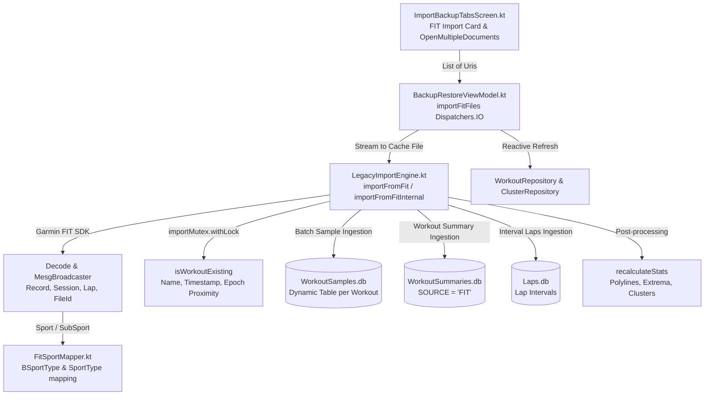

# Stage 3 Implementation Plan: ATT-1828 - FIT Workout Importer with Duplicate Detection and Sport Mapping

**Ticket**: [ATT-1828](https://rainerblind.atlassian.net/browse/ATT-1828)  
**Sub-task**: [ATT-2260](https://rainerblind.atlassian.net/browse/ATT-2260) (`[Impl-Plan]`)  
**Parent Epic**: [ATT-1117](https://rainerblind.atlassian.net/browse/ATT-1117) (*[Epic] FIT File Format Support (Export & Import)*)  
**Target Release**: `V4.9.39`  
**Active Sprint**: `Sprint 2026-40.14`  
**Branch**: `feature/ATT-1828`  
**Author**: AI Agent 1 (Implementer)  
**Date**: 2026-10-03  

---

## 1. Architectural Architecture & Decomposition (SWE.2)

The implementation of `REQ-DAT-019` decomposes cleanly across application layers:

### Component Responsibility
1. **Presentation Layer (`ImportBackupTabsScreen.kt`)**:
   - Houses a dedicated Material 3 elevated card for FIT file import in `ImportTabContent`.
   - Utilizes `rememberLauncherForActivityResult(ActivityResultContracts.OpenMultipleDocuments())` allowing athletes to multi-select `.fit` files.
2. **ViewModel Layer (`BackupRestoreViewModel.kt`)**:
   - Manages asynchronous execution on `Dispatchers.IO`.
   - Emits progressive `UiState.Loading` indicating files processed (e.g. "Importiere Datei 3 von 10...").
   - Copies URI streams safely to `context.cacheDir` and invokes `LegacyImportEngine.importFromFitInternal`.
   - Cleans up temporary cache files.
   - Emits structured `UiState.Success` or `UiState.Error` with imported, skipped duplicate, and failed counts.
   - Triggers reactive reconciliation via `WorkoutRepository` and `WorkoutClusterRepository`.
3. **Domain & Ingestion Layer (`LegacyImportEngine.kt` & `FitSportMapper.kt`)**:
   - Parses `.fit` binary files using `com.garmin.fit.Decode` and `MesgBroadcaster`.
   - Maps coordinates from semicircles to decimal degrees ($\text{deg} = \text{semicircles} \times (180.0 / 2^{31})$) with indoor null-safety.
   - Maps FIT `Sport` and `SubSport` enums to `BSportType` and resolves `sportId`.
   - Enforces deduplication within `importMutex.withLock` via `isWorkoutExisting(...)`.
   - Creates dynamic tables in `WorkoutSamplesDatabaseManager` and inserts samples.
   - Inserts workout summary with `SOURCE = WorkoutSource.FIT.name`.
   - Inserts lap records into `LapsDatabaseManager`.
   - Triggers `recalculateStats(...)` for bounding box and cluster discovery.

---

## 2. Step-by-Step Implementation Sequence

### Step 1: 9-Language Localization Parity
* **Target Files**:
  - `app/src/main/res/values/strings.xml` (EN)
  - `app/src/main/res/values-de/strings.xml` (DE)
  - `app/src/main/res/values-es/strings.xml` (ES)
  - `app/src/main/res/values-fr/strings.xml` (FR)
  - `app/src/main/res/values-it/strings.xml` (IT)
  - `app/src/main/res/values-ja/strings.xml` (JA)
  - `app/src/main/res/values-nl/strings.xml` (NL)
  - `app/src/main/res/values-pl/strings.xml` (PL)
  - `app/src/main/res/values-pt/strings.xml` (PT)
* **Strings to Add**:
  - `import_fit_title`: "FIT-Dateien importieren" / "Import FIT Files"
  - `import_fit_description`: "Aktivitäten von Garmin, Wahoo, Hammerhead oder Smartwatches importieren (.fit)."
  - `import_fit_button`: "FIT-Dateien wählen" / "Select FIT Files"
  - `import_fit_progress`: "Importiere FIT-Dateien (%d von %d)…" / "Importing FIT files (%d of %d)…"
  - `import_fit_summary_success`: "%d Aktivitäten erfolgreich importiert (%d Duplikate übersprungen)."
  - `import_fit_summary_with_errors`: "%d Aktivitäten importiert, %d Duplikate übersprungen, %d Fehler."
* **Validation**: Run `TranslationParityTest.kt`.

### Step 2: Sport Mapping Helper (`FitSportMapper.kt`)
* **Target File**: `app/src/main/java/com/atrainingtracker/trainingtracker/migration/FitSportMapper.kt`
* **Logic**:
  - Function `mapFitSport(sport: Sport?, subSport: SubSport?): BSportType`:
    - `Sport.CYCLING` $\rightarrow$ `BSportType.BIKE`
    - `Sport.RUNNING`, `Sport.WALKING` $\rightarrow$ `BSportType.RUN`
    - `Sport.SWIMMING` $\rightarrow$ `BSportType.OTHER`
    - `Sport.FITNESS_EQUIPMENT`:
      - `subSport == SubSport.INDOOR_CYCLING` $\rightarrow$ `BSportType.BIKE`
      - `subSport == SubSport.INDOOR_RUNNING` $\rightarrow$ `BSportType.RUN`
      - else $\rightarrow$ `BSportType.OTHER`
    - fallback $\rightarrow$ `BSportType.UNKNOWN`
* **Test**: Author and run `FitSportMappingTest.kt`.

### Step 3: Core FIT Ingestion Engine (`LegacyImportEngine.kt`)
* **Target File**: `app/src/main/java/com/atrainingtracker/trainingtracker/migration/LegacyImportEngine.kt`
* **Logic**:
  - Implement `importFromFit(context, fitFile, listener, uploadToStrava): Boolean`
  - Implement `importFromFitInternal(context, fitFile, listener, uploadToStrava): ImportStatus`
  - Semicircles scaling: `deg = semicircles * (180.0 / 2147483648.0)`.
  - Null-safe coordinate handling for indoor trackpoints.
  - Multi-dimensional deduplication via `isWorkoutExisting(...)` inside `importMutex.withLock`.
  - Batch insertion of `bufferedSamples` into `WorkoutSamplesDatabaseManager`.
  - Summary insertion with `WorkoutSummaries.SOURCE = WorkoutSource.FIT.name`.
  - Lap insertion into `LapsDatabaseManager`.
  - Invoke `recalculateStats(...)`.
* **Test**: Author and run `LegacyImportEngineFitTest.kt`.

### Step 4: ViewModel Batch Ingestion & Error Handling
* **Target File**: `app/src/main/java/com/atrainingtracker/trainingtracker/migration/BackupRestoreViewModel.kt`
* **Logic**:
  - Implement `fun importFitFiles(context: Context, uris: List<Uri>)`.
  - Update `_uiState` progressively.
  - Process each URI sequentially on `Dispatchers.IO`.
  - Trigger reactive repository reconciliation on completion.
* **Test**: Author and run `BackupRestoreViewModelFitTest.kt`.

### Step 5: UI Presentation in `ImportBackupTabsScreen.kt`
* **Target File**: `app/src/main/java/com/atrainingtracker/trainingtracker/migration/ImportBackupTabsScreen.kt`
* **Logic**:
  - Add `rememberLauncherForActivityResult(ActivityResultContracts.OpenMultipleDocuments())`.
  - Add "FIT-Dateien importieren" card in `ImportTabContent`.
  - Wire button click to launcher with mime types `arrayOf("*/*")`.

### Step 6: Full Suite Clean-Room Regression
* **Command**: `./gradlew testDebugUnitTest`
* **Requirement**: 100% pass rate with zero regressions.

---

## 3. Invariants & Guardrails

1. **Chesterton's Fences**:
   - `importFromTcx` and `importFromGpx` retain 100% identical signature and behavior.
   - Deduplication window ($\le 180$ seconds for matching sport) remains unchanged.
   - Dynamic sample table schema and indexing in `WorkoutSamplesDatabaseManager` remain unchanged.
2. **Provenance Integrity**:
   - `WorkoutSummaries.SOURCE` is strictly set to `WorkoutSource.FIT.name`.
3. **Data Loss Prevention**:
   - Corrupted or invalid files in a batch import MUST NOT throw unhandled exceptions or abort the processing of subsequent valid files.
4. **Memory Guardrail**:
   - Files are processed sequentially from temporary files in `cacheDir`, which are deleted in a `finally` block immediately after parsing.

---

## 4. Gate 3 Approval Readiness
Upon review and approval of this plan by the auditor, subtask `ATT-2260` will be transitioned to `Erledigt`, and implementation will begin under Stage 4.
