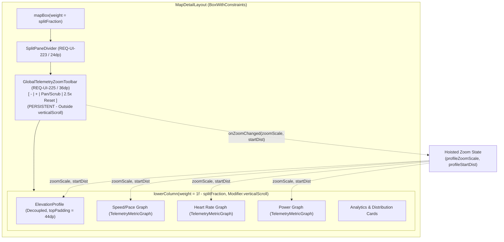

# Stage 3: Implementation Plan - ATT-1876: Persistent Sticky Global Zoom Toolbar Between Map and Telemetry Graphs

**Ticket**: [ATT-1876](https://rainerblind.atlassian.net/browse/ATT-1876)  
**Sub-task**: [ATT-1919](https://rainerblind.atlassian.net/browse/ATT-1919) (`[Plan]`)  
**Parent Epic**: [ATT-111](https://rainerblind.atlassian.net/browse/ATT-111) (*Aftermath: Compact Post-Workout Visual Analytics & Graphs*)  
**Target Release**: `V4.9.38`  
**Active Sprint**: `2026-40.8`  
**Requirement Mapping**: `REQ-UI-225` (*Aftermath/Graphs: Persistent Sticky Global Zoom Toolbar Between Map and Telemetry Graphs*)  
**Test Spec ID**: `TST-UI-179`  
**Branch**: `feature/ATT-1876`  
**Author**: AI Agent 1 (Implementer)  
**Date**: 2026-10-02  

---

## 1. Architectural Strategy & SWE.2 Design

The objective of `ATT-1876` is to extract the horizontal zoom controls from `ElevationProfile.kt` and promote them to a persistent, sticky global toolbar (`GlobalTelemetryZoomToolbar`) positioned directly between the map viewport (or `SplitPaneDivider`) and the scrollable lower telemetry container in `MapDetailLayout.kt`.



### Key Architectural Advantages:
1. **Stationary Accessibility**: Positioned directly beneath `SplitPaneDivider` outside `Modifier.verticalScroll(...)`, the zoom controls never scroll out of view, regardless of how far the athlete scrolls down into Speed, HR, Power, or lap splits.
2. **True Component Encapsulation**: ElevationProfile is no longer burdened with global controls that affect sibling charts.
3. **Vertical Space Recovery**: Removing the embedded button row allows `ElevationProfile` canvas top padding to decrease from `72.dp` to `44.dp` (with `ScrubbingTelemetryBadge` positioned at `top = 4.dp`), reclaiming vertical screen real estate for the profile chart.
4. **Resilient SplitPane Math**: The height of `GlobalTelemetryZoomToolbar` (`36.dp`) is subtracted alongside `DIVIDER_TOUCH_HEIGHT` in `SplitPaneMath.calculateAvailableHeight`, ensuring that fraction scaling remains mathematically exact.

---

## 2. Localization Parity (9 Languages)

Define the following string keys across all 9 supported locales (`values/`, `values-de/`, `values-es/`, `values-fr/`, `values-it/`, `values-ja/`, `values-nl/`, `values-pl/`, `values-pt/`):
- `zoom_in`: Zoom in / Vergrößern / Acercar / Zoom avant / Ingrandisci / 拡大 / Inzoomen / Przybliż / Aproximar
- `zoom_out`: Zoom out / Verkleinern / Alejar / Zoom arrière / Rimpicciolisci / 縮小 / Uitzoomen / Oddal / Afastar
- `zoom_reset`: Reset zoom / Zoom zurücksetzen / Restablecer zoom / Réinitialiser le zoom / Reimposta zoom / ズームをリセット / Zoom resetten / Resetuj powiększenie / Redefinir zoom
- `zoom_pan_mode`: Pan mode / Verschiebemodus / Modo de desplazamiento / Mode panoramique / Modalità panoramica / パンモード / Verschuifmodus / Tryb przesuwania / Modo de deslocamento
- `zoom_scrub_mode`: Scrub mode / Scrub-Modus / Modo de exploración / Mode défilement / Modalità scorrimento / スクラブモード / Scrubmodus / Tryb przewijania / Modo de navegação

---

## 3. Atomic Implementation Steps

### Step 1: Add Localized Strings Across 9 Locales
- **Files**:
  - `app/src/main/res/values/strings.xml`
  - `app/src/main/res/values-de/strings.xml`
  - `app/src/main/res/values-es/strings.xml`
  - `app/src/main/res/values-fr/strings.xml`
  - `app/src/main/res/values-it/strings.xml`
  - `app/src/main/res/values-ja/strings.xml`
  - `app/src/main/res/values-nl/strings.xml`
  - `app/src/main/res/values-pl/strings.xml`
  - `app/src/main/res/values-pt/strings.xml`
- Add `zoom_in`, `zoom_out`, `zoom_reset`, `zoom_pan_mode`, `zoom_scrub_mode`.

### Step 2: Implement `GlobalTelemetryZoomToolbar.kt`
- **Location**: `app/src/main/java/com/atrainingtracker/trainingtracker/ui/components/core/GlobalTelemetryZoomToolbar.kt`
- Declare `object GlobalTelemetryZoomToolbarDefaults { val TOOLBAR_HEIGHT: Dp = 36.dp }`.
- Implement `@Composable fun GlobalTelemetryZoomToolbar(...)` with:
  - Zoom Out (`Icons.Default.Remove`) anchored via `applyZoomAtCentroid(targetZoom = zoomScale / 1.5f)`.
  - Zoom In (`Icons.Default.Add`) anchored via `applyZoomAtCentroid(targetZoom = zoomScale * 1.5f)`.
  - Pan / Scrub Mode Toggle (`Icons.Default.PanTool` / `Icons.Default.TouchApp`).
  - Current Zoom & Reset Pill (`"%.1fx"` + `Icons.Default.RestartAlt`, tapping restores `1.0f, 0.0`).
  - Material 3 container styling matching `SplitPaneDivider` surface tint.

### Step 3: Decouple Zoom Buttons in `ElevationProfile.kt`
- **Location**: `app/src/main/java/com/atrainingtracker/trainingtracker/ui/map/ElevationProfile.kt`
- Accept `isPanMode: Boolean = false` in `ElevationProfile` composable signature.
- Remove lines 718–812 (embedded buttons row `showZoomControls && cachedData.totalDist > 10.0`).
- Update `topPadding = if (showZoomControls) 44.dp else 16.dp`.
- Update `ScrubbingTelemetryBadge` padding to `top = 4.dp`.
- Retain `showLegend` icon button at `Alignment.TopEnd`.

### Step 4: Integrate Persistent Toolbar into `MapDetailLayout.kt`
- **Location**: `app/src/main/java/com/atrainingtracker/trainingtracker/ui/map/MapDetailLayout.kt`
- Declare `var isPanMode by remember(activeScrubPath) { mutableStateOf(false) }`.
- Compute `totalSpan`:
  ```kotlin
  val isTimeDomain = tuningConfig.profileXAxisDomain == ProfileXAxisDomain.TIME && (activeScrubPath?.lastOrNull()?.timeSec ?: 0) > 0
  val totalSpan = if (isTimeDomain) (activeScrubPath?.lastOrNull()?.timeSec ?: 0).toDouble() else (activeScrubPath?.lastOrNull()?.distance ?: 0.0)
  ```
- Account for `toolbarHeightPx` in `SplitPaneMath.calculateAvailableHeight(totalHeightPx, dividerHeightPx + toolbarHeightPx)`.
- Render `GlobalTelemetryZoomToolbar` directly beneath `SplitPaneDivider` inside `Column(modifier = Modifier.fillMaxSize())`.
- Pass `isPanMode` to `ElevationProfile(..., isPanMode = isPanMode)`.

### Step 5: Implement Pure Unit & Contract Tests
- **New Unit Tests**:
  - `app/src/test/java/com/atrainingtracker/trainingtracker/ui/components/core/GlobalTelemetryZoomToolbarTest.kt`
  - `app/src/test/java/com/atrainingtracker/trainingtracker/ui/map/ZoomToolbarLocalizationTest.kt`
- **Updated Contract Tests**:
  - `app/src/test/java/com/atrainingtracker/trainingtracker/ui/map/MapDetailLayoutTest.kt`
  - `app/src/test/java/com/atrainingtracker/trainingtracker/ui/map/ElevationProfileLayoutTest.kt`

### Step 6: Targeted Test Verification
- Run:
  ```bash
  ./gradlew testDebugUnitTest --tests "*ZoomToolbar*" --tests "*MapDetailLayoutTest*" --tests "*ElevationProfileLayoutTest*"
  ```

---

## 4. Invariant Protection & Verification

1. **Pinch-to-zoom on graph surface**: Pointer input gestures in `ElevationProfile.kt` and `TelemetryMetricGraph.kt` remain intact.
2. **Synchronized Cursor Parity**: Scrubbing cursor line appears at identical horizontal position across all stacked charts.
3. **SplitPane Dragging & Reset**: `SplitPaneDivider` continues supporting smooth vertical dragging and double-tap reset to 0.50f.
4. **Clean-Room Regression**: Full test suite `./gradlew testDebugUnitTest` must pass with 0 failures before Gate 5 closure.
