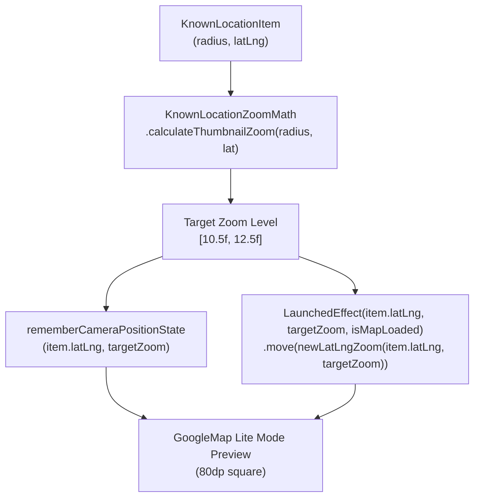

# Stage 3: Implementation Plan - ATT-1878: Calibrate Zoom Level on KnownLocationCard Map Thumbnail to Show Neighborhood Context

**Ticket**: [ATT-1878](https://rainerblind.atlassian.net/browse/ATT-1878)  
**Sub-task**: [ATT-1914](https://rainerblind.atlassian.net/browse/ATT-1914) (`[Plan]`)  
**Parent Epic**: [ATT-355](https://rainerblind.atlassian.net/browse/ATT-355) (*Good and consistent UI*)  
**Target Release**: `V4.9.38`  
**Active Sprint**: `2026-40.8`  
**Requirement Mapping**: `REQ-UI-224` (*Lieblingsorte: Calibrated Zoom Level and Dynamic Geofence Framing on KnownLocationCard Map Thumbnail*)  
**Test Spec ID**: `TST-UI-178`  
**Branch**: `feature/ATT-1878`  
**Author**: AI Agent 1 (Implementer)  
**Date**: 2026-10-02  

---

## 1. Architectural Strategy & SWE.2 Design

The objective is to replace the hardcoded `14.5f` camera zoom level in `KnownLocationThumbnailMap` with a calibrated, dynamic zoom algorithm that ensures:
1. The circular geofence boundary is fully contained with ample margin without edge clipping.
2. The surrounding neighborhood context (major roads, regional topology, district features) is clearly visible to athletes at a glance.
3. The calculation is decoupled into a pure, stateless Kotlin helper (`KnownLocationZoomMath`), providing 100% deterministic unit testability with zero Android UI dependencies.



---

## 2. Mathematical Formulation (`KnownLocationZoomMath.kt`)

In Google Maps Web Mercator projection, the visible ground width in meters across an 80dp thumbnail at zoom $Z$ and latitude $\phi$ is:
$$\text{visibleSpanMeters} = 80 \times \frac{156543.03392 \times \cos(\phi)}{2^Z}$$

To ensure the circular geofence with diameter $2R$ occupies approximately 35% ($\text{TARGET_GEOFENCE_DIAMETER_RATIO} = 0.35\text{f}$) of the thumbnail:
$$\text{targetSpanMeters} = \frac{2 \times R}{0.35}$$
Equating visible span to target span:
$$2^Z = \frac{80 \times 156543.03392 \times \cos(\phi) \times 0.35}{2 \times R} = \frac{14 \times 156543.03392 \times \cos(\phi)}{R}$$
$$Z = \log_2\left( \frac{2191602.47 \times \cos(\phi)}{R} \right) = \frac{\ln\left( \frac{2191602.47 \times \cos(\phi)}{R} \right)}{\ln(2)}$$

### Clamping Bounds
- **`MAX_ZOOM = 12.5f`**: For small geofences ($R \le 200\text{ m}$), zoom is clamped to $12.5\text{f}$. At $Z = 12.5\text{f}$, the visible span is $\approx 1.45\text{ km}$, ensuring athletes always see their surrounding neighborhood regardless of how small the geofence is.
- **`MIN_ZOOM = 10.5f`**: For large geofences ($R \ge 1000\text{ m}$), zoom is clamped to $10.5\text{f}$ ($\approx 5.8\text{ km}$ span), avoiding over-zooming out into unrelated regions.

---

## 3. Atomic Implementation Steps

### Step 1: Create `KnownLocationZoomMath.kt`
- **Location**: `app/src/main/java/com/atrainingtracker/trainingtracker/ui/knownlocations/KnownLocationZoomMath.kt`
- Declare `object KnownLocationZoomMath` with constants:
  - `DEFAULT_THUMBNAIL_ZOOM = 12.0f`
  - `MIN_ZOOM = 10.5f`
  - `MAX_ZOOM = 12.5f`
  - `TARGET_GEOFENCE_DIAMETER_RATIO = 0.35f`
- Implement `calculateThumbnailZoom(radiusMeters: Int, latitude: Double = 0.0): Float` with robust bounds checking.

### Step 2: Refactor `KnownLocationThumbnailMap` in `KnownLocationsScreen.kt`
- Hoist `targetZoom` using `remember(item.radius, item.latLng.latitude)`:
  ```kotlin
  val targetZoom = remember(item.radius, item.latLng.latitude) {
      KnownLocationZoomMath.calculateThumbnailZoom(item.radius, item.latLng.latitude)
  }
  ```
- Initialize camera: `CameraPosition.fromLatLngZoom(item.latLng, targetZoom)`.
- Update `LaunchedEffect`:
  ```kotlin
  LaunchedEffect(item.latLng, targetZoom, isMapLoaded) {
      if (isMapLoaded) {
          cameraPositionState.move(CameraUpdateFactory.newLatLngZoom(item.latLng, targetZoom))
      }
  }
  ```
- Remove all instances of hardcoded `14.5f`.

### Step 3: Implement Pure Unit Tests (`KnownLocationZoomMathTest.kt`)
- **Location**: `app/src/test/java/com/atrainingtracker/trainingtracker/ui/knownlocations/KnownLocationZoomMathTest.kt`
- Implement tests covering `[TST-UI-178.1]`:
  - `testDefaultZoom_isTwelve`
  - `testSmallRadii_clampedToMaxZoom`
  - `testMediumRadii_scalesProportionally`
  - `testLargeRadii_clampedToMinZoom`
  - `testLatitudeVariations_producesStableZoom`
  - `testDegenerateInputs_clampsGracefully`

### Step 4: Update Contract Tests in `KnownLocationCardLayoutTest.kt`
- **Location**: `app/src/test/java/com/atrainingtracker/trainingtracker/ui/knownlocations/KnownLocationCardLayoutTest.kt`
- Add tests covering `[TST-UI-178.2]`:
  - `testMapPreviewThumbnail_usesCalibratedZoomMath`
  - `testMapPreviewThumbnail_eliminatesHardcoded14_5Literal`

### Step 5: Verification & Clean-Room Regression
- Execute targeted unit tests:
  ```bash
  ./gradlew testDebugUnitTest --tests "*KnownLocation*"
  ```
- Execute full regression suite:
  ```bash
  ./gradlew testDebugUnitTest
  ```

---

## 4. Invariant Preservation Checklist

| Invariant | Verification Method |
| :--- | :--- |
| Google Maps lite mode (`liteMode(true)`) | `KnownLocationCardLayoutTest.testMapPreviewThumbnailLayoutAndLiteMode` |
| All map gestures disabled | Static inspection & contract test |
| 80dp square thumbnail & 12dp rounded corners | `KnownLocationCardLayoutTest.testMapPreviewThumbnailLayoutAndLiteMode` |
| Heart pin marker at `item.latLng` | Visual inspection & Compose preview |
| Offline preview fallback (`LocalInspectionMode.current`) | `KnownLocationCardLayoutTest.testMapPreviewThumbnailLayoutAndLiteMode` |
| Location card single-tap edit and long-press delete context menu | `GlobalDeleteContextMenuAuditTest` |
| Starts and routes badge rows | `KnownLocationCardLayoutTest.testAltitudeDecoupledFromBadgesRow` |
| Full clean-room test pass (0 regressions) | `./gradlew testDebugUnitTest` |
