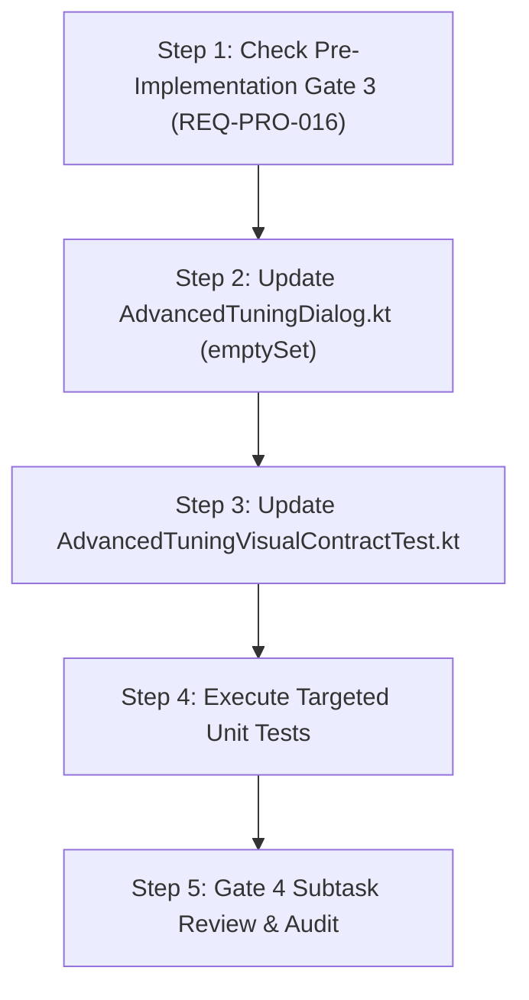

# Stage 3: Implementation Plan - ATT-1957: [Settings/UI] Advanced Settings Accordion Subsections Should Be Initially Collapsed

**Ticket**: [ATT-1957](https://rainerblind.atlassian.net/browse/ATT-1957)  
**Parent Epic**: [ATT-355](https://rainerblind.atlassian.net/browse/ATT-355) (*Good and consistent UI*)  
**Target Release**: `V4.9.38`  
**Active Sprint**: `2026-40.9`  
**Requirement Mapping**: `REQ-UI-222` (*Settings/UI: Modular, Collapsible Subsection Accordion Architecture for Advanced Settings*)  
**Test Mapping**: `TST-UI-187` (*Advanced Settings Initial Collapsed Accordion State Verification*)  
**Branch**: `feature/ATT-1957`  
**Author**: AI Agent 1 (Implementer)  
**Date**: 2026-10-02  

---

## 1. Problem Description & Background

In ticket ATT-1821 (`REQ-UI-222`), the 25+ parameters of `AdvancedTuningDialog.kt` were refactored into a modular, collapsible accordion architecture featuring 5 semantic subsections:
1. `COCKPIT_TYPOGRAPHY` (*Cockpit & Typografie*)
2. `BATTERY_SAVER` (*AMOLED & Akku-Sparmodus*)
3. `SENSORS_GPS` (*Sensoren, GPS & Filterung*)
4. `AFTERMATH_ANALYSIS` (*Aftermath & Profil-Analytik*)
5. `WORKOUT_MASKS_CARDS` (*Workout-Karten & Eingabemasken*)

Currently, `expandedSections` is initialized with `setOf(TuningSection.COCKPIT_TYPOGRAPHY.name)`. Consequently, every time an athlete opens the dialog, the Cockpit Typography section is expanded, forcing the user to scroll past font options and a large preview HUD card to reach other categories.

Under ATT-1957, all 5 accordion subsections will be initially collapsed by default (`expandedSections = emptySet<String>()`), providing an immediate, compact overview of all 5 category cards and their live active subtitles on launch.

---

## 2. Traceability & Requirements Mapping

* **Requirement**: `REQ-UI-222` (*Settings/UI: Modular, Collapsible Subsection Accordion Architecture for Advanced Settings*)
* **Test Mapping**: `TST-UI-187` (*Advanced Settings Initial Collapsed Accordion State Verification*)
* **Living Documentation**: `docs/requirements.md` (`REQ-UI-222`) and `docs/tests.md` (`TST-UI-187`).

---

## 3. System Invariants & Preserved Behavior

1. **Zero Unintended Regressions**: All existing unit and visual contract tests in `AdvancedTuningAccordionTest`, `AdvancedTuningAftermathContractTest`, and `AdvancedTuningVisualContractTest` must pass 100%.
2. **State Retention Across Rotation**: `rememberSaveable` continues to preserve the set of expanded sections across configuration changes (e.g. screen orientation flip).
3. **Independent Toggling**: Any collapsed subsection can be expanded independently by tapping its header, and multiple subsections can remain open simultaneously.
4. **Zero Tonal Elevation**: `TuningAccordionSection` retains `tonalElevation = 0.dp` per `REQ-UI-218`.
5. **DataStore Invariance**: No DataStore keys, default preference values, or reactive flows are altered.
6. **Subtask Self-Sufficiency**: Subtasks transition directly to `Erledigt` upon passing independent Gate audit via `freigabe`.
7. **Parent Human Gate Invariance**: Terminal completion of parent tickets remains reserved for the human user in `Final Review (Human)`.

---

## 4. Proposed Architectural Changes

### Component 1: `AdvancedTuningDialog.kt` (Presentation Layer)
* **File**: `app/src/main/java/com/atrainingtracker/trainingtracker/ui/settings/tuning/AdvancedTuningDialog.kt`
* **Change**:
  Line 99:
  ```kotlin
  // Multi-section expansion state tracked across configuration changes via string identifiers
  // Initially all sections are collapsed (emptySet) providing a clean, compact overview (ATT-1957)
  var expandedSections by rememberSaveable { mutableStateOf(emptySet<String>()) }
  ```

### Component 2: `AdvancedTuningVisualContractTest.kt` (Verification Layer)
* **File**: `app/src/test/java/com/atrainingtracker/trainingtracker/ui/settings/tuning/AdvancedTuningVisualContractTest.kt`
* **Change**:
  Add contract test `testAdvancedTuningDialog_initiallyCollapsesAllSections`:
  ```kotlin
  @Test
  fun testAdvancedTuningDialog_initiallyCollapsesAllSections() {
      val dialogFile = findSourceFile("src/main/java/com/atrainingtracker/trainingtracker/ui/settings/tuning/AdvancedTuningDialog.kt")
      val content = dialogFile.readText()

      // Verify emptySet initialization in rememberSaveable
      assertTrue(
          "AdvancedTuningDialog must initialize expandedSections with emptySet() (REQ-UI-222 / ATT-1957)",
          Regex("""var\s+expandedSections\s+by\s+rememberSaveable\s*\{\s*mutableStateOf\(\s*emptySet<String>\(\)\s*\)\s*\}""").containsMatchIn(content)
      )
      assertFalse(
          "AdvancedTuningDialog must NOT default-expand COCKPIT_TYPOGRAPHY (ATT-1957)",
          content.contains("setOf(TuningSection.COCKPIT_TYPOGRAPHY.name)")
      )
  }
  ```

---

## 5. Implementation Steps & Sequencing



### Atomic Implementation Step Breakdown:
1. **Pre-Implementation Gate Check**:
   - Verify Stage 3 subtask (`[Impl-Plan]`) is in status `Erledigt`.
2. **Modify `AdvancedTuningDialog.kt`**:
   - Update line 99 to initialize `expandedSections` with `emptySet<String>()`.
3. **Update `AdvancedTuningVisualContractTest.kt`**:
   - Add `testAdvancedTuningDialog_initiallyCollapsesAllSections`.
4. **Targeted Verification**:
   - Run:
     ```bash
     ./gradlew testDebugUnitTest --tests "com.atrainingtracker.trainingtracker.ui.settings.tuning.*"
     ```
5. **Gate 4 Completion**:
   - Update Stage 4 Jira subtask, move to `In Überprüfung`, audit with `tools/review_agent.py audit`, and transition to `Erledigt`.
