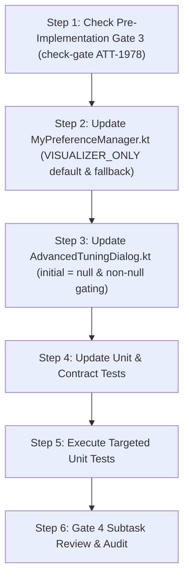

# Stage 3: Implementation Plan - ATT-1958: [Bug] [Settings/Aftermath] Fix Lap Display Mode Selection Persistence in Expert Settings and Change Default to Visualizer Only

**Ticket**: [ATT-1958](https://rainerblind.atlassian.net/browse/ATT-1958)  
**Parent Epic**: [ATT-111](https://rainerblind.atlassian.net/browse/ATT-111) (*Aftermath: Compact Post-Workout Visual Analytics & Graphs*)  
**Target Release**: `V4.9.38`  
**Active Sprint**: `2026-40.9`  
**Requirement Mapping**: `REQ-UI-229` (*Aftermath/Settings: Configurable Lap Section Display Mode (Table vs. Split Visualizer) in Advanced Settings*)  
**Test Mapping**: `TST-UI-188` (*Lap Display Mode Visualizer Default & Advanced Settings Dialog State Synchronization Verification*)  
**Branch**: `feature/ATT-1958`  
**Author**: AI Agent 1 (Implementer)  
**Date**: 2026-10-02  

---

## 1. Problem Description & Background

During Sprint Review of ATT-1870, two issues were identified regarding `lapDisplayMode` in `AdvancedTuningDialog.kt` and `MyPreferenceManager.kt`:

1. **State Desynchronization on Re-opening Dialog**:
   When an athlete changes `lapDisplayMode` in Advanced Settings (*Workout-Karten & Eingabemasken*) and saves, the preference is saved to disk and applied to the workout list. However, upon reopening `AdvancedTuningDialog`, the 3-way FilterChip selector continues to display the fallback setting (`BOTH`).
   *Root Cause*: `preferenceManager.workoutCardPreferencesFlow.collectAsState(initial = WorkoutCardSectionPreferences())` provides a dummy initial fallback object on frame 0. `LaunchedEffect` triggers on frame 0, assigns this dummy object to `workoutCardPrefs`, and sets `isAftermathPrefsInitialized = true`. When the real persisted values arrive from DataStore on frame 1, `isAftermathPrefsInitialized` is already `true`, silently dropping the real persisted preference.

2. **Default Presentation Mode**:
   Defaulting to `LapDisplayMode.BOTH` creates stacked duplicate representations (both the classic table and the split visualizer) out-of-the-box. Per product direction, the default mode out-of-the-box for fresh installations and factory resets must be changed to `LapDisplayMode.VISUALIZER_ONLY` (Split Visualizer only), with the option to select `TABLE_ONLY` or `BOTH` preserved via Advanced Settings.

---

## 2. Traceability & Requirements Mapping

* **Requirement**: `REQ-UI-229` (*Aftermath/Settings: Configurable Lap Section Display Mode (Table vs. Split Visualizer) in Advanced Settings*)
* **Test Mapping**: `TST-UI-188` (*Lap Display Mode Visualizer Default & Advanced Settings Dialog State Synchronization Verification*)
* **Living Documentation**: `docs/requirements.md` (`REQ-UI-229`) and `docs/tests.md` (`TST-UI-188`).

---

## 3. System Invariants & Preserved Behavior

1. **Zero Unintended Regressions**: All unit tests in `LapDisplayModePreferencesTest`, `LapDisplayModeSettingsTest`, `WorkoutLapsDisplayModeTest`, and `AdvancedTuningVisualContractTest` must pass 100%.
2. **Interactive Lap Editing**: Tapping any lap split in `LapSplitVisualizer` or row in `LapRow` must continue to open `LapEditBottomSheet` across all display modes (`VISUALIZER_ONLY`, `TABLE_ONLY`, `BOTH`).
3. **DataStore Integrity**: Preference persistence continues using key `workout_card_lap_display_mode` with safe fallback deserialization.
4. **9-Language Localization**: Display strings across all 3 modes remain fully localized in EN, DE, ES, FR, IT, JA, NL, PL, and PT.
5. **Human Gate Invariance**: Terminal transition on parent ticket `ATT-1958` is strictly `Final Review (Human)`. AI agents must never move parents to `Erledigt`.

---

## 4. Proposed Architectural Changes

### Component 1: `MyPreferenceManager.kt` (Data & Preference Layer)
* **File**: `app/src/main/java/com/atrainingtracker/trainingtracker/MyPreferenceManager.kt`
* **Changes**:
  1. Update `WorkoutCardSectionPreferences` default constructor:
     ```kotlin
     val lapDisplayMode: LapDisplayMode = LapDisplayMode.VISUALIZER_ONLY
     ```
  2. Update fallback deserialization in `workoutCardPreferencesFlow`:
     ```kotlin
     lapDisplayMode = try {
         val rawMode = preferences[WORKOUT_CARD_LAP_DISPLAY_MODE]
         if (rawMode != null) LapDisplayMode.valueOf(rawMode) else LapDisplayMode.VISUALIZER_ONLY
     } catch (e: Exception) {
         LapDisplayMode.VISUALIZER_ONLY
     }
     ```

### Component 2: `AdvancedTuningDialog.kt` (Presentation Layer)
* **File**: `app/src/main/java/com/atrainingtracker/trainingtracker/ui/settings/tuning/AdvancedTuningDialog.kt`
* **Changes**:
  1. Collect flows with `initial = null` instead of dummy fallback objects:
     ```kotlin
     val persistedWorkoutCardPrefs by preferenceManager.workoutCardPreferencesFlow.collectAsState(initial = null)
     val persistedEditWorkoutPrefs by preferenceManager.editWorkoutFieldPreferencesFlow.collectAsState(initial = null)
     ```
  2. Gate initialization on first non-null emission:
     ```kotlin
     LaunchedEffect(persistedWorkoutCardPrefs, persistedEditWorkoutPrefs) {
         val cardPrefs = persistedWorkoutCardPrefs
         val editPrefs = persistedEditWorkoutPrefs
         if (!isAftermathPrefsInitialized && cardPrefs != null && editPrefs != null) {
             workoutCardPrefs = cardPrefs
             editWorkoutPrefs = editPrefs
             isAftermathPrefsInitialized = true
         }
     }
     ```

### Component 3: Test Verification Updates
* **File 1**: `app/src/test/java/com/atrainingtracker/trainingtracker/settings/LapDisplayModePreferencesTest.kt`
  - Update default and fallback assertions to expect `LapDisplayMode.VISUALIZER_ONLY`.
* **File 2**: `app/src/test/java/com/atrainingtracker/trainingtracker/ui/settings/tuning/LapDisplayModeSettingsTest.kt`
  - Update default and reset assertions to expect `LapDisplayMode.VISUALIZER_ONLY`.
* **File 3**: `app/src/test/java/com/atrainingtracker/trainingtracker/ui/settings/tuning/AdvancedTuningVisualContractTest.kt`
  - Add contract test verifying `initial = null` flow collection in `AdvancedTuningDialog.kt`.

---

## 5. Implementation Steps & Sequencing



### Atomic Implementation Step Breakdown:
1. **Pre-Implementation Gate Check**:
   - Verify Stage 3 subtask (`[Impl-Plan]`) is in status `Erledigt` via `python3 tools/jira_util.py check-gate <KEY>`.
2. **Modify `MyPreferenceManager.kt`**:
   - Change `lapDisplayMode` default in `WorkoutCardSectionPreferences` and fallback logic in `workoutCardPreferencesFlow` to `LapDisplayMode.VISUALIZER_ONLY`.
3. **Modify `AdvancedTuningDialog.kt`**:
   - Change `persistedWorkoutCardPrefs` and `persistedEditWorkoutPrefs` collection to `initial = null`.
   - Update `LaunchedEffect` to gate initialization on non-null values.
4. **Update Tests**:
   - Update `LapDisplayModePreferencesTest.kt` and `LapDisplayModeSettingsTest.kt`.
   - Add contract check to `AdvancedTuningVisualContractTest.kt`.
5. **Targeted Verification**:
   - Execute:
     ```bash
     ./gradlew testDebugUnitTest --tests "com.atrainingtracker.trainingtracker.settings.LapDisplayMode*" --tests "com.atrainingtracker.trainingtracker.ui.settings.tuning.*"
     ```
6. **Gate 4 Completion**:
   - Update Stage 4 Jira subtask, move to `In Überprüfung`, audit with `tools/review_agent.py audit`, and transition to `Erledigt`.
