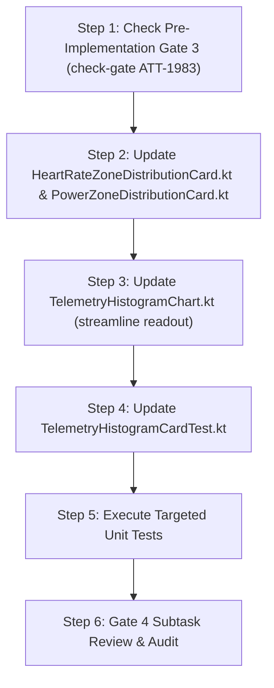

# Stage 3: Implementation Plan - ATT-1959: [Aftermath/Zones] Refine Zone Card Header Layout and Streamline Telemetry Histogram Readout

**Ticket**: [ATT-1959](https://rainerblind.atlassian.net/browse/ATT-1959)  
**Parent Epic**: [ATT-111](https://rainerblind.atlassian.net/browse/ATT-111) (*Aftermath: Compact Post-Workout Visual Analytics & Graphs*)  
**Target Release**: `V4.9.38`  
**Active Sprint**: `2026-40.9`  
**Requirement Mapping**: `REQ-UI-231` (*Aftermath/Zones: Fine-Grained Telemetry Frequency Histogram (BPM & Wattage Bins) with Zone Color Shading*)  
**Test Mapping**: `TST-UI-189` (*Zone Card Header Row Layout, Bottom Toggle Placement & Streamlined Readout Verification*)  
**Branch**: `feature/ATT-1959`  
**Author**: AI Agent 1 (Implementer)  
**Date**: 2026-10-02  

---

## 1. Problem Description & Background

In ticket ATT-1845 (`REQ-UI-231`), fine-grained frequency histograms were introduced for Heart Rate and Power zone distribution cards. During on-device inspection on Google Pixel 10, two layout issues were noted:
1. **Header Row Overcrowding**: In both `HeartRateZoneDistributionCard.kt` and `PowerZoneDistributionCard.kt`, placing `SingleChoiceSegmentedButtonRow` in the same horizontal row as the icon, localized card title, and total active duration squeezes the duration text into a 1-character-wide column, forcing characters to wrap vertically.
2. **Streamlined Readout**: In `TelemetryHistogramChart.kt`, the unscrubbed default readout line includes a middle label (`"X active bins"`), which is hardcoded in English and adds visual noise without actionable training utility.

Under ATT-1959, the header row will be simplified to host only the icon, title, spacer, and total active duration. The view mode toggle will be positioned cleanly below the chart, centered horizontally. The default histogram readout line will be streamlined by removing the active bins label, leaving range on the left and bin width delta on the right.

---

## 2. Traceability & Requirements Mapping

* **Requirement**: `REQ-UI-231` (*Aftermath/Zones: Fine-Grained Telemetry Frequency Histogram (BPM & Wattage Bins) with Zone Color Shading*)
* **Test Mapping**: `TST-UI-189` (*Zone Card Header Row Layout, Bottom Toggle Placement & Streamlined Readout Verification*)
* **Living Documentation**: `docs/requirements.md` (`REQ-UI-231`) and `docs/tests.md` (`TST-UI-189`).

---

## 3. System Invariants & Preserved Behavior

1. **Zero Unintended Regressions**: All unit tests in `TelemetryHistogramCalculatorTest`, `TelemetryHistogramLocalizationTest`, and `TelemetryHistogramCardTest` must pass 100%.
2. **Interactive Scrubbing**: Touching or dragging across histogram bars continues to highlight the bin and show its range, duration, percentage, and zone index.
3. **5-Zone View Parity**: Default view mode remains `FIVE_ZONES` rendering `ZoneDistributionColumnChart`.
4. **9-Language Localization**: `zone_mode_5_zones` and `zone_mode_histogram` remain fully localized across all 9 locales.
5. **Human Gate Invariance**: Terminal transition on parent ticket `ATT-1959` remains strictly `Final Review (Human)`.

---

## 4. Proposed Architectural Changes

### Component 1 & 2: `HeartRateZoneDistributionCard.kt` & `PowerZoneDistributionCard.kt`
* **Files**:
  - `app/src/main/java/com/atrainingtracker/trainingtracker/ui/aftermath/zones/HeartRateZoneDistributionCard.kt`
  - `app/src/main/java/com/atrainingtracker/trainingtracker/ui/aftermath/zones/PowerZoneDistributionCard.kt`
* **Changes**:
  1. Remove `SingleChoiceSegmentedButtonRow` from the header `Row`:
     ```kotlin
     // Header Row: Leading Icon + Title + Flexible Spacer + Total Duration
     Row(
         modifier = Modifier.fillMaxWidth(),
         verticalAlignment = Alignment.CenterVertically
     ) {
         Icon(...)
         Spacer(modifier = Modifier.width(8.dp))
         Text(text = stringResource(...), ...)
         Spacer(modifier = Modifier.weight(1f))
         Text(text = ZoneDistributionChartMath.formatZoneDuration(distribution.totalActiveTimeSec), ...)
     }
     ```
  2. Add dedicated bottom toggle row below the chart body:
     ```kotlin
     // Body
     when (displayMode) {
         ZoneCardDisplayMode.FIVE_ZONES -> ZoneDistributionColumnChart(...)
         ZoneCardDisplayMode.HISTOGRAM -> TelemetryHistogramChart(...)
     }

     // Bottom Mode Switcher
     if (distribution.histogram != null) {
         Row(
             modifier = Modifier.fillMaxWidth(),
             horizontalArrangement = Arrangement.Center
         ) {
             SingleChoiceSegmentedButtonRow(
                 modifier = Modifier.height(28.dp)
             ) {
                 SegmentedButton(
                     selected = displayMode == ZoneCardDisplayMode.FIVE_ZONES,
                     onClick = { displayMode = ZoneCardDisplayMode.FIVE_ZONES },
                     shape = SegmentedButtonDefaults.itemShape(index = 0, count = 2),
                     icon = {},
                     contentPadding = PaddingValues(horizontal = 8.dp, vertical = 0.dp)
                 ) {
                     Text(
                         text = stringResource(R.string.zone_mode_5_zones),
                         style = MaterialTheme.typography.labelSmall
                     )
                 }
                 SegmentedButton(
                     selected = displayMode == ZoneCardDisplayMode.HISTOGRAM,
                     onClick = { displayMode = ZoneCardDisplayMode.HISTOGRAM },
                     shape = SegmentedButtonDefaults.itemShape(index = 1, count = 2),
                     icon = {},
                     contentPadding = PaddingValues(horizontal = 8.dp, vertical = 0.dp)
                 ) {
                     Text(
                         text = stringResource(R.string.zone_mode_histogram),
                         style = MaterialTheme.typography.labelSmall
                     )
                 }
             }
         }
     }
     ```

### Component 3: `TelemetryHistogramChart.kt`
* **File**: `app/src/main/java/com/atrainingtracker/trainingtracker/ui/aftermath/zones/TelemetryHistogramChart.kt`
* **Change**:
  Remove the middle `Text("${histogram.bins.count { it.durationSec > 0 }} active bins", ...)` in the unscrubbed `else` block of the readout header line:
  ```kotlin
  } else {
      Text(
          text = "${histogram.dataMin}–${histogram.dataMax} $unit",
          style = MaterialTheme.typography.labelSmall,
          color = MaterialTheme.colorScheme.onSurfaceVariant
      )
      Text(
          text = "Δ ${histogram.binWidth} $unit",
          style = MaterialTheme.typography.labelSmall,
          fontWeight = FontWeight.Bold,
          color = MaterialTheme.colorScheme.primary
      )
  }
  ```

### Component 4: Test Verification Updates
* **File**: `app/src/test/java/com/atrainingtracker/trainingtracker/ui/aftermath/zones/TelemetryHistogramCardTest.kt`
* **Changes**:
  - Add structural contract test verifying header row and bottom toggle placement in `HeartRateZoneDistributionCard.kt` and `PowerZoneDistributionCard.kt`.
  - Add structural contract test verifying removal of `"active bins"` in `TelemetryHistogramChart.kt`.

---

## 5. Implementation Steps & Sequencing



### Atomic Implementation Step Breakdown:
1. **Pre-Implementation Gate Check**:
   - Verify Stage 3 subtask (`[Impl-Plan]`) is in status `Erledigt` via `python3 tools/jira_util.py check-gate <KEY>`.
2. **Modify `HeartRateZoneDistributionCard.kt` and `PowerZoneDistributionCard.kt`**:
   - Decouple toggle from header row; place centered below chart.
3. **Modify `TelemetryHistogramChart.kt`**:
   - Remove `"active bins"` label from default resting readout.
4. **Update `TelemetryHistogramCardTest.kt`**:
   - Add contract tests for layout and readout invariants.
5. **Targeted Verification**:
   - Execute:
     ```bash
     ./gradlew testDebugUnitTest --tests "com.atrainingtracker.trainingtracker.ui.aftermath.zones.*"
     ```
6. **Gate 4 Completion**:
   - Update Stage 4 Jira subtask, move to `In Überprüfung`, audit with `tools/review_agent.py audit`, and transition to `Erledigt`.
