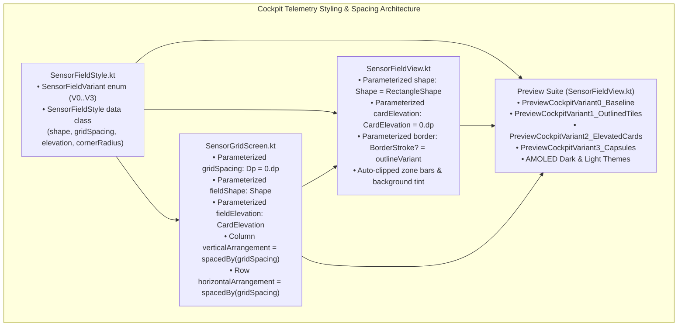

# Stage 3: Implementation Plan - ATT-2058: Visual Evaluation & Prototyping: Rounded Corners & Tile Spacing Variants for SensorFieldView

**Ticket**: [ATT-2058](https://rainerblind.atlassian.net/browse/ATT-2058)  
**Sub-task**: [ATT-2228](https://rainerblind.atlassian.net/browse/ATT-2228) (`[Impl-Plan]`)  
**Parent Epic**: [ATT-355](https://rainerblind.atlassian.net/browse/ATT-355) (*Good and consistent UI*)  
**Target Release**: `V4.9.39`  
**Active Sprint**: `Sprint 2026-40.14`  
**Requirement Mapping**: `REQ-UI-258` (*Cockpit Sensor Field Visual Styling Architecture & Grid Spacing Prototyping Variants*)  
**Test Spec Mapping**: `TST-UI-217` (*Cockpit Sensor Field Visual Styling Architecture & Grid Spacing Prototyping Verification*)  
**Branch**: `feature/ATT-2058`  
**Author**: AI Agent 1 (Implementer)  
**Date**: 2026-10-03  

---

## 1. Architectural Design & SWE.2 Component Decomposition



### Component Boundaries & Clean Architecture
1. **Design System Domain (`SensorFieldStyle.kt`)**:
   - Location: `app/src/main/java/com/atrainingtracker/trainingtracker/ui/tracking/SensorFieldStyle.kt`
   - Encapsulates `SensorFieldVariant` and `SensorFieldStyle` defining properties for:
     - `Variant0_Baseline`: `shape = RectangleShape`, `gridSpacing = 0.dp`, `defaultElevation = 0.dp`.
     - `Variant1_OutlinedTiles`: `shape = RoundedCornerShape(6.dp)`, `gridSpacing = 4.dp`, `defaultElevation = 0.dp`.
     - `Variant2_ElevatedCards`: `shape = RoundedCornerShape(8.dp)`, `gridSpacing = 6.dp`, `defaultElevation = 2.dp`.
     - `Variant3_Capsules`: `shape = RoundedCornerShape(12.dp)`, `gridSpacing = 8.dp`, `defaultElevation = 1.dp`.
2. **Telemetry Tile Presentation (`SensorFieldView.kt`)**:
   - Parameterizes `shape`, `cardElevation`, and `border` with default values matching the current baseline.
   - Ensures child composables (such as the 6dp left zone bar and zone background tint) clip seamlessly within rounded card boundaries.
3. **Grid Layout Coordinator (`SensorGridScreen.kt`)**:
   - Parameterizes `gridSpacing`, `fieldShape`, and `fieldElevation` with defaults (`0.dp`, `RectangleShape`, `0.dp`).
   - Dynamically applies `spacedBy(gridSpacing)` to rows and columns when `gridSpacing > 0.dp`.
4. **Visual Prototyping Preview Suite (`SensorFieldView.kt`)**:
   - Implements dedicated Compose previews rendering realistic multi-tile cockpits (Heart Rate in Zone 4, Speed, Cadence, Active Time) across all 4 variants in both AMOLED Pure Black (`#000000`) and Light Mode.

---

## 2. Atomic Implementation Step Sequence

### Step 1: Create `SensorFieldStyle.kt`
- Create `app/src/main/java/com/atrainingtracker/trainingtracker/ui/tracking/SensorFieldStyle.kt`.
- Define `enum class SensorFieldVariant` and `data class SensorFieldStyle` with the 4 canonical variant definitions.

### Step 2: Parameterize `SensorFieldView.kt`
- Add optional parameters to `SensorFieldView`:
  ```kotlin
  shape: Shape = RectangleShape,
  cardElevation: CardElevation = CardDefaults.cardElevation(defaultElevation = 0.dp),
  border: BorderStroke? = if (isSelectedForMove) {
      BorderStroke(2.dp, MaterialTheme.colorScheme.primary)
  } else {
      BorderStroke(1.dp, MaterialTheme.colorScheme.outlineVariant)
  }
  ```
- Pass `shape = shape`, `elevation = cardElevation`, and `border = border` to `Card`.

### Step 3: Parameterize `SensorGridScreen.kt`
- Add optional parameters to `SensorGridScreen`:
  ```kotlin
  gridSpacing: Dp = 0.dp,
  fieldShape: Shape = RectangleShape,
  fieldElevation: CardElevation = CardDefaults.cardElevation(defaultElevation = 0.dp)
  ```
- Configure `Column` `verticalArrangement = if (gridSpacing > 0.dp) Arrangement.spacedBy(gridSpacing) else Arrangement.Top`.
- Configure `Row` `horizontalArrangement = if (gridSpacing > 0.dp) Arrangement.spacedBy(gridSpacing) else Arrangement.Start`.
- Pass `fieldShape` and `fieldElevation` down to `SensorFieldView`.

### Step 4: Author Compose Preview Suite
- In `SensorFieldView.kt`, author realistic 4-tile mock cockpit previews for:
  1. `PreviewCockpitVariant0_Baseline`
  2. `PreviewCockpitVariant1_OutlinedTiles`
  3. `PreviewCockpitVariant2_ElevatedCards`
  4. `PreviewCockpitVariant3_Capsules`
  5. `PreviewCockpitVariantsComparison` (side-by-side)
  with `@Preview` annotations for AMOLED Dark Mode and Light Mode.

### Step 5: Author Unit and Contract Tests
- Target file: `app/src/test/java/com/atrainingtracker/trainingtracker/ui/tracking/SensorFieldStyleContractTest.kt`.
- Test cases:
  1. `testDefaultParameters_preserveProductionBaseline`
  2. `testVariant0_baselineMetrics`
  3. `testVariant1_outlinedTilesMetrics`
  4. `testVariant2_elevatedCardsMetrics`
  5. `testVariant3_capsuleMetrics`
  6. `testSelectionBorder_appliesAcrossAllShapes`
  7. `testPreviewDeclarationsExistInCodebase`

---

## 3. Targeted Test Verification Commands

```bash
# Execute targeted contract test
./gradlew testDebugUnitTest --tests "com.atrainingtracker.trainingtracker.ui.tracking.SensorFieldStyleContractTest"

# Execute translation parity test
./gradlew testDebugUnitTest --tests "com.atrainingtracker.trainingtracker.localization.TranslationParityTest"

# Execute full clean-room suite
./gradlew testDebugUnitTest
```

---

## 4. Rollback & Invariant Checklist

| Check | Constraint | Status |
| :--- | :--- | :--- |
| **Production Invariance** | Default invocation of `SensorFieldView` and `SensorGridScreen` retains 100% visual parity with baseline (Variant 0) | Strictly preserved |
| **Pick & Place (`REQ-UI-200`)** | Long-press selection, primary 2dp border, `ColAdder`, `RowAdder`, field swap intact | Strictly preserved |
| **AMOLED Contrast (`REQ-UI-171`)** | Numeric readouts remain `#FFFFFF`, SemiBold; labels remain `#9E9E9E` | Strictly preserved |
| **No Schema Change** | SQLite database schemas and migrations untouched | Confirmed |
| **9-Language Parity** | Zero missing translation keys | Confirmed |
