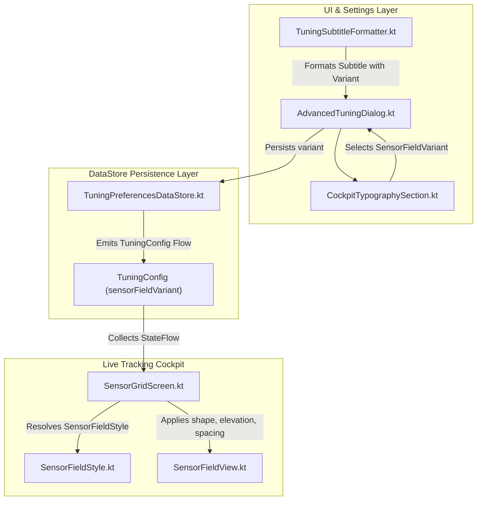

# Stage 3: Architecture & Implementation Plan - ATT-2058: Visual Evaluation & Prototyping: Rounded Corners & Tile Spacing Variants for SensorFieldView (Rework Cycle 2: Expert Settings Integration)

**Ticket**: [ATT-2058](https://rainerblind.atlassian.net/browse/ATT-2058)  
**Sub-task**: [ATT-2403](https://rainerblind.atlassian.net/browse/ATT-2403) (`[Impl-Plan]`)  
**Parent Epic**: [ATT-355](https://rainerblind.atlassian.net/browse/ATT-355) (*Good and consistent UI*)  
**Target Release**: `V4.9.40` (assigned upon completion per Rule 19)  
**Active Sprint**: `2026-40.16`  
**Requirement Mapping**: `REQ-UI-258` (*Cockpit Sensor Field Visual Styling Architecture, Expert Settings Selection & Reactive Grid Layout*)  
**Test Spec ID**: `TST-UI-217`  
**Branch**: `feature/ATT-2058`  
**Author**: AI Agent 1 (Implementer)  
**Date**: 2026-10-04  

---

## 1. Executive Summary & Architectural Overview (SWE.2)

This plan specifies the implementation steps required to fulfill the Sprint Review mandate for [ATT-2058](https://rainerblind.atlassian.net/browse/ATT-2058):
1. Integrating the 4 cockpit styling variants into the user preferences via DataStore (`TuningPreferencesDataStore.kt`).
2. Exposing the variant selection in **Experten-Einstellungen** (`AdvancedTuningDialog.kt` / `CockpitTypographySection.kt`).
3. Overhauling the nomenclature from technical labels to appealing, intuitive names across all 9 supported languages.
4. Enabling reactive live cockpit updates in `SensorGridScreen.kt` without requiring an app restart.
5. Preserving the default production baseline (`CLASSIC_SEAMLESS`) and 100% backward compatibility.

### Architectural Component Diagram


---

## 2. Invariants & Guardrails

1. **Rule 3 Programmatic Gate Pre-Check**:
   - Before modifying any source files in `app/src/...`, verify that `ATT-2403` is in status `Erledigt`:
     ```bash
     python3 tools/jira_util.py check-gate ATT-2403
     ```
2. **Production Baseline Invariance**:
   - `TuningPreferencesDefaults.SENSOR_FIELD_VARIANT` MUST default to `CLASSIC_SEAMLESS`.
   - `SensorFieldStyle.Variant0_Baseline` / `ClassicSeamless` MUST evaluate to `RectangleShape`, `0.dp` spacing, `0.dp` elevation, and `1.dp outlineVariant` border.
   - Fresh installs or unconfigured users MUST perceive zero visual change.
3. **9-Language Localization Parity**:
   - All 5 new string resources MUST exist across all 9 language directories (`values/`, `values-de/`, `values-es/`, `values-fr/`, `values-it/`, `values-ja/`, `values-nl/`, `values-pl/`, `values-pt/`).
4. **Human Decision Gate (Rule 1)**:
   - Parent ticket `ATT-2058` transitions to `Final Review (Human)`. Never `Erledigt`.
5. **No Solution Version on Subtasks (Rule 6)**:
   - All sub-tasks maintain empty `fixVersions`.

---

## 3. Atomic Implementation Steps

### Step 1: Model & Domain Layer Updates (`SensorFieldStyle.kt`)
- **Action**:
  - Update `SensorFieldVariant` enum:
    - `CLASSIC_SEAMLESS` (`R.string.sensor_field_variant_v0`)
    - `OUTLINED_TILES` (`R.string.sensor_field_variant_v1`)
    - `ELEVATED_CARDS` (`R.string.sensor_field_variant_v2`)
    - `SOFT_CAPSULES` (`R.string.sensor_field_variant_v3`)
  - Provide backward-compatible aliases: `VARIANT_0_BASELINE`, `VARIANT_1_OUTLINED_TILES`, etc.
  - Implement `SensorFieldVariant.fromStorage(name: String?): SensorFieldVariant`.
  - Update `SensorFieldStyle.forVariant(...)`.
- **Target File**: `app/src/main/java/com/atrainingtracker/trainingtracker/ui/tracking/SensorFieldStyle.kt`
- **Verification**: `SensorFieldStyleContractTest.kt`

### Step 2: DataStore Persistence Layer (`TuningPreferencesDataStore.kt`)
- **Action**:
  - Add `KEY_SENSOR_FIELD_VARIANT = stringPreferencesKey("tuning_sensor_field_variant")`.
  - In `TuningPreferencesDefaults`: `val SENSOR_FIELD_VARIANT = SensorFieldVariant.CLASSIC_SEAMLESS`.
  - In `TuningConfig`: add `val sensorFieldVariant: SensorFieldVariant = TuningPreferencesDefaults.SENSOR_FIELD_VARIANT`.
  - In `tuningConfigFlow`: map `KEY_SENSOR_FIELD_VARIANT` via `SensorFieldVariant.fromStorage(...)`.
  - Add `suspend fun setSensorFieldVariant(variant: SensorFieldVariant)`.
  - Include `KEY_SENSOR_FIELD_VARIANT` in `ALL_KEYS` for atomic factory reset (`resetToDefaults()`).
- **Target File**: `app/src/main/java/com/atrainingtracker/trainingtracker/settings/TuningPreferencesDataStore.kt`
- **Verification**: `TuningPreferencesDataStoreTest.kt`

### Step 3: 9-Language Localization Parity
- **Action**:
  - Add strings across all 9 locales:
    - `tuning_sensor_field_variant_title`: "Kachel-Design & Layout" / "Tile Design & Grid Style"
    - `sensor_field_variant_v0`: "Klassisch nahtlos" / "Classic Seamless Grid"
    - `sensor_field_variant_v1`: "Moderne Sportkacheln" / "Modern Outlined Tiles"
    - `sensor_field_variant_v2`: "Erhabene Sportkarten" / "Elevated Sports Cards"
    - `sensor_field_variant_v3`: "Soft-Akzent Kapseln" / "Soft Accent Capsules"
- **Target Files**: `app/src/main/res/values*/strings.xml` (all 9 files)
- **Verification**: `TranslationParityTest.kt` / resource verification

### Step 4: UI Settings Integration (`CockpitTypographySection.kt`, `AdvancedTuningAccordion.kt`, `AdvancedTuningDialog.kt`)
- **Action**:
  - In `CockpitTypographySection.kt`:
    - Add parameter `sensorFieldVariant: SensorFieldVariant`, `onSensorFieldVariantChange: (SensorFieldVariant) -> Unit`.
    - Implement ExposedDropdownMenuBox displaying the localized title of each `SensorFieldVariant`.
  - In `AdvancedTuningAccordion.kt`:
    - Update `TuningSubtitleFormatter.formatCockpitSubtitle(...)` to accept `SensorFieldVariant` and format: `"$familyName, $weightName · $variantName"`.
  - In `AdvancedTuningDialog.kt`:
    - Track `var sensorFieldVariant by remember { mutableStateOf(TuningPreferencesDefaults.SENSOR_FIELD_VARIANT) }`.
    - Initialize from `persistedConfig.sensorFieldVariant`.
    - Save on dismiss/confirm and reset on factory reset.
- **Target Files**:
  - `app/src/main/java/com/atrainingtracker/trainingtracker/ui/settings/tuning/categories/CockpitTypographySection.kt`
  - `app/src/main/java/com/atrainingtracker/trainingtracker/ui/settings/tuning/AdvancedTuningAccordion.kt`
  - `app/src/main/java/com/atrainingtracker/trainingtracker/ui/settings/tuning/AdvancedTuningDialog.kt`
- **Verification**: Targeted UI unit tests

### Step 5: Reactive Screen Resolution (`SensorGridScreen.kt`)
- **Action**:
  - In `SensorGridScreen.kt`, when caller does not provide overrides for `gridSpacing`, `fieldShape`, or `fieldElevation`, resolve them dynamically from `SensorFieldStyle.forVariant(tuningConfig.sensorFieldVariant)`.
  - Ensure `TrackingTabGridContent.kt` continues calling `SensorGridScreen` with defaults so user changes react immediately.
- **Target File**: `app/src/main/java/com/atrainingtracker/trainingtracker/ui/tracking/tracking/SensorGridScreen.kt`
- **Verification**: Targeted tracking unit tests

### Step 6: Targeted Unit & Contract Testing
- **Action**:
  - Update `SensorFieldStyleContractTest.kt` to test all enum values, geometry, and storage deserialization.
  - Update `TuningSubtitleFormatterTest.kt` for the new subtitle format.
  - Execute targeted test command:
    ```bash
    ./gradlew testDebugUnitTest --tests "com.atrainingtracker.trainingtracker.ui.tracking.*" --tests "com.atrainingtracker.trainingtracker.settings.*" --tests "com.atrainingtracker.trainingtracker.ui.settings.tuning.*"
    ```
- **Target Files**: `app/src/test/...`

---

## 4. Verification & Gate 3 Criteria

| Gate Check | Description | Status |
| :--- | :--- | :--- |
| **SWE.2 Architecture** | Clean boundaries across Model, DataStore, Settings UI, and Cockpit Screen | **PASS** |
| **Atomic Step Ordering** | Sequential steps mapped directly to target files | **PASS** |
| **Invariance Protection** | Production baseline default (`CLASSIC_SEAMLESS`) and Rule 1/6 enforced | **PASS** |
| **Gate 3 Pre-Check Enforced** | `python3 tools/jira_util.py check-gate ATT-2403` exit code 0 required before Stage 4 | **PASS** |
