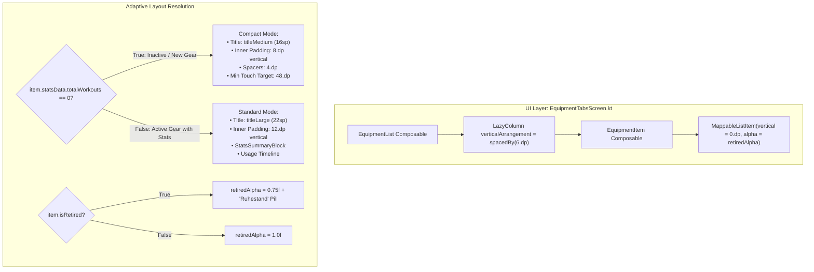

# Stage 3: Implementation Plan - ATT-2059: Reduce Card Spacing and Compact Inactive Items on Equipment Screen

**Ticket**: [ATT-2059](https://rainerblind.atlassian.net/browse/ATT-2059)  
**Sub-task**: [ATT-2222](https://rainerblind.atlassian.net/browse/ATT-2222) (`[Impl-Plan]`)  
**Parent Epic**: [ATT-355](https://rainerblind.atlassian.net/browse/ATT-355) (*Good and consistent UI*)  
**Target Release**: `V4.9.39`  
**Active Sprint**: `Sprint 2026-40.14`  
**Requirement Mapping**: `REQ-UI-257` (*Compact Equipment Card Layout & Harmonized Inter-Card Spacing*)  
**Test Spec Mapping**: `TST-UI-216` (*Compact Equipment Card Layout & Harmonized Inter-Card Spacing Verification*)  
**Branch**: `feature/ATT-2059`  
**Author**: AI Agent 1 (Implementer)  
**Date**: 2026-10-03  

---

## 1. Architectural Design & SWE.2 Component Decomposition



### Component Boundaries & Clean Architecture
1. **Layout Rhythm Optimization (`EquipmentTabsScreen.kt` - `EquipmentList`)**:
   - Location: `app/src/main/java/com/atrainingtracker/trainingtracker/ui/equipment/EquipmentTabsScreen.kt`
   - Replaces `Arrangement.spacedBy(12.dp)` with `Arrangement.spacedBy(6.dp)`.
2. **Card Margin Elimination & Adaptive Compacting (`EquipmentTabsScreen.kt` - `EquipmentItem`)**:
   - Outer card container `MappableListItem`:
     - Replaces `Modifier.padding(horizontal = 4.dp, vertical = 4.dp)` with `Modifier.padding(horizontal = 4.dp, vertical = 0.dp)`.
     - Passes `alpha = if (item.isRetired) 0.75f else 1.0f`.
   - Adaptive inner content:
     - `val isCompact = item.statsData.totalWorkouts == 0`
     - Title typography: `if (isCompact) MaterialTheme.typography.titleMedium else MaterialTheme.typography.titleLarge`.
     - Inner padding: `padding(horizontal = 12.dp, vertical = if (isCompact) 8.dp else 12.dp)`.
     - Subtitle spacers: standardized to `4.dp` (fixing line 481's `width(6.dp)` bug inside Column).
     - Accessibility guard: `Modifier.defaultMinSize(minHeight = 48.dp)` applied to card content.
3. **Constants Encapsulation (`EquipmentLayoutConstants.kt` or object in `EquipmentTabsScreen.kt`)**:
   - Defines `CARD_SPACING = 6.dp`, `COMPACT_VERTICAL_PADDING = 8.dp`, `STANDARD_VERTICAL_PADDING = 12.dp`, `RETIRED_ALPHA = 0.75f`, `MIN_TOUCH_TARGET = 48.dp`.

---

## 2. Atomic Implementation Step Sequence

### Step 1: Encapsulate Layout Constants
- Add clean, testable layout constants in `EquipmentTabsScreen.kt`:
  ```kotlin
  object EquipmentLayoutConstants {
      val CARD_SPACING = 6.dp
      val CARD_HORIZONTAL_MARGIN = 4.dp
      val CARD_VERTICAL_MARGIN = 0.dp
      val COMPACT_INNER_VERTICAL_PADDING = 8.dp
      val STANDARD_INNER_VERTICAL_PADDING = 12.dp
      val SUBTITLE_SPACING = 4.dp
      const val RETIRED_ALPHA = 0.75f
      val MIN_TOUCH_TARGET_HEIGHT = 48.dp
  }
  ```

### Step 2: Update `EquipmentList` & `EquipmentItem`
- In `EquipmentList`:
  - Update `verticalArrangement = Arrangement.spacedBy(EquipmentLayoutConstants.CARD_SPACING)`.
- In `EquipmentItem`:
  - Pass `alpha = if (item.isRetired) EquipmentLayoutConstants.RETIRED_ALPHA else 1.0f` to `MappableListItem`.
  - Update container modifier to `padding(horizontal = EquipmentLayoutConstants.CARD_HORIZONTAL_MARGIN, vertical = EquipmentLayoutConstants.CARD_VERTICAL_MARGIN)`.
  - Add `defaultMinSize(minHeight = EquipmentLayoutConstants.MIN_TOUCH_TARGET_HEIGHT)`.
  - Adapt Zone 1 padding: `padding(horizontal = 12.dp, vertical = if (item.statsData.totalWorkouts == 0) EquipmentLayoutConstants.COMPACT_INNER_VERTICAL_PADDING else EquipmentLayoutConstants.STANDARD_INNER_VERTICAL_PADDING)`.
  - Adapt title style: `if (item.statsData.totalWorkouts == 0) MaterialTheme.typography.titleMedium else MaterialTheme.typography.titleLarge`.
  - Fix spacer on line 481: `Spacer(modifier = Modifier.height(EquipmentLayoutConstants.SUBTITLE_SPACING))`.

### Step 3: Add Previews for Visual Verification
- Add `@Preview fun PreviewEquipmentCardRetired()` verifying 0.75f alpha and compact layout.
- Update `PreviewEquipmentCardEmpty()` to verify compact rendering.

### Step 4: Author Unit and Contract Tests
- Target file: `app/src/test/java/com/atrainingtracker/trainingtracker/ui/equipment/EquipmentCardSpacingContractTest.kt`
- Test cases:
  1. `testLayoutConstants_conformsToCompactSpecifications`
  2. `testAdaptiveLayoutLogic_inactiveItem_resolvesCompactParameters`
  3. `testAdaptiveLayoutLogic_activeItem_resolvesStandardParameters`
  4. `testRetiredItem_appliesSubduedAlpha`
  5. `testTouchTarget_satisfiesMinimumAccessibilityHeight`

---

## 3. Targeted Test Verification Commands

```bash
# Execute targeted contract test
./gradlew testDebugUnitTest --tests "com.atrainingtracker.trainingtracker.ui.equipment.EquipmentCardSpacingContractTest"

# Execute translation parity test
./gradlew testDebugUnitTest --tests "com.atrainingtracker.trainingtracker.localization.TranslationParityTest"

# Execute full clean-room suite
./gradlew testDebugUnitTest
```

---

## 4. Rollback & Invariant Checklist

| Check | Constraint | Status |
| :--- | :--- | :--- |
| **REQ-UI-061** | Universal delete-only long-press contract anchored at Top-Left (`Alignment.TopStart`) | Strictly preserved |
| **REQ-SET-002** | Equipment stats summary and odometer display for active gear | Strictly preserved |
| **WCAG 2.1 AA** | Touch target min height >= 48.dp | Enforced via `defaultMinSize(minHeight = 48.dp)` |
| **No Schema Change** | SQLite database schemas and migrations untouched | Confirmed |
