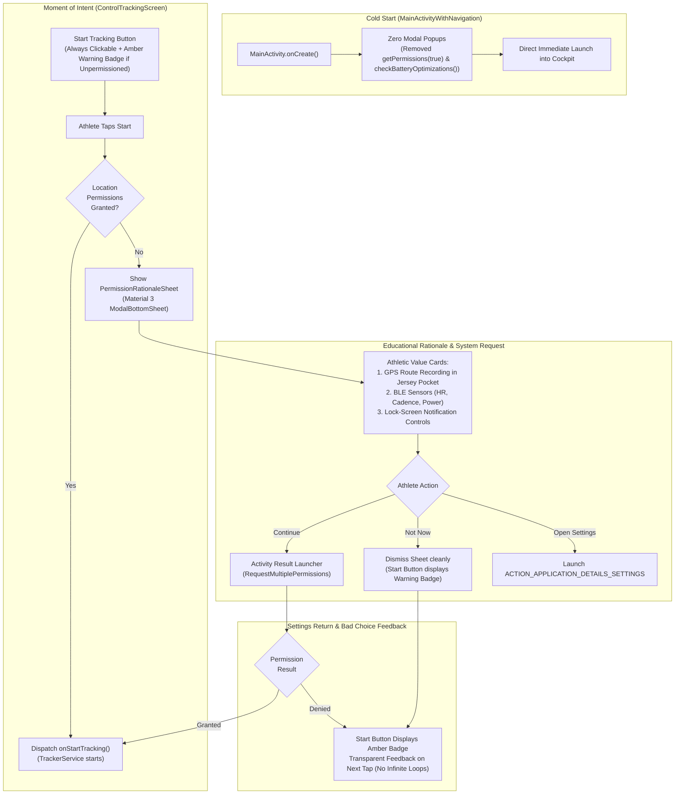

# Stage 3: Implementation Plan - ATT-2075: Modernize Permission Flow: Contextual Just-in-Time Prompts & Graceful Settings Return Handling

**Ticket**: [ATT-2075](https://rainerblind.atlassian.net/browse/ATT-2075)  
**Sub-task**: [ATT-2212](https://rainerblind.atlassian.net/browse/ATT-2212) (`[Impl-Plan]`)  
**Parent Epic**: [ATT-355](https://rainerblind.atlassian.net/browse/ATT-355) (*Good and consistent UI*)  
**Target Release**: `V4.9.39`  
**Active Sprint**: `Sprint 2026-40.14`  
**Requirement Mapping**: `REQ-PRI-003` (*Contextual Just-in-Time Permission Flow, Zero-Friction Cold Start & Graceful Settings Return Handling*)  
**Test Spec Mapping**: `TST-PRI-002` (*Contextual Just-in-Time Permission Flow, Zero-Friction Cold Start & Graceful Settings Return Verification*)  
**Branch**: `feature/ATT-2075`  
**Author**: AI Agent 1 (Implementer)  
**Date**: 2026-10-03  

---

## 1. Architectural Design & SWE.2 Component Decomposition

### Component Boundaries & Clean Architecture
1. **Activity Entry Point (`MainActivityWithNavigation.kt`)**:
   - Eliminate synchronous cold-start blocking dialogs (`getPermissions(true)` and `checkBatteryOptimizations()`) from `onCreate()`.
   - Preserve passive safety queries (`checkGpsEnabledIfPermitted()` guarded by `REQ-STB-008`).
   - Retain system permission callback compatibility.
2. **Presentation Layer (`com.atrainingtracker.trainingtracker.ui.tracking.controltracking`)**:
   - `PermissionRationaleSheet.kt`: Material 3 `ModalBottomSheet` presenting athletic benefits (GPS tracking with phone in cycling jersey or running belt, Bluetooth connectivity for HR/Power sensors, real-time lock-screen workout controls). Handles "Continue", "Open Settings", and "Not Now".
   - `ControlTrackingButton.kt`: Adds `hasPermissionWarning: Boolean` parameter. Renders amber warning indicator badge when permissions are missing while remaining interactive (never dead/disabled without explanation).
   - `ControlTrackingScreen.kt`: Manages permission state reactively, intercepts "Start Tracking" when permissions are missing, displays `PermissionRationaleSheet`, integrates `rememberLauncherForActivityResult(ActivityResultContracts.RequestMultiplePermissions())`, and provides graceful settings return handling without popup loops.
3. **ViewModel Layer (`ControlTrackingViewModel.kt`)**:
   - Exposes reactive permission check helper and tracking launch dispatcher.
4. **Localization (9 Languages)**:
   - Full string parity across `values/strings.xml`, `values-de/`, `values-es/`, `values-fr/`, `values-it/`, `values-ja/`, `values-nl/`, `values-pl/`, `values-pt/`.

---

## 2. Atomic Implementation Step Sequence

### Step 1: Localization Resources Across All 9 Languages
- **Action**: Add rationale string resources to `app/src/main/res/values/strings.xml` and all 8 localized counterparts (`values-de`, `values-es`, `values-fr`, `values-it`, `values-ja`, `values-nl`, `values-pl`, `values-pt`):
  - `permission_rationale_title`
  - `permission_rationale_subtitle`
  - `permission_rationale_location_title`
  - `permission_rationale_location_desc`
  - `permission_rationale_bluetooth_title`
  - `permission_rationale_bluetooth_desc`
  - `permission_rationale_notification_title`
  - `permission_rationale_notification_desc`
  - `permission_rationale_continue`
  - `permission_rationale_not_now`
  - `permission_rationale_open_settings`
  - `permission_rationale_settings_explanation`
  - `permission_warning_badge_desc`
- **Verification**: `python3 -c "import xml.etree.ElementTree as ET..."` verifying 100% key parity across all 9 files.

### Step 2: Modern Material 3 `PermissionRationaleSheet.kt`
- **Action**: Create `app/src/main/java/com/atrainingtracker/trainingtracker/ui/tracking/controltracking/PermissionRationaleSheet.kt`:
  - `ModalBottomSheet` composable with `onDismissRequest`, `onContinue`, `onOpenSettings`, `isPermanentlyDenied`.
  - Material 3 cards for Location, Bluetooth, and Notifications with athletic context.
  - Primary button ("Continue" or "Open Settings") and dismiss button ("Not Now").
  - Light and Dark mode `@Preview` composables.

### Step 3: Enhance `ControlTrackingButton.kt` with Warning Badge
- **Action**: In `ControlTrackingButton.kt`:
  - Add parameter `hasPermissionWarning: Boolean = false`.
  - When `hasPermissionWarning == true` in `READY`/`IDLE` mode, display an accessible amber warning badge overlay on the Start button.
  - Ensure the button remains clickable (`enabled = true`) so the athlete can trigger the rationale sheet and understand what is needed.

### Step 4: Integrate Just-in-Time Permission Flow in `ControlTrackingScreen.kt`
- **Action**: In `ControlTrackingScreen.kt`:
  - Retain reactive `hasLocationPermission` state checking `ACCESS_FINE_LOCATION` and `ACCESS_COARSE_LOCATION`.
  - Add `showRationaleSheet` state and `isPermanentlyDenied` detection.
  - Setup `rememberLauncherForActivityResult(ActivityResultContracts.RequestMultiplePermissions())`.
  - When Start is clicked:
    - If `hasLocationPermission`: call `onStart()`.
    - If not: set `showRationaleSheet = true`.
  - When rationale "Continue" clicked: launch permissions launcher.
  - If permissions granted on result: immediately invoke `onStart()`.
  - If denied or returned from settings without permissions: dismiss sheet, keep warning badge on Start button.

### Step 5: Cold-Start Decoupling in `MainActivityWithNavigation.kt`
- **Action**: In `MainActivityWithNavigation.kt`:
  - Remove `getPermissions(true)` and `checkBatteryOptimizations()` from `onCreate()`.
  - Suppress eager modal popup launch on cold start.
  - Keep `checkGpsEnabledIfPermitted()` safe and guarded per `REQ-STB-008`.

### Step 6: Unit and Contract Test Suite Creation
- **Action**: Author comprehensive unit tests:
  - `MainActivityStartupPermissionContractTest.kt`: Verifies cold start does not display modal dialogs.
  - `ControlTrackingPermissionTest.kt`: Verifies permission state handling, warning badge presence, and JIT request dispatch.
  - `PermissionRationaleSheetContractTest.kt`: Verifies composable structure, athletic text content, and button actions.

---

## 3. System Invariants & Defensive Protections ("What MUST NOT Change")

1. **`REQ-STB-008` (Startup Crash Immunity & Location Provider Guard)**:
   - `LocationManager.getProvider()` calls MUST remain permission-gated and wrapped in `try/catch (SecurityException)`.
2. **`REQ-STB-002` (Foreground Service Resilience on Android 14+)**:
   - `TrackerService` background location and FGS lifecycle requirements remain completely intact.
3. **`REQ-LOC-001` (9-Language Parity)**:
   - Every string resource added MUST exist across all 9 localized `strings.xml` files with exact keys and format specifiers.
4. **Clean-Room Test Pass Rate**:
   - Full regression suite (`./gradlew testDebugUnitTest`) MUST maintain 100% pass rate.

---

## 4. Test Coverage Mapping

| Test Class | Focus / Invariant | Covered Criteria |
| :--- | :--- | :--- |
| `MainActivityStartupPermissionContractTest.kt` | Cold start freedom from modal popups | AC-1, `REQ-PRI-003`, `REQ-STB-008` |
| `ControlTrackingPermissionTest.kt` | JIT permission request trigger & warning badge | AC-2, AC-4, `REQ-PRI-003` |
| `PermissionRationaleSheetContractTest.kt` | Educational rationale UI & button actions | AC-3, `REQ-PRI-003` |
| `TranslationParityTest.kt` | 9-language localization audit | AC-5, `REQ-LOC-001` |
| Full clean-room test suite | Complete app regression immunity | `TST-PRI-002` |
