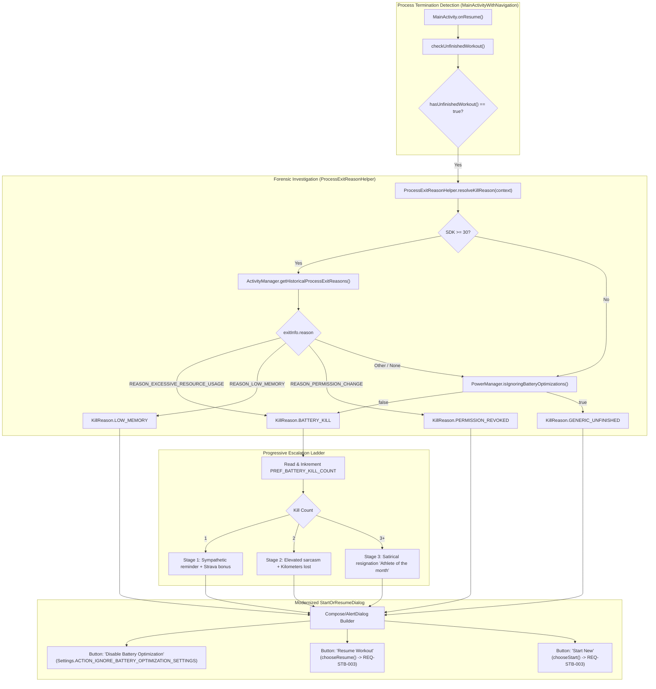

# Stage 3: Implementation Plan - ATT-2079: Inform Athlete on Process Kill Reasons (Battery Saver, LMK, Permission Revocation) via ApplicationExitInfo

**Ticket**: [ATT-2079](https://rainerblind.atlassian.net/browse/ATT-2079)  
**Sub-task**: [ATT-2217](https://rainerblind.atlassian.net/browse/ATT-2217) (`[Impl-Plan]`)  
**Parent Epic**: [ATT-355](https://rainerblind.atlassian.net/browse/ATT-355) (*Good and consistent UI*)  
**Target Release**: `V4.9.39`  
**Active Sprint**: `Sprint 2026-40.14`  
**Requirement Mapping**: `REQ-STB-012` (*Forensic Process Kill Diagnosis, Progressive Escalation & Battery Optimization Guidance*)  
**Test Spec Mapping**: `TST-STB-012` (*Forensic Process Kill Diagnosis & Progressive Escalation Verification*)  
**Branch**: `feature/ATT-2079`  
**Author**: AI Agent 1 (Implementer)  
**Date**: 2026-10-03  

---

## 1. Architectural Design & SWE.2 Component Decomposition

### Component Boundaries & Clean Architecture
1. **Helper & Diagnostics Layer (`ProcessExitReasonHelper.kt`)**:
   - Location: `app/src/main/java/com/atrainingtracker/trainingtracker/helpers/ProcessExitReasonHelper.kt`
   - Encapsulates Android 11+ `ApplicationExitInfo` query, `PowerManager` queries, and `battery_kill_count` persistence.
   - Provides pure, testable domain mappings and helper methods (`resolveKillReason()`, `getBatteryKillCount()`, `incrementBatteryKillCount()`, `resetBatteryKillCount()`).
2. **Presentation & Dialog Layer (`StartOrResumeDialog.kt`)**:
   - Modernized from legacy Java to clean Kotlin.
   - Preserves `StartOrResumeInterface` contract (`chooseResume()`, `chooseStart()`).
   - Dynamically renders diagnostic title, explanation, progressive escalation text, and neutral button to open battery optimization settings when `KillReason.BATTERY_KILL` is detected.
3. **Activity Coordination (`MainActivityWithNavigation.kt`)**:
   - In `checkUnfinishedWorkout()`, passes context or invokes `StartOrResumeDialog`.
   - In `onResume()`, checks `ProcessExitReasonHelper.isIgnoringBatteryOptimizations(this)`; if `true` and `battery_kill_count > 0`, safely resets `battery_kill_count` to `0`.
4. **Localization Parity (`REQ-LOC-001`)**:
   - 10 new string keys added with 100% parity across all 9 supported application locales (EN, DE, ES, FR, IT, JA, NL, PL, PT).

---

## 2. Atomic Implementation Step Sequence

### Step 1: Create `ProcessExitReasonHelper.kt`
- Target file: `app/src/main/java/com/atrainingtracker/trainingtracker/helpers/ProcessExitReasonHelper.kt`
- Defines:
  - `enum class KillReason { BATTERY_KILL, LOW_MEMORY, PERMISSION_REVOKED, GENERIC_UNFINISHED }`
  - `data class KillDiagnosis(val reason: KillReason, val escalationLevel: Int, val isStravaActive: Boolean, val shouldShowBatteryButton: Boolean)`
  - Methods: `resolveKillReason(Context)`, `getBatteryKillCount(Context)`, `incrementBatteryKillCount(Context)`, `resetBatteryKillCount(Context)`, `isIgnoringBatteryOptimizations(Context)`, `openBatteryOptimizationSettings(Context)`.
- Targeted verification: Author unit test `ProcessExitReasonHelperTest.kt`.

### Step 2: Implement Progressive Escalation Copy & 9-Language Localization
- Target files:
  - `app/src/main/res/values/strings.xml` (EN)
  - `app/src/main/res/values-de/strings.xml` (DE)
  - `app/src/main/res/values-es/strings.xml` (ES)
  - `app/src/main/res/values-fr/strings.xml` (FR)
  - `app/src/main/res/values-it/strings.xml` (IT)
  - `app/src/main/res/values-ja/strings.xml` (JA)
  - `app/src/main/res/values-nl/strings.xml` (NL)
  - `app/src/main/res/values-pl/strings.xml` (PL)
  - `app/src/main/res/values-pt/strings.xml` (PT)
- Add 10 keys:
  - `unfinished_workout_title`
  - `kill_reason_battery_title`
  - `kill_reason_battery_stage1`
  - `kill_reason_battery_stage1_strava`
  - `kill_reason_battery_stage2`
  - `kill_reason_battery_stage3`
  - `kill_reason_low_memory`
  - `kill_reason_permission_revoked`
  - `action_disable_battery_optimization`
  - `battery_optimization_exempt_celebration`
- Targeted verification: Run `./gradlew testDebugUnitTest --tests "com.atrainingtracker.trainingtracker.TranslationParityTest"`.

### Step 3: Modernize `StartOrResumeDialog` into Kotlin (`StartOrResumeDialog.kt`)
- Target file: `app/src/main/java/com/atrainingtracker/trainingtracker/dialogs/StartOrResumeDialog.kt` (replacing `.java`)
- Retrieves `KillDiagnosis` from `ProcessExitReasonHelper`.
- If `diagnosis.reason == KillReason.BATTERY_KILL`, increments counter and renders corresponding stage text.
- If `diagnosis.shouldShowBatteryButton`, adds neutral button calling `ProcessExitReasonHelper.openBatteryOptimizationSettings(context)`.
- Retains positive button ("Start New") and negative button ("Resume") mapped to `mStartOrResumeInterface`.
- Targeted verification: Author `StartOrResumeDialogContractTest.kt` and `ProcessKillEscalationTest.kt`.

### Step 4: Integrate Auto-Reset into `MainActivityWithNavigation.kt`
- Target file: `app/src/main/java/com/atrainingtracker/trainingtracker/activities/MainActivityWithNavigation.kt`
- In `onResume()`:
  - If `ProcessExitReasonHelper.isIgnoringBatteryOptimizations(this)`, reset counter via `resetBatteryKillCount(this)`.
- Targeted verification: Run `./gradlew testDebugUnitTest --tests "com.atrainingtracker.trainingtracker.activities.*"`.

### Step 5: Full Test Suite Execution & Clean-Room Regression
- Run `./gradlew testDebugUnitTest` across all 1500+ tests, ensuring 100% pass rate.

---

## 3. Preserved Invariants & Safety Measures

1. **`REQ-STB-003` Interrupted Workout Resumption Integrity**:
   - `chooseResume()` and `chooseStart()` callbacks, SQLite unfinalized workout handling, and notification extra resumption (`EXTRA_RESUME_INTERRUPTED_WORKOUT`) remain unaltered.
2. **Crash Immunity on API < 30 (`REQ-STB-008`, `REQ-STB-001`)**:
   - All invocations of `ActivityManager.getHistoricalProcessExitReasons()` are version-gated with `Build.VERSION.SDK_INT >= Build.VERSION_CODES.R` and enclosed in defensive try-catch blocks.
3. **No Automatic System Setting Tampering**:
   - Per Android platform security, the app cannot modify battery optimization settings silently; it opens the standard system intent for the athlete.
4. **9-Language Localization Parity (`REQ-LOC-001`)**:
   - Zero missing translations and zero placeholder format discrepancies across all 9 locales.
