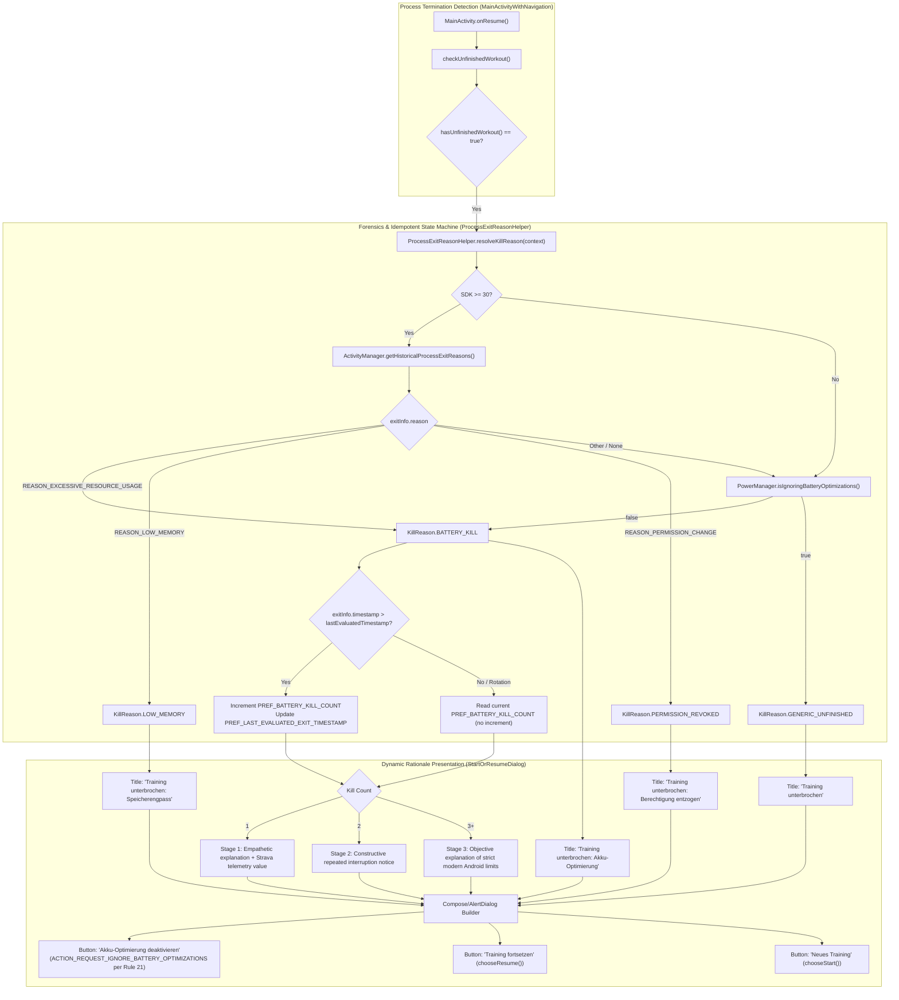

# Stage 3: Implementation Plan - ATT-2079: Inform Athlete on Process Kill Reasons (Battery Saver, LMK, Permission Revocation) via ApplicationExitInfo (Rework Cycle 2)

**Ticket**: [ATT-2079](https://rainerblind.atlassian.net/browse/ATT-2079)  
**Sub-task**: [ATT-2397](https://rainerblind.atlassian.net/browse/ATT-2397) (`[Impl-Plan]`)  
**Parent Epic**: [ATT-355](https://rainerblind.atlassian.net/browse/ATT-355) (*Good and consistent UI*)  
**Target Release**: `V4.9.40` (per Rule 19: Lösungsversion added upon completion)  
**Active Sprint**: `Sprint 2026-40.16`  
**Requirement Mapping**: `REQ-STB-012` (*Forensic Process Kill Diagnosis, Dynamic Rationale Titles, Empathetic Escalation & Direct Battery Exemption Guidance*)  
**Test Spec Mapping**: `TST-STB-012` (*Forensic Process Kill Diagnosis, Dynamic Rationale Titles, Empathetic Escalation & Direct Battery Exemption Guidance Verification*)  
**Branch**: `feature/ATT-2079`  
**Author**: AI Agent 1 (Implementer)  
**Date**: 2026-10-04  

---

## 1. Architectural Design & SWE.2 Component Decomposition

---

## 2. Atomic Implementation Step Sequence

### Step 1: Idempotent Counter & Rule 21 Direct Intents in `ProcessExitReasonHelper.kt`
- Target file: `app/src/main/java/com/atrainingtracker/trainingtracker/helpers/ProcessExitReasonHelper.kt`
- Enhancements:
  - Add constant `PREF_LAST_EVALUATED_EXIT_TIMESTAMP = "pref_last_evaluated_exit_timestamp"`.
  - In `resolveKillReason(context)`:
    - Compare `exitInfo.timestamp` with `prefs.getLong(PREF_LAST_EVALUATED_EXIT_TIMESTAMP, 0L)`.
    - If `exitInfo != null && exitInfo.timestamp > lastTimestamp`:
      - Increment `battery_kill_count` and store new `exitInfo.timestamp`.
    - If `exitInfo == null` and unexempt: only increment if a session flag has not yet been processed in this process lifetime.
    - If device is already exempted (`isIgnoringBatteryOptimizations == true`): automatically invoke `resetBatteryKillCount(context)`.
  - In `openBatteryOptimizationSettings(context)`:
    - First attempt `Settings.ACTION_REQUEST_IGNORE_BATTERY_OPTIMIZATIONS` with `Uri.parse("package:${context.packageName}")` (Rule 21 compliance).
    - Catch `ActivityNotFoundException` / `SecurityException` and fall back to `ACTION_IGNORE_BATTERY_OPTIMIZATION_SETTINGS`.
    - Catch secondary exceptions and fall back to `ACTION_APPLICATION_DETAILS_SETTINGS`.
- Targeted verification:
  `./gradlew testDebugUnitTest --tests "com.atrainingtracker.trainingtracker.helpers.ProcessExitReasonHelperTest"`

### Step 2: Dynamic Rationale Titles in `StartOrResumeDialog.kt`
- Target file: `app/src/main/java/com/atrainingtracker/trainingtracker/dialogs/StartOrResumeDialog.kt`
- Enhancements:
  - Dynamically set dialog title based on `diagnosis.reason`:
    - `KillReason.BATTERY_KILL` -> `R.string.unfinished_workout_title_battery`
    - `KillReason.LOW_MEMORY` -> `R.string.unfinished_workout_title_memory`
    - `KillReason.PERMISSION_REVOKED` -> `R.string.unfinished_workout_title_permission`
    - `KillReason.GENERIC_UNFINISHED` -> `R.string.unfinished_workout_title`
  - Render constructive, empathetic copy for Stage 1, Stage 2, and Stage 3.
- Targeted verification:
  `./gradlew testDebugUnitTest --tests "com.atrainingtracker.trainingtracker.dialogs.StartOrResumeDialogContractTest"`

### Step 3: De-escalated Copy & 9-Language Localization Parity
- Target files:
  - `app/src/main/res/values/strings.xml` (EN)
  - `app/src/main/res/values-de/strings.xml` (DE)
  - `app/src/main/res/values-es/strings.xml` (ES)
  - `app/src/main/res/values-fr/strings.xml` (FR)
  - `app/src/main/res/values-it/strings.xml` (IT)
  - `app/src/main/res/values-ja/strings.xml` (JA)
  - `app/src/main/res/values-nl/strings.xml` (NL)
  - `app/src/main/res/values-pl/strings.xml` (PL)
  - `app/src/main/res/values-pt/strings.xml` (PT)
- Add new string keys:
  - `unfinished_workout_title_battery`
  - `unfinished_workout_title_memory`
  - `unfinished_workout_title_permission`
- Update existing keys with constructive, empathetic athletic-partnership copy:
  - `kill_reason_battery_stage1`
  - `kill_reason_battery_stage1_strava`
  - `kill_reason_battery_stage2`
  - `kill_reason_battery_stage3`
- Targeted verification:
  `./gradlew testDebugUnitTest --tests "com.atrainingtracker.trainingtracker.TranslationParityTest"`

### Step 4: Unit Test Suite Expansion
- Target test files:
  - `app/src/test/java/com/atrainingtracker/trainingtracker/helpers/ProcessExitReasonHelperTest.kt`
  - `app/src/test/java/com/atrainingtracker/trainingtracker/dialogs/StartOrResumeDialogContractTest.kt`
  - `app/src/test/java/com/atrainingtracker/trainingtracker/ProcessKillEscalationTest.kt`
- Test scenarios:
  - Screen rotation / repeated calls do not increment counter.
  - New timestamp increments counter.
  - Dynamic titles resolve to correct resource IDs.
  - Direct `ACTION_REQUEST_IGNORE_BATTERY_OPTIMIZATIONS` intent constructed.
  - Reset to 0 when battery optimization is granted.
- Targeted verification:
  `./gradlew testDebugUnitTest --tests "com.atrainingtracker.trainingtracker.*"`

### Step 5: Clean-Room Full Suite Regression
- Execute `./gradlew testDebugUnitTest` and `./gradlew assembleDebug` ensuring 100% pass rate.

---

## 3. Preserved Invariants & Safety Measures

1. **`REQ-STB-003` Interrupted Workout Resumption Integrity**:
   - `chooseResume()` and `chooseStart()` callbacks, SQLite unfinalized workout handling, and notification extra resumption (`EXTRA_RESUME_INTERRUPTED_WORKOUT`) remain unaltered.
2. **Rule 21 Compliance**:
   - Specific direct intent `Settings.ACTION_REQUEST_IGNORE_BATTERY_OPTIMIZATIONS` with package URI prioritized over generic settings.
3. **Crash Immunity on API < 30 (`REQ-STB-008`, `REQ-STB-001`)**:
   - Defensive version gating and try-catch wrappers around all platform service queries.
4. **9-Language Parity (`REQ-LOC-001`)**:
   - 100% translation coverage across all 9 application locales.
