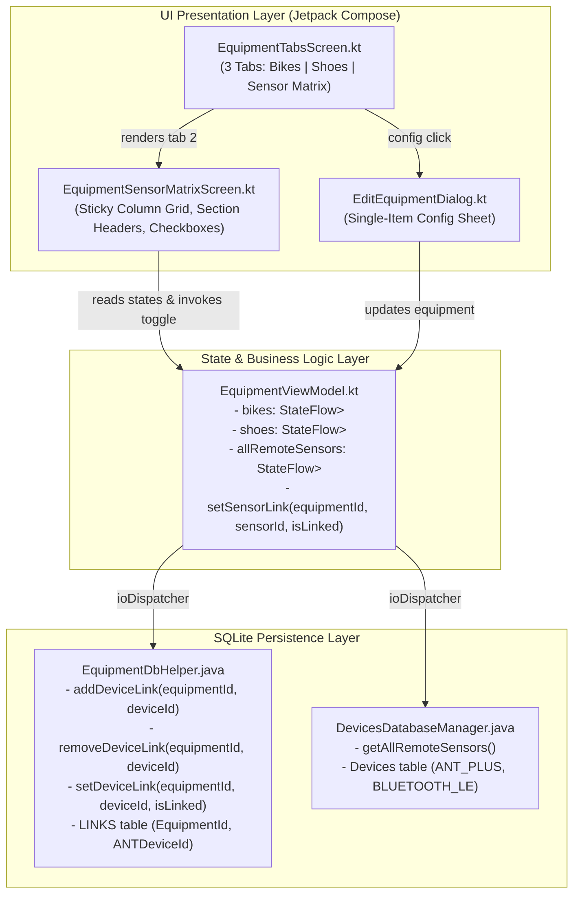

# Stage 3: Implementation Plan - ATT-2126: Equipment-to-Sensor Mapping Matrix with Checkboxes for Bikes and Shoes

**Ticket**: [ATT-2126](https://rainerblind.atlassian.net/browse/ATT-2126)  
**Sub-task**: [ATT-2207](https://rainerblind.atlassian.net/browse/ATT-2207) (`[Impl-Plan]`)  
**Parent Epic**: [ATT-355](https://rainerblind.atlassian.net/browse/ATT-355) (*Good and consistent UI*)  
**Target Release**: `V4.9.39`  
**Active Sprint**: `Sprint 2026-40.14`  
**Requirement Mapping**: `REQ-UI-256` (*Equipment Management: Fleet-Wide Equipment-to-Sensor Mapping Matrix with Checkboxes for Bikes and Shoes*)  
**Test Spec Mapping**: `TST-UI-215` (*Equipment Management: Fleet-Wide Equipment-to-Sensor Mapping Matrix with Checkboxes Verification*)  
**Branch**: `feature/ATT-2126`  
**Author**: AI Agent 1 (Implementer)  
**Date**: 2026-10-03  

---

## 1. Architectural Design & SWE.2 Component Decomposition

### Clean Architecture Boundaries
1. **Presentation Layer (`com.atrainingtracker.trainingtracker.ui.equipment`)**:
   - `EquipmentTabsScreen.kt`: Hosts the 3-tab pager (`Bikes`, `Shoes`, `Sensor Matrix`). Gates FAB display to pages 0 and 1. Integrates collapsing nested scroll connection.
   - `EquipmentSensorMatrixScreen.kt`: Implements the 2D grid with a sticky left column (Equipment icon & name), horizontal scrolling for remote sensor columns, sticky header for sensor names, and responsive Material 3 checkboxes.
2. **ViewModel Layer (`com.atrainingtracker.trainingtracker.ui.equipment.EquipmentViewModel`)**:
   - Holds and exposes `allRemoteSensors: StateFlow<List<SimpleSensorInfo>>`.
   - Exposes `setSensorLink(equipmentId: Long, sensorId: Long, isLinked: Boolean)` executing on `ioDispatcher` (`Dispatchers.IO`), delegating to `EquipmentDbHelper`, and sequentially triggering `loadEquipment()`.
3. **Data / Database Layer (`com.atrainingtracker.trainingtracker.database`)**:
   - `EquipmentDbHelper.java`: Provides atomic single-link SQLite operations (`addDeviceLink`, `removeDeviceLink`, `setDeviceLink`) with transaction boundaries.
   - `DevicesDatabaseManager.java`: Provides `getAllRemoteSensors()`, returning all user-named external remote sensors sorted alphabetically.

---

## 2. Atomic Implementation Step Sequence

### Step 1: Database Helper Enhancements (`EquipmentDbHelper.java`)
- **Action**: Add atomic single-link methods:
  - `addDeviceLink(long equipmentId, long deviceId)`: queries `LINKS` table to verify link absence, then inserts `(equipmentId, deviceId)`.
  - `removeDeviceLink(long equipmentId, long deviceId)`: executes delete on `LINKS` matching `EquipmentId = ? AND ANTDeviceId = ?`.
  - `setDeviceLink(long equipmentId, long deviceId, boolean isLinked)`: delegates to `addDeviceLink` or `removeDeviceLink`.
- **Target File**: `app/src/main/java/com/atrainingtracker/trainingtracker/database/EquipmentDbHelper.java`
- **Verification**: `EquipmentDbLinkContractTest.kt`

### Step 2: Remote Sensor Fleet Discovery (`DevicesDatabaseManager.java`)
- **Action**: Add `getAllRemoteSensors(): List<SimpleSensorInfo>`:
  - Queries `Devices` table filtering for `NAME IS NOT NULL AND NAME != ''` and external remote protocols/device types (`PROTOCOL IN ('ANT_PLUS', 'BLUETOOTH_LE')` or `DEVICE_TYPE LIKE 'BIKE%'`, `'RUN%'`, `'HRM'`, etc.).
  - Sorts alphabetically by device name.
- **Target File**: `app/src/main/java/com/atrainingtracker/banalservice/database/DevicesDatabaseManager.java`
- **Verification**: Unit test checking remote vs internal sensors filtering.

### Step 3: ViewModel Fleet State & Link Dispatch (`EquipmentViewModel.kt`)
- **Action**:
  - Add `_allRemoteSensors = MutableStateFlow<List<SimpleSensorInfo>>(emptyList())` and expose public `allRemoteSensors: StateFlow<List<SimpleSensorInfo>>`.
  - Load `allRemoteSensors` inside `loadEquipment()` on `ioDispatcher`.
  - Implement `fun setSensorLink(equipmentId: Long, sensorId: Long, isLinked: Boolean)` on `viewModelScope.launch(ioDispatcher)`.
- **Target File**: `app/src/main/java/com/atrainingtracker/trainingtracker/ui/equipment/EquipmentViewModel.kt`
- **Verification**: `EquipmentViewModelMatrixTest.kt`

### Step 4: 9-Language Localization Parity (`strings.xml`)
- **Action**: Add new string keys to all 9 locale directories:
  - `@string/equipment_tab_sensor_matrix`: "Sensor Matrix" / "Sensormatrix" / "Matriz de sensores" / etc.
  - `@string/equipment_matrix_no_sensors`: "No paired sensors found. Pair sensors first in Settings."
  - `@string/equipment_matrix_no_equipment`: "No equipment created yet. Add bikes or shoes first."
  - `@string/equipment_matrix_bike_section`: "Bikes"
  - `@string/equipment_matrix_shoe_section`: "Shoes"
- **Target Files**:
  - `app/src/main/res/values/strings.xml` (EN)
  - `app/src/main/res/values-de/strings.xml` (DE)
  - `app/src/main/res/values-es/strings.xml` (ES)
  - `app/src/main/res/values-fr/strings.xml` (FR)
  - `app/src/main/res/values-it/strings.xml` (IT)
  - `app/src/main/res/values-ja/strings.xml` (JA)
  - `app/src/main/res/values-nl/strings.xml` (NL)
  - `app/src/main/res/values-pl/strings.xml` (PL)
  - `app/src/main/res/values-pt/strings.xml` (PT)
- **Verification**: XML resource validation script.

### Step 5: EquipmentSensorMatrixScreen Composable (`EquipmentSensorMatrixScreen.kt`)
- **Action**: Author `EquipmentSensorMatrixScreen`:
  - Receives `bikes: List<EquipmentItem>`, `shoes: List<EquipmentItem>`, `sensors: List<SimpleSensorInfo>`, and `onToggleLink: (equipmentId: Long, sensorId: Long, isLinked: Boolean) -> Unit`.
  - Handles empty states when `sensors.isEmpty()` or both lists are empty.
  - Sticky first column showing Equipment Icon (`MTB`, `ROAD`, `CROSS`, `TT`, `SHOE`), Name, and retirement indicator.
  - Horizontally scrollable row cells aligned with column headers.
  - Vertically scrollable table with Bikes section header and Shoes section header.
  - Material 3 Checkbox in each intersection cell with accessible 48dp minimum touch target.
- **Target File**: `app/src/main/java/com/atrainingtracker/trainingtracker/ui/equipment/EquipmentSensorMatrixScreen.kt`
- **Verification**: `EquipmentSensorMatrixContractTest.kt`

### Step 6: Navigation Integration in EquipmentTabsScreen (`EquipmentTabsScreen.kt`)
- **Action**:
  - Extend `tabs` list: `listOf(stringResource(R.string.equipment_type_bike), stringResource(R.string.equipment_type_shoe), stringResource(R.string.equipment_tab_sensor_matrix))`.
  - Update `HorizontalPager`:
    - Page 0: `EquipmentList(items = bikes, ...)`
    - Page 1: `EquipmentList(items = shoes, ...)`
    - Page 2: `EquipmentSensorMatrixScreen(bikes = bikes, shoes = shoes, sensors = allSensors, onToggleLink = { eqId, sId, link -> viewModel.setSensorLink(eqId, sId, link) })`
  - Suppress Floating Action Button when `pagerState.currentPage == 2`.
- **Target File**: `app/src/main/java/com/atrainingtracker/trainingtracker/ui/equipment/EquipmentTabsScreen.kt`
- **Verification**: `EquipmentTabsScreenContractTest.kt`

### Step 7: Comprehensive Unit & Contract Test Suite
- **Action**: Author 3 targeted test suites:
  1. `EquipmentDbLinkContractTest.kt`: verifies `EquipmentDbHelper` link insertion, deletion, and idempotency.
  2. `EquipmentViewModelMatrixTest.kt`: verifies sensor list emission and link toggling state reactivity.
  3. `EquipmentSensorMatrixContractTest.kt`: verifies UI structural contracts (3 tabs, FAB gating, sticky column layout).
- **Target Files**:
  - `app/src/test/java/com/atrainingtracker/trainingtracker/database/EquipmentDbLinkContractTest.kt`
  - `app/src/test/java/com/atrainingtracker/trainingtracker/ui/equipment/EquipmentViewModelMatrixTest.kt`
  - `app/src/test/java/com/atrainingtracker/trainingtracker/ui/equipment/EquipmentSensorMatrixContractTest.kt`
- **Verification**: `./gradlew testDebugUnitTest --tests "com.atrainingtracker.trainingtracker.ui.equipment.*"`

### Step 8: Full Clean-Room Regression Verification
- **Action**: Execute `./gradlew testDebugUnitTest` ensuring 100% clean-room test suite pass rate.

---

## 3. Invariants & Guardrails

1. **Direct SQLite Schema Stability**: No modifications or migrations to `Equipment.db` table schemas (`Equipment`, `Links`).
2. **Bidirectional Synchronization**: Any link updated in the matrix is immediately visible in `EditEquipmentDialog` without manual sync.
3. **Data Safety**: Single-link operations must be executed safely without affecting other equipment or other sensors.
4. **Touch Accessibility**: Checkboxes in matrix cells must provide touch targets of at least 48dp.
5. **9-Language Parity**: 100% translation coverage across EN, DE, ES, FR, IT, JA, NL, PL, PT.
6. **ASPICE Governance**: Subtasks only to `Erledigt`; parent ticket never to `Erledigt` (moves to `Final Review (Human)`).
