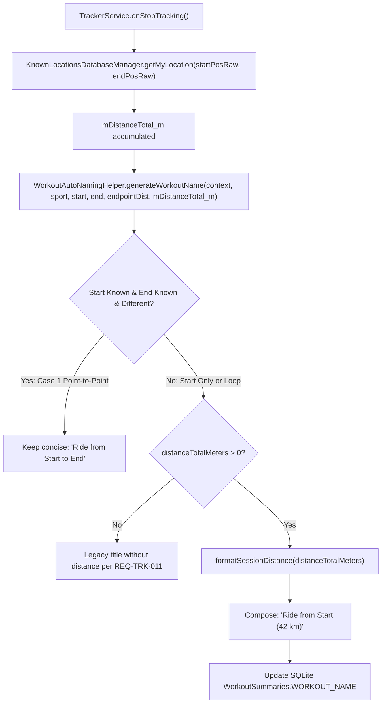

# Stage 3: Implementation Plan - ATT-2247: Append Distance to Auto-Generated Workout Names for Start-Location Sessions

**Ticket**: [ATT-2247](https://rainerblind.atlassian.net/browse/ATT-2247)  
**Sub-task**: [ATT-2443](https://rainerblind.atlassian.net/browse/ATT-2443) (`[Impl-Plan] Append Distance to Auto-Generated Workout Names for Start-Location Sessions`)  
**Parent Epic**: [ATT-1396](https://rainerblind.atlassian.net/browse/ATT-1396) (*[Epic] Lieblingsorte: Visible Value, Auto-Naming & Tracking Integration*)  
**Target Release**: `V4.9.39`  
**Active Sprint**: `Sprint 2026-40.16`  
**Requirement Mapping**: `REQ-TRK-012`  
**Test Mapping**: `TST-TRK-004`  
**Branch**: `feature/ATT-2247`  
**Author**: AI Agent 1 (Implementer)  
**Date**: 2026-10-04  

---

## 1. Architectural Overview & SWE.2 Design

### 1.1 Root Cause & Solution Architecture
Currently, `WorkoutAutoNamingHelper.generateWorkoutName()` produces session titles based solely on sport type and recognized endpoint locations (*Lieblingsorte*, `REQ-TRK-011`). When athletes embark on round trips or single-location sessions from their home or office, every activity receives an identical title (e.g. *"Radfahrt ab Zuhause"* / *"Ride from Home"*), regardless of whether it was a 15 km recovery spin or a 120 km gran fondo.

To resolve this defect while maintaining zero regressions on existing callers:
1. **Extend `WorkoutAutoNamingHelper.generateWorkoutName`**:
   - Add parameter `distanceTotalMeters: Double = 0.0` with `@JvmOverloads`.
   - Implement `formatSessionDistance(context: Context, distanceMeters: Double): String` adhering to the athlete's unit preference (`TrainingApplication.getUnit()`) and precision guidelines:
     - Metric: `km = meters / 1000.0`, unit `"km"`.
     - Imperial: `mi = meters / BANALService.METER_PER_MILE`, unit `"mi"`.
     - Value $< 10.0$: 1 decimal place (`%.1f`, e.g. `8.2 km`, `5.1 mi`).
     - Value $\ge 10.0$: 0 decimal places if effectively integer (`Math.abs(dist - round(dist)) < 0.05`), else 1 decimal place (`%.1f`, e.g. `42 km`, `42.5 km`).
2. **Wire in `TrackerService.java`**:
   - Pass `mDistanceTotal_m` (already finalized in `onStopTracking()`) as the 6th argument to `WorkoutAutoNamingHelper.generateWorkoutName`.
3. **9-Language String Resources**:
   - Add 4 new format string resources across all 9 supported locales:
     - `workout_name_run_from_with_distance`
     - `workout_name_ride_from_with_distance`
     - `workout_name_activity_from_with_distance`
     - `workout_name_round_trip_with_distance`
4. **Preserve Exclusion Invariants**:
   - Case 1 (Point-to-Point: "Fahrt von Zuhause nach Büro") remains without distance.
   - Case 4 (Destination Only: "Lauf nach Büro") remains without distance.
   - Calls with `distanceTotalMeters <= 0.0` produce standard titles without distance per `REQ-TRK-011`.

---

## 2. Target Files Slated for Modification

1. `app/src/main/res/values/strings.xml` (and 8 localized variants: `de`, `es`, `fr`, `it`, `ja`, `nl`, `pl`, `pt`):
   - Declare 4 distance-enriched workout auto-naming format templates with `%1$s` and `%2$s`.
2. `app/src/main/java/com/atrainingtracker/trainingtracker/database/WorkoutAutoNamingHelper.kt`:
   - Add `formatSessionDistance(context: Context, distanceMeters: Double): String`.
   - Update `generateWorkoutName` to accept `distanceTotalMeters: Double = 0.0` with `@JvmOverloads`.
   - Conditionally use distance-enriched format strings for Case 2 (Round Trip), Case 3 (Start Only), and same-name fallback.
3. `app/src/main/java/com/atrainingtracker/trainingtracker/tracker/TrackerService.java`:
   - Line 1341: Pass `mDistanceTotal_m` to `WorkoutAutoNamingHelper.generateWorkoutName(...)`.
4. `app/src/test/java/com/atrainingtracker/trainingtracker/database/WorkoutAutoNamingHelperTest.kt`:
   - Add unit tests for metric and imperial distance formatting, decimal precision, sport types, and exclusion cases.

---

## 3. Atomic Implementation Steps

### Step 1: Add Localized String Resources Across 9 Locales
- Define `workout_name_run_from_with_distance`, `workout_name_ride_from_with_distance`, `workout_name_activity_from_with_distance`, and `workout_name_round_trip_with_distance` in `values/strings.xml`.
- Translate and append exact keys with `%1$s` and `%2$s` format specifiers to:
  - `values-de/strings.xml`
  - `values-es/strings.xml`
  - `values-fr/strings.xml`
  - `values-it/strings.xml`
  - `values-ja/strings.xml`
  - `values-nl/strings.xml`
  - `values-pl/strings.xml`
  - `values-pt/strings.xml`
- Run `TranslationParityTest` to confirm 100% parity.

### Step 2: Implement Distance Formatting & Signature Extension in `WorkoutAutoNamingHelper.kt`
- Add `@JvmStatic fun formatSessionDistance(context: Context, distanceMeters: Double): String`.
- Extend `generateWorkoutName(...)` signature with `distanceTotalMeters: Double = 0.0`.
- Wire distance formatting into Case 2 (Round Trip), Case 3 (Start Only), and same-name fallback when `distanceTotalMeters > 0.0`.
- Preserve Case 1 (Point-to-Point) and Case 4 (Destination Only) without distance.

### Step 3: Wire `mDistanceTotal_m` in `TrackerService.java`
- At line 1341 in `TrackerService.java`, pass `mDistanceTotal_m` as the 6th argument to `WorkoutAutoNamingHelper.generateWorkoutName`.

### Step 4: Author Unit Tests in `WorkoutAutoNamingHelperTest.kt`
- Test metric distance formatting (<10 km, >=10 km whole, >=10 km non-whole).
- Test imperial distance formatting (<10 mi, >=10 mi whole, >=10 mi non-whole).
- Test Case 2, Case 3, Case 1, Case 4, and distance <= 0.0.
- Verify backward compatibility when omitting distance.

### Step 5: Full Suite Clean-Room Regression Execution
- Run `./gradlew testDebugUnitTest` verifying 100% pass rate.

---

## 4. Invariant Protection & Verification

- **Invariant 1 (Point-to-Point Clarity)**: Point-to-Point sessions where both start and destination are known remain concise without distance clutter.
- **Invariant 2 (Cluster Priority)**: Route Cluster matches (`suggestion != null`) continue to take absolute precedence over location auto-naming.
- **Invariant 3 (User Edit Immutability)**: User manual renames in `WorkoutRepository` remain strictly immutable.
- **Invariant 4 (Backward Compatibility)**: Existing calls to `generateWorkoutName` without distance continue to compile and function identically via `@JvmOverloads`.
- **Invariant 5 (Localization Parity)**: All 9 languages maintain exact `%1$s` and `%2$s` format specifiers.
