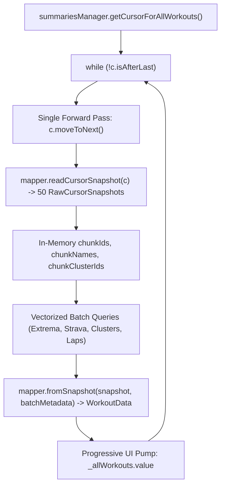

# Stage 3: Implementation Plan - ATT-2309: CursorWindow IllegalStateException in WorkoutRepository.loadAllWorkouts on Large Databases

**Ticket**: [ATT-2309](https://rainerblind.atlassian.net/browse/ATT-2309)  
**Sub-task**: [ATT-2438](https://rainerblind.atlassian.net/browse/ATT-2438) (`[Impl-Plan] CursorWindow IllegalStateException in WorkoutRepository.loadAllWorkouts on Large Databases`)  
**Parent Epic**: [ATT-68](https://rainerblind.atlassian.net/browse/ATT-68) (*[Epic] Improve WorkoutSummaries*)  
**Target Release**: `V4.9.39`  
**Active Sprint**: `Sprint 2026-40.16`  
**Requirement Mapping**: `REQ-STB-013`  
**Test Mapping**: `TST-STB-013`  
**Branch**: `feature/ATT-2309`  
**Author**: AI Agent 1 (Implementer)  
**Date**: 2026-10-04  

---

## 1. Architectural Overview & SWE.2 Design

### 1.1 Root Cause & Solution Architecture
The current `WorkoutRepository.loadAllWorkouts()` executes a two-pass chunk loop:
1. Inner loop 1 moves forward 50 rows reading IDs.
2. Vectorized auxiliary database queries fetch batch metadata.
3. Inner loop 2 seeks **backward** to `currentChunkStartPos` via `c.moveToPosition(currentChunkStartPos)` and iterates forward another 50 rows to map `WorkoutData`.

When the database exceeds ~1,600 rows (or whenever crossing 2MB `CursorWindow` boundaries), jumping backwards forces the native SQLite layer to discard and refill the memory window, throwing `IllegalStateException: Couldn't read row 60, col 0 from CursorWindow`.

To permanently solve this defect:
1. **Decoupled Row Snapshot**: Decompose `WorkoutDataMapper` into:
   - `readCursorSnapshot(cursor)`: Reads SQLite primitive column values from the active cursor row into an in-memory `RawCursorSnapshot`.
   - `fromSnapshot(snapshot, batch)`: Enriches `RawCursorSnapshot` with vectorized batch metadata (`extrema`, `stravaData`, `clusterNames`, `laps`) to produce the complete `WorkoutData` instance.
2. **Single-Pass Monotonic Traversal**: In `WorkoutRepository.loadAllWorkouts()`:
   - Read 50 `RawCursorSnapshot` items in a single forward-only pass (`c.moveToNext()`).
   - Eliminate `c.moveToPosition(currentChunkStartPos)` completely.
   - Perform vectorized metadata queries in memory using the extracted chunk IDs.
   - Map snapshots to `WorkoutData` and pump progressively to UI.
3. **Defensive Row Exception Shielding**: Wrap row extraction in a defensive try/catch catching `IllegalStateException` or `CursorWindowAllocationException`, logging diagnostics and skipping faulty rows without crashing.

---

## 2. Target Files Slated for Modification

1. `app/src/main/java/com/atrainingtracker/trainingtracker/ui/aftermath/WorkoutDataMapper.kt`:
   - Introduce `RawCursorSnapshot` data class.
   - Implement `readCursorSnapshot(cursor: Cursor): RawCursorSnapshot`.
   - Implement `fromSnapshot(snapshot: RawCursorSnapshot, batch: BatchMetadata): WorkoutData`.
   - Retain `fromCursor(cursor, batch)` delegating to `readCursorSnapshot` and `fromSnapshot` for backward compatibility.
2. `app/src/main/java/com/atrainingtracker/trainingtracker/ui/aftermath/WorkoutRepository.kt`:
   - Refactor `loadAllWorkouts()` to use single forward-only pass without `moveToPosition`.
   - Implement defensive row exception shielding.
3. `app/src/test/java/com/atrainingtracker/trainingtracker/ui/aftermath/WorkoutRepositoryStreamTest.kt`:
   - Unit tests validating single-pass streaming, metadata association, and zero backward seeking.
4. `app/src/test/java/com/atrainingtracker/trainingtracker/ui/aftermath/WorkoutRepositoryStressTest.kt`:
   - Stress test simulating 2,000 synthetic workouts streaming without `IllegalStateException`.
   - Exception shielding test simulating faulty rows.

---

## 3. Atomic Implementation Steps

### Step 1: Decouple Row Extraction & Domain Mapping in `WorkoutDataMapper.kt`
- Create `data class RawCursorSnapshot(...)` holding extracted column values.
- Implement `readCursorSnapshot(cursor: Cursor): RawCursorSnapshot` reading column indices safely.
- Implement `fromSnapshot(snapshot: RawCursorSnapshot, batch: BatchMetadata): WorkoutData`.
- Refactor `fromCursor(cursor: Cursor, batch: BatchMetadata)` to delegate to `fromSnapshot(readCursorSnapshot(cursor), batch)`.

### Step 2: Implement Single-Pass Monotonic Streaming in `WorkoutRepository.kt`
- In `loadAllWorkouts()`:
  - Replace the backward-seeking two-pass chunk loop with single-pass `RawCursorSnapshot` collection.
  - Collect up to `batchSize = 50` snapshots in a single forward pass via `c.moveToNext()`.
  - Wrap row extraction in `try { ... } catch (e: Exception) { Log.e(TAG, "Error reading row at pos ${c.position}", e) }`.
  - Perform vectorized metadata queries using in-memory `snapshots.map { it.workoutId }`.
  - Enrich snapshots via `mapper.fromSnapshot(snapshot, batchMetadata)`.
  - Retain progressive UI emission thresholds (first 10, each batch of 50, completion).

### Step 3: Implement Comprehensive Test Suite
- `WorkoutRepositoryStreamTest.kt`: Verify single-pass sequential streaming, metadata enrichment, and progressive emission.
- `WorkoutRepositoryStressTest.kt`:
  - 2,000-row synthetic workout stress test validating complete execution without `IllegalStateException`.
  - Faulty row simulation validating exception shielding and uninterrupted streaming.

### Step 4: Full Suite Clean-Room Regression Execution
- Run `./gradlew testDebugUnitTest` across all modules with 100% pass rate.

---

## 4. Invariant Protection & Pre-Implementation Verification

- **Invariant 1**: Table schemas for `WorkoutSummaries.db`, `Extrema.db`, `StravaUpload.db`, `WorkoutClusters.db`, and `Laps.db` remain untouched.
- **Invariant 2**: Zero backward seeking on cursors (`c.moveToPosition` is never called).
- **Invariant 3**: Vectorized query optimizations (ATT-359) remain fully preserved with zero N+1 queries.
- **Invariant 4**: Progressive UI emission contract (`_allWorkouts.value`) remains intact.
- **Invariant 5**: Pre-implementation CLI gate check (`python3 tools/jira_util.py check-gate ATT-2438`) will be executed prior to any file edit.
