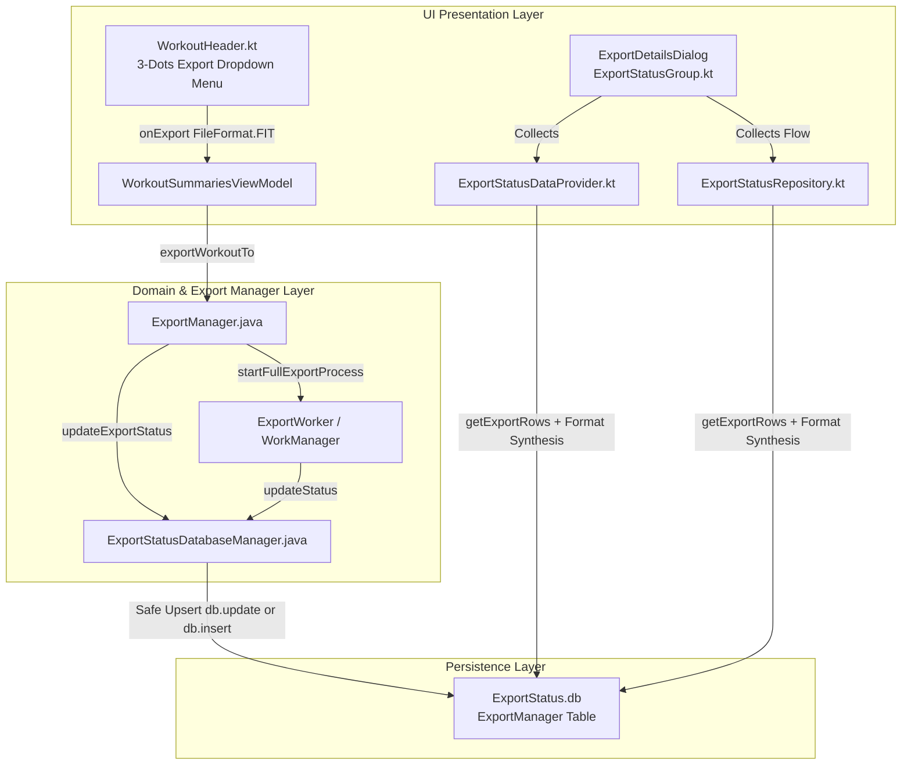

# Stage 3: Architecture & Implementation Plan - ATT-2310: Include FIT Format in Detailed Export Report, Export Status Tracking and Workout Header Export Menu

**Ticket**: [ATT-2310](https://rainerblind.atlassian.net/browse/ATT-2310)  
**Sub-task**: [ATT-2356](https://rainerblind.atlassian.net/browse/ATT-2356) (`[Impl-Plan]`)  
**Parent Epic**: [ATT-1117](https://rainerblind.atlassian.net/browse/ATT-1117) (*FIT File Format Support (Export & Import)*)  
**Target Release**: `V4.9.40`  
**Active Sprint**: `2026-40.15`  
**Requirement Mapping**: `REQ-EXP-018`  
**Test Mapping**: `TST-EXP-015`  
**Branch**: `feature/ATT-2310`  
**Author**: AI Agent 1 (Implementer)  
**Date**: 2026-10-04  

---

## 1. SWE.2 Architecture & Component Decomposition



### Component Interfaces & Contracts
1. **`ExportStatusDatabaseManager.java`**:
   - `updateExportStatus(ContentValues, String fileBaseName, ExportType, FileFormat)`: Safely upserts records. If `db.update(...)` affects 0 rows, executes `db.insert(...)` into `ExportStatusDbHelper.TABLE`.
   - Handles `exportType == null` defensively to prevent `NullPointerException`.
2. **`ExportStatusDataProvider.kt` & `ExportStatusRepository.kt`**:
   - Compares existing rows for each `ExportType` against `exportType.exportToFileFormats`.
   - Synthesizes `ExportRow` with `status = ExportStatus.UNWANTED` for any missing formats (e.g. `FileFormat.FIT` on legacy workouts).
   - Sorts details deterministically based on `exportType.exportToFileFormats`.
3. **`WorkoutHeader.kt`**:
   - Appends `FileFormat.FIT to R.string.fitWrite` to `standardFormats`.
4. **9-Language String Resources**:
   - Implements `fitWrite` across all 9 supported application locales.

---

## 2. Atomic Implementation Steps

### Step 1: Database Safe Upsert in `ExportStatusDatabaseManager.java`
* **Target File**: `app/src/main/java/com/atrainingtracker/trainingtracker/exporter/db/ExportStatusDatabaseManager.java`
* **Changes**:
  - In `updateExportStatus(ContentValues contentValues, String fileBaseName, ExportType exportType, FileFormat fileFormat)`:
    - If `exportType != null`:
      - Execute `db.update(...)`.
      - If returned rows == 0: construct `insertValues` with `fileBaseName`, `TYPE = exportType.name()`, `FORMAT = fileFormat.name()`, `EXPORT_STATUS = contentValues.getAsString(EXPORT_STATUS)` (defaulting to `ExportStatus.UNWANTED.name()`), and `ANSWER = contentValues.getAsString(ANSWER)`. Execute `db.insert(ExportStatusDbHelper.TABLE, null, insertValues)`.
    - If `exportType == null`:
      - Execute `db.update(ExportStatusDbHelper.TABLE, contentValues, WorkoutSummaries.FILE_BASE_NAME + "=? AND " + FORMAT + "=?", new String[]{fileBaseName, fileFormat.name()})`.
      - If returned rows == 0: insert rows for all `ExportType`s that include `fileFormat` in `getExportToFileFormats()`.
  - In `updateExportStatus(ContentValues contentValues, ExportInfo exportInfo)`:
    - Forward to `updateExportStatus(contentValues, exportInfo.getFileBaseName(), exportInfo.getExportType(), exportInfo.getFileFormat())`.

### Step 2: Missing Format Synthesis in UI Data Providers
* **Target Files**:
  - `app/src/main/java/com/atrainingtracker/trainingtracker/ui/components/export/ExportStatusDataProvider.kt`
  - `app/src/main/java/com/atrainingtracker/trainingtracker/ui/components/export/ExportStatusRepository.kt`
* **Changes**:
  - In `ExportStatusDataProvider.createGroupData(fileBaseName, exportType)`:
    - If `rows.isNotEmpty()`, compute `existingFormats = rows.map { it.format }.toSet()`.
    - For each `format` in `exportType.exportToFileFormats` not in `existingFormats`, create `ExportStatusDatabaseManager.ExportRow(exportType, format, ExportStatus.UNWANTED, null)`.
    - Combine and sort rows by `exportType.exportToFileFormats.indexOf(it.format)`.
  - In `ExportStatusRepository.createGroupData(exportType, rows)`:
    - Apply identical synthesis and deterministic ordering.

### Step 3: 9-Language Localization of `fitWrite`
* **Target Files**:
  - `app/src/main/res/values/strings.xml` (`export to FIT`)
  - `app/src/main/res/values-de/strings.xml` (`export nach FIT`)
  - `app/src/main/res/values-es/strings.xml` (`exportar a FIT`)
  - `app/src/main/res/values-fr/strings.xml` (`exporter en FIT`)
  - `app/src/main/res/values-it/strings.xml` (`esporta in FIT`)
  - `app/src/main/res/values-ja/strings.xml` (`FIT出力`)
  - `app/src/main/res/values-nl/strings.xml` (`naar FIT exporteren`)
  - `app/src/main/res/values-pl/strings.xml` (`eksportuj do FIT`)
  - `app/src/main/res/values-pt/strings.xml` (`exportar para FIT`)

### Step 4: WorkoutHeader 3-Dots Export Menu Integration
* **Target File**: `app/src/main/java/com/atrainingtracker/trainingtracker/ui/components/workoutheader/WorkoutHeader.kt`
* **Changes**:
  - In `standardFormats`, add `FileFormat.FIT to R.string.fitWrite`:
    ```kotlin
    val standardFormats = listOf(
        FileFormat.TCX to R.string.tcxWrite,
        FileFormat.GPX to R.string.gpxWrite,
        FileFormat.FIT to R.string.fitWrite,
        FileFormat.CSV to R.string.csvWrite,
        FileFormat.GC to R.string.jsonWrite
    )
    ```

### Step 5: Unit Tests Construction & Targeted Execution
* **Target Files**:
  - `app/src/test/java/com/atrainingtracker/trainingtracker/exporter/db/ExportStatusDatabaseManagerTest.kt`: Tests safe upsert on non-existent row and null exportType safety.
  - `app/src/test/java/com/atrainingtracker/trainingtracker/ui/components/export/ExportStatusDataProviderTest.kt`: Tests missing format synthesis for `FileFormat.FIT` with `UNWANTED` status and ordering.
  - `app/src/test/java/com/atrainingtracker/trainingtracker/ui/components/workoutheader/WorkoutHeaderExportMenuContractTest.kt`: Tests presence of `FileFormat.FIT` in `WorkoutHeader.kt`.
* **Execution**:
  - `./gradlew testDebugUnitTest --tests "com.atrainingtracker.trainingtracker.exporter.db.*"`
  - `./gradlew testDebugUnitTest --tests "com.atrainingtracker.trainingtracker.ui.components.export.*"`
  - `./gradlew testDebugUnitTest --tests "com.atrainingtracker.trainingtracker.ui.components.workoutheader.*"`

---

## 3. Invariants & Governance Protection

1. **Mandatory Programmatic Pre-Check (Rule 3)**:
   - Before modifying any files in `app/src/...`, verify `python3 tools/jira_util.py check-gate ATT-2356` exits with code 0 (`GATE_PASSED: ATT-2356 is Erledigt`).
2. **Database Integrity**:
   - Zero modifications to SQLite table schemas. `ExportStatusDbHelper.TABLE` columns (`_id`, `FileBaseName`, `Format`, `Type`, `Progress`, `Answer`) remain identical.
3. **9-Language Parity**:
   - `fitWrite` must exist in all 9 supported locales without missing entries or malformed format specifiers.
4. **Clean Architecture**:
   - UI components remain decoupled from direct database writes; state propagation flows through standard repositories and ViewModels.
