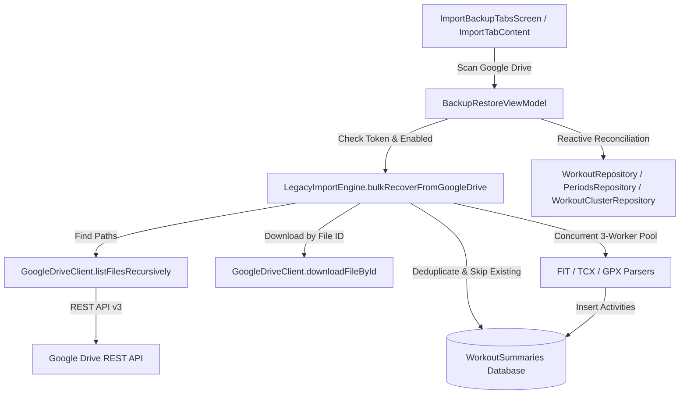

# Stage 3: Implementation Plan - ATT-2346

**Ticket**: [ATT-2346](https://atrainingtracker.atlassian.net/browse/ATT-2346)  
**Parent Epic**: [ATT-162](https://atrainingtracker.atlassian.net/browse/ATT-162) (*[Epic] Cloud integration*)  
**Target Release**: `V4.9.39`  
**Active Sprint**: `2026-41.1`  
**Branch**: `feature/ATT-2346`  
**Author**: AI Agent 1 (Implementer)  
**Date**: 2026-10-06  

---

## 1. Architecture Overview (SWE.2)

This plan implements historical workout discovery, download, and multi-format bulk importing from Google Drive with 100% parity to the Dropbox bulk recovery flow (`bulkRecoverFromDropbox`), fulfilling `REQ-MIG-034` and `TST-MIG-031`.

---

## 2. Invariants & Boundary Guards

1. **Least-Privilege OAuth Invariant**: `GoogleDriveAuthManager` remains strictly bound to `https://www.googleapis.com/auth/drive.file`. Only folders created by or shared with aTrainingTracker are accessed.
2. **Pre-Download Duplicate Skipping Invariant**: Existing activities must be skipped prior to download via `isWorkoutExisting(summaryDb, baseFileName, bSportType)`.
3. **Cross-Folder Deduplication Invariant**: Files discovered across candidate folders matching the same base filename must be deduplicated before queueing (REQ-MIG-031).
4. **Non-Breaking Return Types & Backward Compatibility**: Existing `importFromTcx`, `importFromGpx`, `importFromFit`, and `bulkRecoverFromDropbox` signatures and behaviors remain untouched.
5. **Full Test Regression Invariant**: 100% clean-room test pass rate across all modules.

---

## 3. Atomic Implementation Steps

### Step 1: 9-Language Resource Bundles
- Add string keys to `res/values/strings.xml` and all 8 localized counterparts (`values-de`, `values-es`, `values-fr`, `values-it`, `values-ja`, `values-nl`, `values-pl`, `values-pt`):
  - `scan_google_drive`: "Scan Google Drive" / "Google Drive durchsuchen"
  - `legacy_import__downloading_google_drive`: "Downloading %1$s from Google Drive..." / "Lade %1$s von Google Drive herunter..."

### Step 2: Google Drive Client Recursive Listing & Direct ID Download (`GoogleDriveClient.kt`)
- Add data class `DriveFileEntry(val id: String, val name: String, val size: Long? = null, val mimeType: String? = null)`.
- Implement `fun listFilesRecursively(folderId: String, extensions: List<String> = listOf(".fit", ".tcx", ".gpx")): List<DriveFileEntry>`:
  - Query children of `folderId` via `q = "'$folderId' in parents and trashed = false"`.
  - Handle pagination via `nextPageToken`.
  - Traverse child folders (`mimeType == FOLDER_MIME_TYPE`) recursively.
  - Accumulate files whose names match any target extension.
- Implement `fun downloadFileById(fileId: String, destinationFile: File): Boolean`:
  - Fetch content from `$baseUrl/drive/v3/files/$fileId?alt=media` directly into destination file.

### Step 3: Google Drive Bulk Recovery Pipeline (`LegacyImportEngine.kt`)
- Implement `suspend fun bulkRecoverFromGoogleDrive(context: Context, format: String = "all", listener: ProgressListener? = null, uploadToStrava: Boolean = TrainingApplication.uploadImportedWorkoutsToStrava()): RecoveryResult`:
  - Validate Google Drive token.
  - Determine search targets: `["aTrainingTracker", "Workouts"]`, `["aTrainingTracker", "TCX"]`, `["aTrainingTracker", "GPX"]`, `["aTrainingTracker", "FIT"]`.
  - Resolve folder IDs and invoke `listFilesRecursively`.
  - Filter by `format` ("all", "fit", "tcx", "gpx").
  - Deduplicate entries by base name across discovered folders.
  - Establish temporary directory `File(context.cacheDir, "gdrive_recovery")`.
  - Launch 3-worker coroutine channel bounded by `interactionSemaphore(3)`.
  - For each file:
    - Check `isWorkoutExisting`. If exists, increment `skippedCount` and continue.
    - Download via `downloadFileById` with retry.
    - Dispatch to internal import methods:
      - `.fit` -> `importFromFitInternal`
      - `.tcx` -> `importFromTcxInternal`
      - `.gpx` -> `importFromGpxInternal`
    - Update atomic counters (`importedCount`, `skippedCount`, `failedCount`).
    - Clean up temporary files in `finally`.
  - Return `RecoveryResult(importedCount, skippedCount, failedCount, totalScanned)`.

### Step 4: ViewModel Orchestration & Reconciliation (`BackupRestoreViewModel.kt`)
- Add `fun bulkRecoverFromGoogleDrive(context: Context, format: String = "all")`:
  - Validate connection state (`TrainingApplication.uploadToGoogleDrive() && getGoogleDriveAuthToken() != null`). If disconnected, emit error.
  - Emit `UiState.Loading`.
  - Call `LegacyImportEngine.bulkRecoverFromGoogleDrive`.
  - Format localized completion message (`legacy_import__finished_all_new`, `legacy_import__finished_with_skipped`, `legacy_import__finished_with_failed`).
  - If `importedCount > 0`, trigger post-recovery reconciliation:
    - `WorkoutRepository.getInstance(app).loadAllWorkouts()`
    - `PeriodsRepository.getInstance(app).syncPeriodsIfDiscrepancy()`
    - `WorkoutClusterRepository.getInstance(app).refreshClusters()`
  - Emit `UiState.Success(message)`.

### Step 5: UI Integration & Connection Gating (`ImportBackupTabsScreen.kt`)
- In `ImportTabContent`:
  - Add `isGoogleDriveConnected: Boolean`.
  - Add `onGoogleDriveRecoverClick: () -> Unit`.
  - Render "Scan Google Drive" button styled consistently with "Scan Dropbox" (`scan_tcx`), muted when disconnected.
- In `ImportBackupTabsScreen`:
  - Wire `isGoogleDriveConnected = TrainingApplication.uploadToGoogleDrive() && !TrainingApplication.getGoogleDriveAuthToken().isNullOrBlank()`.
  - Wire `onGoogleDriveRecoverClick`:
    - If connected: show `PreImportTuningBottomSheet`, confirming which executes `viewModel.bulkRecoverFromGoogleDrive(context, "all")`.
    - If disconnected: show Google Drive disconnected alert dialog with connect affordance.

### Step 6: Unit & Contract Tests
- `GoogleDriveClientRecursiveListingTest`: Test recursive discovery, pagination, extension filtering, and direct ID downloading.
- `GoogleDriveBulkRecoveryContractTest`: Test duplicate skipping before download, multi-format routing, and cross-folder deduplication.
- `BackupRestoreViewModelGoogleDriveTest`: Test connection checking, error emission, and reactive reconciliation.
- `TranslationParityTest`: Verify all 9 languages contain `scan_google_drive` and `legacy_import__downloading_google_drive`.
