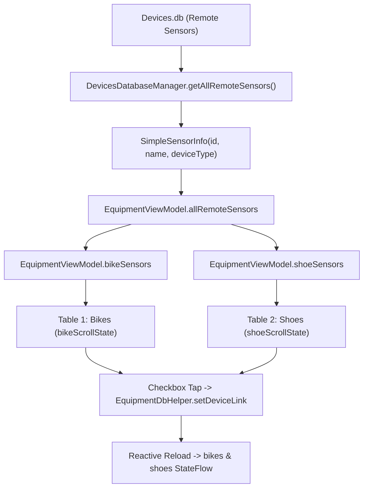

# Stage 3: Implementation Plan - ATT-2382: Split Equipment Sensor Matrix into Sport-Specific Tables for Bikes and Shoes and Restrict Incompatible Sensor Linkage

**Ticket**: [ATT-2382](https://rainerblind.atlassian.net/browse/ATT-2382)  
**Sub-task**: [ATT-2453](https://rainerblind.atlassian.net/browse/ATT-2453) (`[Impl-Plan] Split Equipment Sensor Matrix into Sport-Specific Tables for Bikes and Shoes and Restrict Incompatible Sensor Linkage`)  
**Parent Epic**: [ATT-355](https://rainerblind.atlassian.net/browse/ATT-355) (*Good and consistent UI*)  
**Target Release**: `V4.9.39`  
**Active Sprint**: `Sprint 2026-40.16`  
**Requirement Mapping**: `REQ-UI-256`  
**Test Mapping**: `TST-UI-230`  
**Branch**: `feature/ATT-2382`  
**Author**: AI Agent 1 (Implementer)  
**Date**: 2026-10-05  

---

## 1. Architectural Overview & SWE.2 Design

### 1.1 Root Cause & Solution Architecture
Currently, `EquipmentSensorMatrixScreen.kt` displays a single monolithic matrix grid where every paired remote sensor is presented as a column across all equipment rows. This causes cycling-exclusive sensors (power meters, bike cadence/speed) to appear on shoes, and running-exclusive sensors (footpods) to appear on bikes, creating visual clutter and nonsensical mapping options.

To establish sport-specific matrix partitioning and strict linkage restriction:
1. **Domain & Data Layer (`DevicesDatabaseManager.java`)**:
   - Enhance `SimpleSensorInfo` to encapsulate `@Nullable DeviceType deviceType`.
   - Update `getAllRemoteSensors()` to query the `DEVICE_TYPE` column from `Devices.db` and populate `deviceType`.
   - Implement `isBikeSensor(DeviceType)`, `isRunSensor(DeviceType)`, `isSharedSensor(DeviceType)`.
   - Add `getSensorsForSportType(BSportType sportType)` returning sensors compatible with the requested sport (cycling sensors + shared sensors for `BSportType.BIKE`, running sensors + shared sensors for `BSportType.RUN`).
2. **ViewModel Layer (`EquipmentViewModel.kt`)**:
   - Expose `bikeSensors: StateFlow<List<SimpleSensorInfo>>` and `shoeSensors: StateFlow<List<SimpleSensorInfo>>` filtered by sport compatibility from `allRemoteSensors`.
   - Maintain `allRemoteSensors: StateFlow<List<SimpleSensorInfo>>` for fleet-wide queries and backward compatibility.
3. **UI Matrix Layer (`EquipmentSensorMatrixScreen.kt`)**:
   - Deconstruct the monolithic grid into two distinct, independent tables:
     - **Table 1: Bikes (`bikes`)**: Columns display `bikeSensors`. Governed by dedicated `bikeScrollState`. Sticky first column with bike icon, name, and total distance.
     - **Table 2: Shoes (`shoes`)**: Columns display `shoeSensors`. Governed by dedicated `shoeScrollState`. Sticky first column with shoe icon, name, and total distance.
   - Independent horizontal scrolling ensures scrolling Table 1 never desynchronizes or moves Table 2.
   - Informative inline empty states when a category has equipment but zero compatible sensors.
4. **Single-Item Dialogs (`EditEquipmentDialog.kt`, `EditDeviceDialog.kt`)**:
   - In `EditEquipmentDialog`, filter selectable sensors by equipment sport (`type == EquipmentType.BIKE` shows bike + shared sensors, `type == EquipmentType.SHOE` shows run + shared sensors).
   - In `EditDeviceDialog`, filter selectable equipment by sensor compatibility (`isBikeSensor` -> bikes only, `isRunSensor` -> shoes only, `isSharedSensor` -> both).
5. **Localization & Parity**:
   - 100% 9-language parity across EN, DE, ES, FR, IT, JA, NL, PL, PT.

---

## 2. Target Files Slated for Modification

1. `app/src/main/java/com/atrainingtracker/trainingtracker/database/DevicesDatabaseManager.java`:
   - Enhance `SimpleSensorInfo` with `DeviceType deviceType`.
   - Update `getAllRemoteSensors()` to read `DEVICE_TYPE` column.
   - Implement `isBikeSensor`, `isRunSensor`, `isSharedSensor`, and `getSensorsForSportType(BSportType)`.
2. `app/src/main/java/com/atrainingtracker/trainingtracker/ui/equipment/EquipmentViewModel.kt`:
   - Expose `bikeSensors` and `shoeSensors` derived flows.
3. `app/src/main/java/com/atrainingtracker/trainingtracker/ui/equipment/EquipmentSensorMatrixScreen.kt`:
   - Implement partitioned tables for Bikes and Shoes with separate `ScrollState` instances.
   - Add inline category empty states.
4. `app/src/main/java/com/atrainingtracker/trainingtracker/ui/equipment/EditEquipmentDialog.kt`:
   - Restrict sensor list based on `equipment.type`.
5. `app/src/main/java/com/atrainingtracker/trainingtracker/ui/devices/EditDeviceDialog.kt` (or `EditDeviceViewModel.kt`):
   - Restrict equipment list based on `deviceType.sportType`.
6. String resources across all 9 locales:
   - `app/src/main/res/values/strings.xml` and 8 localized variants (`values-de`, `values-es`, `values-fr`, `values-it`, `values-ja`, `values-nl`, `values-pl`, `values-pt`).
7. Unit and contract test files:
   - `app/src/test/java/com/atrainingtracker/trainingtracker/ui/equipment/EquipmentSportSensorCompatibilityTest.kt`
   - `app/src/test/java/com/atrainingtracker/trainingtracker/ui/equipment/EquipmentViewModelMatrixTest.kt`
   - `app/src/test/java/com/atrainingtracker/trainingtracker/ui/equipment/EquipmentSensorMatrixScreenTest.kt`
   - `app/src/test/java/com/atrainingtracker/trainingtracker/ui/equipment/EditEquipmentDialogContractTest.kt`

---

## 3. Atomic Implementation Steps

### Step 1: Enhance `DevicesDatabaseManager.java` with DeviceType & Sport Filtering
- Add `deviceType` field, constructor parameter, and getter to `SimpleSensorInfo`.
- In `getAllRemoteSensors()`, query `DEVICE_TYPE` column and parse `DeviceType.fromString(typeStr)` or `DeviceType.valueOf(...)`.
- Implement helper methods:
  - `public static boolean isBikeSensor(@Nullable DeviceType type)`
  - `public static boolean isRunSensor(@Nullable DeviceType type)`
  - `public static boolean isSharedSensor(@Nullable DeviceType type)`
  - `public List<SimpleSensorInfo> getSensorsForSportType(BSportType sportType)`
- Target tests: Create `EquipmentSportSensorCompatibilityTest.kt` validating classification.

### Step 2: Add Partitioned Sensor Flows to `EquipmentViewModel.kt`
- Define `val bikeSensors: StateFlow<List<SimpleSensorInfo>>` filtering `allRemoteSensors` where `isBikeSensor(it.deviceType) || isSharedSensor(it.deviceType)`.
- Define `val shoeSensors: StateFlow<List<SimpleSensorInfo>>` filtering `allRemoteSensors` where `isRunSensor(it.deviceType) || isSharedSensor(it.deviceType)`.
- Target tests: Update `EquipmentViewModelMatrixTest.kt` verifying flow emissions and link updates.

### Step 3: Refactor `EquipmentSensorMatrixScreen.kt` for Dual-Table Layout
- Create reusable composable `EquipmentCategoryMatrixTable(...)` accepting:
  - `title: String`, `equipmentList: List<EquipmentItem>`, `sensorList: List<SimpleSensorInfo>`, `scrollState: ScrollState`, `onToggleLink: (Long, Long, Boolean) -> Unit`.
- In `EquipmentSensorMatrixScreen`:
  - Declare `val bikeScrollState = rememberScrollState()` and `val shoeScrollState = rememberScrollState()`.
  - Render Table 1 (Bikes) with `bikeScrollState` and `bikeSensors`.
  - Render Table 2 (Shoes) with `shoeScrollState` and `shoeSensors`.
  - Provide inline empty states when `sensorList.isEmpty()`.
- Target tests: Update `EquipmentSensorMatrixScreenTest.kt` verifying independent scrolling and table structure.

### Step 4: Enforce Compatibility Filtering in Single-Item Configuration Dialogs
- In `EditEquipmentDialog.kt`, filter available sensors:
  - For Bikes: show only bike-compatible and shared sensors.
  - For Shoes: show only run-compatible and shared sensors.
- In `EditDeviceDialog.kt` / `EditDeviceViewModel.kt`:
  - When editing a sensor, filter available equipment based on sensor type.
- Target tests: Create/update `EditEquipmentDialogContractTest.kt`.

### Step 5: 9-Language Localization Audit
- Verify all newly introduced string resources exist in EN, DE, ES, FR, IT, JA, NL, PL, PT.

### Step 6: Full Suite Clean-Room Regression Execution
- Execute `./gradlew testDebugUnitTest` verifying 100% test pass rate with zero regressions.

---

## 4. Invariant Protection & Verification

- **Invariant 1**: SQLite schemas for `Devices.db`, `Equipment.db`, and `LINKS` table remain 100% untouched.
- **Invariant 2**: Bidirectional sync between matrix checkboxes and single-item dialogs is strictly preserved (`REQ-UI-257`).
- **Invariant 3**: Sticky first column (`STICKY_COLUMN_WIDTH = 184.dp`) remains anchored during horizontal scroll.
- **Invariant 4**: Shared sensors (`HRM`, `ENVIRONMENT`) appear in both bike and shoe tables and remain assignable to both.
- **Invariant 5**: 100% clean-room unit test suite pass rate.
