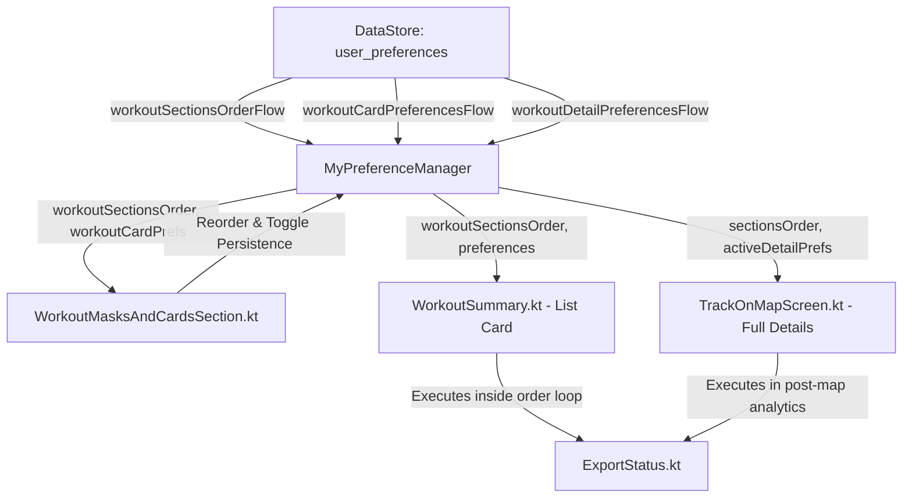

# Stage 3: Implementation Plan - ATT-2384: Define and Harmonize Default Section Visibility and Order for Workout Cards and Details

**Ticket**: [ATT-2384](https://rainerblind.atlassian.net/browse/ATT-2384)  
**Sub-task**: [ATT-2613](https://rainerblind.atlassian.net/browse/ATT-2613) (`[Impl-Plan]`)  
**Parent Epic**: [ATT-355](https://rainerblind.atlassian.net/browse/ATT-355) (*Good and consistent UI*)  
**Target Release**: `V4.9.40`  
**Active Sprint**: `2026-41.1`  
**Requirement Mapping**: `REQ-UI-285`  
**Test Mapping**: `TST-UI-245`  
**Branch**: `feature/ATT-2384`  
**Author**: AI Agent 1 (Implementer)  
**Date**: 2026-10-06  

---

## 1. Architectural Design & SWE.2 Boundaries



### Component Boundaries:
1. **Domain Model Layer (`WorkoutSectionType.kt`)**:
   - Houses the enum `WorkoutSectionType` and its companion `DEFAULT_ORDER`, serialization, and self-healing deserialization.
2. **Preference & DataStore Layer (`MyPreferenceManager.kt`)**:
   - Houses `WorkoutCardSectionPreferences` and `WorkoutDetailPreferences` data classes.
   - Manages asynchronous reactive flows and transactional DataStore edits.
3. **Settings Tuning Presentation (`WorkoutMasksAndCardsSection.kt`)**:
   - Displays the 9-feature matrix table with alternating row background, 48dp touch targets, and Move Up/Down controls.
4. **Workout Aftermath Presentation (`WorkoutSummary.kt` & `TrackOnMapScreen.kt`)**:
   - Executes dynamic section slotting according to `workoutSectionsOrder`, respecting independent List and Detail visibility toggles.

---

## 2. Atomic Implementation Steps

### Step 1: Extend Domain Model `WorkoutSectionType.kt`
- Target: `app/src/main/java/com/atrainingtracker/trainingtracker/ui/aftermath/WorkoutSectionType.kt`
- Actions:
  - Add enum constant: `EXPORT_STATUS(R.string.export_status)`.
  - Update `DEFAULT_ORDER` to:
    ```kotlin
    val DEFAULT_ORDER: List<WorkoutSectionType> = listOf(
        DESCRIPTION,
        EXTREMA,
        MAP,
        ELEVATION,
        CHARTS,
        ZONES,
        LAPS,
        EXPORT_STATUS,
        STRAVA
    )
    ```
- Verification: Compile-check and verify `fromSerializedString` retains self-healing append logic.

### Step 2: Harmonize Defaults & Add Export Status in `MyPreferenceManager.kt`
- Target: `app/src/main/java/com/atrainingtracker/trainingtracker/MyPreferenceManager.kt`
- Actions:
  - Update `WorkoutCardSectionPreferences`:
    ```kotlin
    data class WorkoutCardSectionPreferences(
        val showDescription: Boolean = true,
        val showExtrema: Boolean = true,
        val showLaps: Boolean = false,
        val showStrava: Boolean = true,
        val showMapPreview: Boolean = true,
        val showElevationProfile: Boolean = false,
        val showTelemetryCharts: Boolean = false,
        val showZoneAnalysis: Boolean = true,
        val showExportStatus: Boolean = true,
        val lapDisplayMode: LapDisplayMode = LapDisplayMode.VISUALIZER_ONLY
    )
    ```
  - Update `WorkoutDetailPreferences`:
    ```kotlin
    data class WorkoutDetailPreferences(
        val showDescription: Boolean = true,
        val showExtrema: Boolean = true,
        val showLaps: Boolean = true,
        val showStrava: Boolean = true,
        val showMap: Boolean = true,
        val showElevationProfile: Boolean = true,
        val showTelemetryCharts: Boolean = true,
        val showZoneAnalysis: Boolean = true,
        val showExportStatus: Boolean = true
    )
    ```
  - Add preference keys:
    - `WORKOUT_CARD_SHOW_EXPORT_STATUS = booleanPreferencesKey("workout_card_show_export_status")`
    - `WORKOUT_DETAIL_SHOW_EXPORT_STATUS = booleanPreferencesKey("workout_detail_show_export_status")`
  - Update `workoutCardPreferencesFlow` and `setWorkoutCardPreferences` to handle `showExportStatus` (defaulting `showLaps` to `false`, `showZoneAnalysis` to `true`, `showExportStatus` to `true`).
  - Update `workoutDetailPreferencesFlow` and `setWorkoutDetailPreferences` to handle `showExportStatus`.

### Step 3: Add `EXPORT_STATUS` Row to `WorkoutMasksAndCardsSection.kt`
- Target: `app/src/main/java/com/atrainingtracker/trainingtracker/ui/settings/tuning/categories/WorkoutMasksAndCardsSection.kt`
- Actions:
  - Add mapping for `WorkoutSectionType.EXPORT_STATUS` in `features`:
    ```kotlin
    WorkoutSectionType.EXPORT_STATUS -> MatrixFeatureRow(
        sectionType = type,
        titleRes = R.string.export_status,
        listChecked = workoutCardPrefs.showExportStatus,
        onListChange = { onWorkoutCardPrefsChange(workoutCardPrefs.copy(showExportStatus = it)) },
        detailChecked = workoutDetailPrefs.showExportStatus,
        onDetailChange = { onWorkoutDetailPrefsChange(workoutDetailPrefs.copy(showExportStatus = it)) }
    )
    ```

### Step 4: Modularize `ExportStatus` in `WorkoutSummary.kt`
- Target: `app/src/main/java/com/atrainingtracker/trainingtracker/ui/aftermath/workoutlist/WorkoutSummary.kt`
- Actions:
  - Inside `workoutSectionsOrder.forEach`:
    ```kotlin
    WorkoutSectionType.EXPORT_STATUS -> {
        if (preferences.showExportStatus) {
            ExportStatus(
                exportStatuses = workoutData.exportStatuses
            )
        }
    }
    ```
  - Remove the trailing hardcoded call to `ExportStatus(...)` outside the loop.

### Step 5: Render `ExportStatus` in `TrackOnMapScreen.kt`
- Target: `app/src/main/java/com/atrainingtracker/trainingtracker/ui/aftermath/TrackOnMapScreen.kt`
- Actions:
  - Import `com.atrainingtracker.trainingtracker.ui.components.export.ExportStatus`.
  - Inside the `when (type)` block in `analyticsContent`:
    ```kotlin
    WorkoutSectionType.EXPORT_STATUS -> {
        if (activeDetailPrefs.showExportStatus) {
            ExportStatus(
                exportStatuses = workoutData.exportStatuses
            )
        }
    }
    ```

### Step 6: Update & Add Unit / Contract Tests
- Targets:
  - `app/src/test/java/com/atrainingtracker/trainingtracker/settings/WorkoutSectionOrderPersistenceTest.kt`
  - `app/src/test/java/com/atrainingtracker/trainingtracker/settings/WorkoutPreferencesDefaultMatrixTest.kt` (new)
  - `app/src/test/java/com/atrainingtracker/trainingtracker/ui/settings/tuning/WorkoutSectionReorderContractTest.kt`
- Verification Commands:
  ```bash
  ./gradlew testDebugUnitTest --tests "com.atrainingtracker.trainingtracker.settings.WorkoutSectionOrderPersistenceTest" \
                              --tests "com.atrainingtracker.trainingtracker.settings.WorkoutPreferencesDefaultMatrixTest" \
                              --tests "com.atrainingtracker.trainingtracker.ui.settings/tuning.WorkoutSectionReorderContractTest"
  ```

---

## 3. UI Consistency & Architectural Alignment (Rule 23)

* **Reference Screen / Baseline**: The Workout Tuning Screen (`WorkoutMasksAndCardsSection.kt`) and Journal Cards (`WorkoutSummary.kt`):
  * **Matrix Table Layout**: The new `EXPORT_STATUS` row utilizes identical layout parameters: 48dp minimum touch targets for checkboxes, alternating background tint `MaterialTheme.colorScheme.surfaceVariant.copy(alpha = 0.25f)`, `MaterialTheme.colorScheme.primary` move icon buttons, and typography matching all existing rows.
  * **Dynamic Zero-Height Handling**: Like `DESCRIPTION` (which occupies 0 dp when blank), `ExportStatus` natively checks `if (activeExports.isNotEmpty())` and collapses to 0 dp when no export operations are active or configured.
  * **No Ad-Hoc Styling**: Relies strictly on semantic theme tokens (`colorScheme.onSurface`, `colorScheme.surfaceVariant`, `colorScheme.outlineVariant`).

---

## 4. Invariants & Rollback Safety

1. **Self-Healing Deserialization**:
   - `WorkoutSectionType.fromSerializedString` parses existing comma-separated strings from disk and appends any missing enum values (`missing = values().filter { !parsed.contains(it) }`). Upgrades from previous 8-section installations automatically adopt `EXPORT_STATUS` without migration failure.
2. **0 dp Empty State Invariant**:
   - Inactive exports do not render empty space or divider lines.
3. **Clean-Room Test Pass Rate**:
   - 100% full-suite pass rate must be maintained with 0 regressions.
