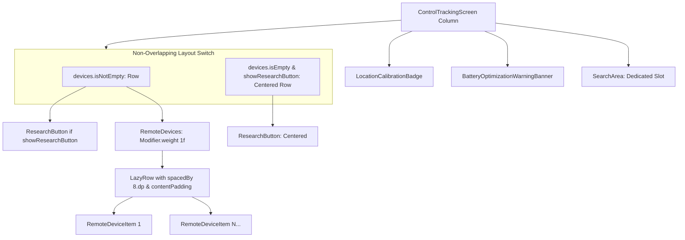

# Stage 3 Implementation Plan: ATT-2479 - Sensor-related items in the header part of the tracking control screen overlapping each other

**Ticket**: [ATT-2479](https://atrainingtracker.atlassian.net/browse/ATT-2479)  
**Sub-task**: [ATT-2752](https://atrainingtracker.atlassian.net/browse/ATT-2752) (`[Impl-Plan]`)  
**Parent Epic**: [ATT-355](https://atrainingtracker.atlassian.net/browse/ATT-355) (*Good and consistent UI*)  
**Target Release**: `V4.9.39`  
**Active Sprint**: `2026-41.3`  
**Branch**: `feature/ATT-2479`  
**Author**: Antigravity  
**Date**: 2026-10-08  

---

## 1. User Intent & Goal
On the Control Tracking screen (`Aufzeichnung`), when multiple sensors are active or connected (e.g. 5–6 sensors such as Magene HR, speed, cadence), the "Suchen" (`ResearchButton`) action button overlaps directly on top of the first sensor tile because both components are layered inside an unconstrained `Box` with conflicting alignments (`TopStart` vs `TopCenter`). Additionally, sensor tiles in `RemoteDevices` touch the screen margins without proper horizontal spacing.

The goal is to restructure the sensor header layout into non-overlapping, flow-controlled layout containers:
1. Isolate `SearchArea` into a dedicated full-width slot above the device section.
2. Structure `RemoteDevices` and `ResearchButton` into a clean side-by-side `Row` when devices are present, with `RemoteDevices` taking `Modifier.weight(1f)` so its horizontal list scrolls smoothly without occluding `ResearchButton`.
3. Render `ResearchButton` centered horizontally when `devices.isEmpty()`, or omit it entirely when `showResearchButton == false`.
4. Modernize `RemoteDevices` to accept `modifier: Modifier = Modifier` and use `Arrangement.spacedBy(8.dp, Alignment.CenterHorizontally)` with proper content padding.

---

## 2. Architectural Design (SWE.2)

### 2.1 Component Decomposition


### 2.2 UI Consistency Analysis (Rule 23)
- **Design System Tokens**: Utilizes standard `MaterialTheme.colorScheme` tokens and Material 3 `Arrangement.spacedBy(8.dp)`.
- **Layout Rhythm**: Preserves 16.dp screen-edge padding and 8.dp item separation consistent with app-wide design guidelines.
- **Dark Mode Compatibility**: Fully preserved; all components inherit theme styling.
- **Accessibility & Touch Targets**: `ResearchButton` retains 48.dp icon size and standard padding. `RemoteDeviceItem` retains minimum touch targets with unobstructed clickability.

---

## 3. Discrete Atomic Steps

### Step 1: Update `RemoteDevices.kt` Component Interface & Internal Spacing
- Add optional `modifier: Modifier = Modifier` to `RemoteDevices` composable signature.
- Apply `modifier` to the root container.
- Update `LazyRow` to use `horizontalArrangement = Arrangement.spacedBy(8.dp, Alignment.CenterHorizontally)` and `contentPadding = PaddingValues(horizontal = 8.dp, vertical = 4.dp)`.
- Provide stable key mapping `key = { it.address ?: it.name }` for `items(devices)`.

### Step 2: Restructure Sensor Header in `ControlTrackingScreen.kt`
- Extract `SearchArea(searchingFor = searchingFor)` from the legacy `Box` and place it directly below `BatteryOptimizationWarningBanner`.
- Replace the legacy z-stacked `Box(fillMaxWidth())` with conditional `Row` layouts:
  - If `devices.isNotEmpty()`:
    ```kotlin
    Row(
        modifier = Modifier.fillMaxWidth().padding(bottom = 8.dp),
        verticalAlignment = Alignment.CenterVertically
    ) {
        if (showResearchButton) {
            ResearchButton(
                isEnabled = searchingFor == null,
                onClick = onSearch
            )
        }
        RemoteDevices(
            devices = devices,
            onDeviceClick = onDeviceClick,
            modifier = Modifier.weight(1f)
        )
    }
    ```
  - Else if `showResearchButton`:
    ```kotlin
    Row(
        modifier = Modifier.fillMaxWidth().padding(bottom = 8.dp),
        horizontalArrangement = Arrangement.Center,
        verticalAlignment = Alignment.CenterVertically
    ) {
        ResearchButton(
            isEnabled = searchingFor == null,
            onClick = onSearch
        )
    }
    ```
- Update Compose Previews in `ControlTrackingScreen.kt` to cover:
  1. Searching with 1 device.
  2. Not searching with 1 device.
  3. No remote devices with hidden research button.
  4. Multiple devices (5+ devices) with research button visible.

### Step 3: Implement Automated Contract Tests
- Create `ControlTrackingSensorHeaderContractTest.kt` verifying:
  - Header hierarchy under 0 devices + show research button.
  - Header hierarchy under 5 devices + show research button (non-overlapping row structure).
  - Header hierarchy under devices present + hide research button.
  - SearchArea vertical positioning above device row.
- Create `RemoteDevicesContractTest.kt` verifying:
  - `RemoteDevices` modifier forwarding.
  - `RemoteDevices` tile spacing configuration.

### Step 4: Regression Verification & Gate Progression
- Run targeted tests:
  `./gradlew testDebugUnitTest --tests "*ControlTrackingSensorHeaderContractTest*" --tests "*RemoteDevicesContractTest*"`
- Run full clean-room repository regression suite:
  `./gradlew testDebugUnitTest`
- Progress subtask through Gate 3, then advance to Stage 4.

---

## 4. Invariants & Guardrails
1. **Zero Regression on Interactions**:
   - Tapping `ResearchButton` triggers `onSearch`.
   - Tapping any `RemoteDeviceItem` triggers `onDeviceClick(device)`.
2. **Behavioral Invariance of SearchArea**:
   - `SearchArea` only renders indicator and text when `searchingFor != null`.
3. **No Overflow Clipping**:
   - `LazyRow` handles any number of devices gracefully without clipping or throwing layout exceptions.
4. **Clean-Room Test Pass Rate**:
   - 100% test pass rate across all modules.

---

## 5. Traceability Matrix

| Requirement | Test Identifier | Implementation Target | Plan Step |
| :--- | :--- | :--- | :--- |
| `REQ-UI-301.1` (SearchArea vertical isolation) | `TST-UI-261.1` | `ControlTrackingScreen.kt` | Step 2 |
| `REQ-UI-301.2` (Side-by-side Row with weight) | `TST-UI-261.1` | `ControlTrackingScreen.kt` | Step 2 |
| `REQ-UI-301.3` (Centered ResearchButton fallback) | `TST-UI-261.1` | `ControlTrackingScreen.kt` | Step 2 |
| `REQ-UI-301.4` (RemoteDevices modifier & spacing) | `TST-UI-261.2` | `RemoteDevices.kt` | Step 1 |
| `REQ-UI-301.5` (Interaction preservation) | `TST-UI-261.1`, `TST-UI-261.2` | `ControlTrackingScreen.kt`, `RemoteDevices.kt` | Step 2, Step 3 |
