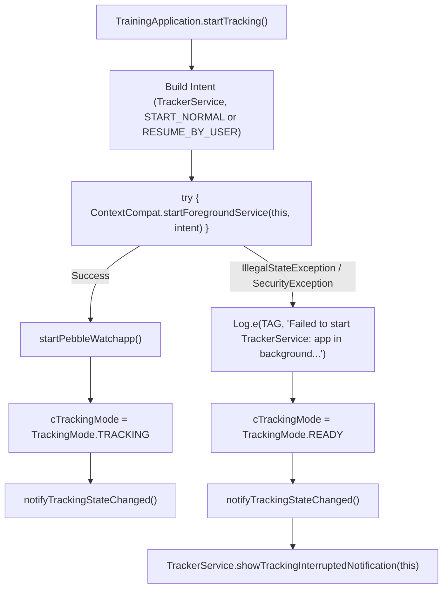

# Stage 3: Implementation Plan - ATT-2661: TrainingApplication.startTracking FGS Background Crash

**Ticket**: [ATT-2661](https://atrainingtracker.atlassian.net/browse/ATT-2661)  
**Sub-task**: [ATT-2664](https://atrainingtracker.atlassian.net/browse/ATT-2664) (`[Impl-Plan] TrainingApplication.startTracking`)  
**Parent Epic**: [ATT-235](https://atrainingtracker.atlassian.net/browse/ATT-235) (*No crashs*)  
**Target Release**: `V4.9.39`  
**Active Sprint**: `2026-41.3`  
**Requirement Mapping**: `REQ-STB-014`  
**Test Mapping**: `TST-STB-014`  
**Branch**: `feature/ATT-2661`  
**Author**: AI Agent 1 (Implementer)  
**Date**: 2026-10-08  

---

## 1. Architectural Overview & SWE.2 Design

### 1.1 Root Cause & Solution Architecture
In release `4.9.38.1 (263)`, `TrainingApplication.startTracking()` crashed with:
```
Fatal Exception: java.lang.RuntimeException: Error receiving broadcast Intent { act=com.atrainingtracker.trainingapplication.REQUEST_START_TRACKING ... } in TrainingApplication$3
Caused by: java.lang.IllegalStateException: Not allowed to start service Intent { cmp=com.atrainingtracker/.trainingtracker.tracker.TrackerService (has extras) }: app is in background uid UidRecord{... RCVR idle}
```
The crash occurred because `TrainingApplication.java:1443` invoked `startService(intent)` directly. On Android 8.0+ (API 26+), background service startup is strictly forbidden when the app is in background state (`RCVR idle`). Furthermore, on Android 12+ (API 31+), `ForegroundServiceStartNotAllowedException` is thrown if foreground service starts are disallowed from the background.

While `TrackerService.onStartCommand()` already incorporates defensive lifecycle handling for OS restarts (`intent == null`, `REQ-STB-002`), the caller site in `TrainingApplication.java` lacked both `ContextCompat.startForegroundService()` delegation and defensive exception shielding.

To achieve complete crash immunity:
1. **Foreground Service Launch Delegation**: Replace `startService(intent)` with `ContextCompat.startForegroundService(this, intent)`.
2. **Defensive Launch Exception Shielding**: Encapsulate `startForegroundService` inside a `try ... catch (IllegalStateException | SecurityException)` block.
3. **Graceful State Reset & User Alert**: Upon encountering a launch failure:
   - Reset `cTrackingMode = TrackingMode.READY`.
   - Dispatch `notifyTrackingStateChanged()`.
   - Post `TrackerService.showTrackingInterruptedNotification(this)` to alert the athlete and provide a tap target to resume tracking once the app returns to the foreground (`REQ-STB-003`).
4. **Context-Parametrized Notification Helper**: Expose `public static void showTrackingInterruptedNotification(Context context)` in `TrackerService.java`.



---

## 2. Target Files Slated for Modification

1. `app/src/main/java/com/atrainingtracker/trainingtracker/tracker/TrackerService.java`:
   - Refactor `showTrackingInterruptedNotification()` to provide a `public static void showTrackingInterruptedNotification(Context context)` helper.
   - Retain the instance method `protected void showTrackingInterruptedNotification()` delegating to the static overload.

2. `app/src/main/java/com/atrainingtracker/trainingtracker/TrainingApplication.java`:
   - Import `androidx.core.content.ContextCompat`.
   - In `startTracking()` (lines 1436-1448):
     - Replace `startService(intent)` with `ContextCompat.startForegroundService(this, intent)`.
     - Wrap in `try ... catch (IllegalStateException | SecurityException e)`.
     - In catch block, reset tracking mode to `READY`, notify listeners, and display `TrackerService.showTrackingInterruptedNotification(this)`.

3. `app/src/test/java/com/atrainingtracker/trainingtracker/TrainingApplicationTrackingTest.kt`:
   - Unit test suite verifying:
     - Normal foreground startup delegation (`TST-STB-014.1`).
     - Exception shielding for `IllegalStateException` / background restriction (`TST-STB-014.2`).
     - Exception shielding for `SecurityException` (`TST-STB-014.3`).

---

## 3. Atomic Implementation Steps

### Step 1: Expose Static `showTrackingInterruptedNotification(Context context)` in `TrackerService.java`
- Refactor `TrackerService.showTrackingInterruptedNotification()` to `public static void showTrackingInterruptedNotification(Context context)`.
- Ensure null-safety on `context`.
- Keep existing instance method `protected void showTrackingInterruptedNotification()` delegating to `showTrackingInterruptedNotification(this)`.

### Step 2: Update `TrainingApplication.startTracking()` with Foreground Service Delegation and Defensive Exception Shielding
- In `TrainingApplication.java`:
  - Add import `androidx.core.content.ContextCompat`.
  - Update `startTracking()`:
    ```java
    try {
        ContextCompat.startForegroundService(this, intent);
        startPebbleWatchapp();

        cTrackingMode = TrackingMode.TRACKING;
        notifyTrackingStateChanged();
    } catch (IllegalStateException | SecurityException e) {
        Log.e(TAG, "Failed to start TrackerService: app in background or permission denied: " + e.getMessage(), e);
        cTrackingMode = TrackingMode.READY;
        notifyTrackingStateChanged();
        TrackerService.showTrackingInterruptedNotification(this);
    }
    ```

### Step 3: Implement Unit Test Suite (`TrainingApplicationTrackingTest.kt`)
- Write targeted Robolectric/MockK unit tests in `app/src/test/java/com/atrainingtracker/trainingtracker/TrainingApplicationTrackingTest.kt`:
  - `startTracking_delegatesToStartForegroundService()`: verifies foreground delegation.
  - `startTracking_whenIllegalStateExceptionThrown_recoversGracefully()`: simulates `IllegalStateException` and asserts mode is reset to `READY` without throwing.
  - `startTracking_whenSecurityExceptionThrown_recoversGracefully()`: simulates `SecurityException` and asserts mode is reset to `READY` without throwing.

### Step 4: Run Targeted & Full Clean-Room Test Suite
- Run `./gradlew testDebugUnitTest --tests com.atrainingtracker.trainingtracker.TrainingApplicationTrackingTest`.
- Run full suite `./gradlew testDebugUnitTest`.

---

## 4. Invariant Protection & Pre-Implementation Verification

- **Invariant 1**: `START_STICKY` service lifecycle in `TrackerService.onStartCommand` (`REQ-STB-002`) MUST remain untouched.
- **Invariant 2**: `TrackerService.StartType` contracts (`START_NORMAL`, `RESUME_BY_USER`) and resume-from-crash handling (`REQ-STB-003`) MUST NOT be altered.
- **Invariant 3**: Paired sensor discovery broadcast (`REQUEST_START_SEARCH_FOR_PAIRED_DEVICES`) and Pebble watchapp coordination MUST be preserved.
- **Invariant 4**: Clean-room test suite 100% pass rate MUST be maintained.
- **Invariant 5**: Pre-implementation CLI gate check (`python3 tools/jira_util.py check-gate ATT-2664`) will be executed prior to any file edit.
