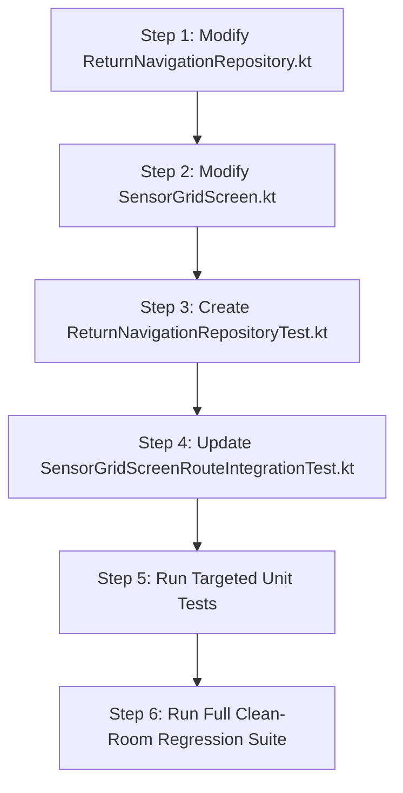

# Stage 3: Implementation Plan - ATT-2938: Prevent unsolicited ReturnNavigationHud activation during regular route navigation and gate by tab navigation hints

**Ticket**: [ATT-2938](https://atrainingtracker.atlassian.net/browse/ATT-2938)  
**Sub-task**: [ATT-2970](https://atrainingtracker.atlassian.net/browse/ATT-2970) (`[Impl-Plan]`)  
**Parent Epic**: [ATT-66](https://atrainingtracker.atlassian.net/browse/ATT-66) (*Improve Routes*)  
**Target Release**: `V4.9.40`  
**Active Sprint**: `Sprint 2026-41.6`  
**Requirement Mapping**: `REQ-MAP-039` (*Strict "Take Me Home" Return Navigation Activation Decoupling, Tab Navigation Hints Gating, and Non-Displacing Cockpit Overlay Integration*)  
**Test Mapping**: `TST-MAP-041` (*Strict "Take Me Home" Activation Decoupling, Tab Hints Gating, and Non-Displacing Overlay Verification*)  
**Branch**: `feature/ATT-2938`  
**Author**: AI Agent 1 (Implementer)  
**Date**: 2026-10-09  

---

## 1. Problem Description & Background

During active workout tracking on Google Pixel 10, athletes following a selected navigation route frequently observe an unsolicited "Zu Hause" Return Navigation HUD card (`ReturnNavigationHud.kt`) anchored at the top of their cockpit screen (`🏠 Zu Hause • 8.2 km • +137 m • 17:32 (~41 min)`), even though they never activated "Take Me Home" ("Heimweg") mode.

Forensic root cause analysis identified three interrelated defects:
1. `ReturnNavigationRepository.kt:146` evaluated `val isActive = hasActiveRoute || isTakeMeHomeMode`, conflating ordinary route navigation with return navigation.
2. `ReturnCorridorSnapper.kt:229-232` automatically overrode the route name to "Zu Hause" whenever the route endpoint fell within 500m of the athlete's home destination.
3. `SensorGridScreen.kt:475` rendered `ReturnNavigationHud` as an in-flow composable inside the main cockpit `Column` without checking `state.showNavigationHints`, pushing telemetry sensor tiles downwards and polluting telemetry-only cockpit tabs.

This plan details the atomic implementation steps to decouple "Take Me Home" activation, place the HUD within the non-displacing top-level overlay, gate it by tab navigation hints, and enforce clean lifecycle state reset invariants.

---

## 2. Traceability & Requirements Mapping

* **Requirement**: `REQ-MAP-039` (*Strict "Take Me Home" Return Navigation Activation Decoupling, Tab Navigation Hints Gating, and Non-Displacing Cockpit Overlay Integration*)
* **Test Mapping**: `TST-MAP-041` (*Strict "Take Me Home" Activation Decoupling, Tab Hints Gating, and Non-Displacing Overlay Verification*)
  * `TST-MAP-041.1`: Unit test verifying regular route navigation does not activate `ReturnNavigationState` (`isActive == false`, `hasRemainingMetrics == false`).
  * `TST-MAP-041.2`: Unit test verifying `startTakeMeHome()` activates return metrics and resolves home destination.
  * `TST-MAP-041.3`: Unit test verifying `stopTakeMeHome()` or route clearing resets state to inactive.
  * `TST-MAP-041.4`: Contract test verifying `ReturnNavigationHud` is NOT located in the in-flow sensor grid `Column`.
  * `TST-MAP-041.5`: Contract test verifying `ReturnNavigationHud` is hosted in top-level overlay at `Alignment.TopCenter` and gated by `state.showNavigationHints`.
  * `TST-MAP-041.6`: Full clean-room regression test suite (`./gradlew testDebugUnitTest`).

---

## 3. System Invariants & Preserved Behavior

1. **Mid-Ride "Take Me Home" Invariant (`REQ-UI-282`)**: Opening `RouteSelectorSheet` mid-ride MUST continue to offer the "Take Me Home" card, invoking `startTakeMeHome()`.
2. **Elevation-Aware Dynamic ETA Invariant (`REQ-MAP-029`)**: When "Take Me Home" is active, `ElevationAwareEtaCalculator` calculations (remaining distance, climb, athletic VAM ascent penalty, clock ETA) MUST be strictly preserved.
3. **Reverse Return Guidance**: When `isReverseReturn == true`, return guidance along the route back to the start MUST remain operational.
4. **Cockpit Telemetry Stationarity**: Telemetry sensor tiles in `SensorGridScreen` MUST remain completely stationary when navigation cards appear or dismiss.
5. **Per-Tab Navigation Gating**: When `state.showNavigationHints == false`, ambient navigation cards MUST NOT be composed into the UI tree.
6. **Lifecycle State Reset Invariant**: When return navigation is stopped or the active route is deselected, `isTakeMeHomeMode` and `isReverseReturn` MUST reset to `false` and emit inactive state.
7. **Human Decision Gate**: Parent ticket `ATT-2938` terminal state is strictly `Final Review (Human)`.

---

## 4. UI Consistency & Design System Alignment (Rule 23)

* **Reference Screen**: `SensorGridScreen.kt` top overlay layer hosting `ForkDecisionCard` (introduced in `ATT-2874`).
* **Reused Components**: `ReturnNavigationHud.kt` and `ForkDecisionCard.kt`.
* **Theme Tokens**:
  - Anchored at `Alignment.TopCenter` within the outer `Box(modifier = Modifier.fillMaxSize().padding(top = paddingValues.calculateTopPadding()))`.
  - Shape: `RoundedCornerShape(12.dp)`.
  - Border stroke: `BorderStroke(1.dp, TTColor.RouteSelected.copy(alpha = 0.35f))`.
  - Container color: `MaterialTheme.colorScheme.secondaryContainer.copy(alpha = tuningConfig.navigationCueTransparency)`.
  - Spacing: Stacked vertically within `Column(modifier = Modifier.align(Alignment.TopCenter).fillMaxWidth())` with `spacedBy(8.dp)`.
  - Strict gating: `if (state.showNavigationHints)`.

---

## 5. Proposed Architectural Changes (SWE.2)

### Component 1: `ReturnNavigationRepository.kt` (`com.atrainingtracker.trainingtracker.routes`)

1. **Activation Decoupling**:
   In `recalculateNavigationMetrics`:
   ```kotlin
   val activeRoute = currentActiveRoute
   val hasActiveRoute = activeRoute != null && activeRoute.path.isNotEmpty()

   // Active ONLY if athlete explicitly requested "Take Me Home"
   val isActive = isTakeMeHomeMode

   if (!isActive) {
       _navigationState.value = ReturnNavigationState(isActive = false)
       return
   }
   ```
2. **Home Snapping Parameter**:
   Only pass `cachedHomeDestination` into `snapToCorridor` when `isTakeMeHomeMode == true`:
   ```kotlin
   val snap = ReturnCorridorSnapper.snapToCorridor(
       currentLat = currentLocation.latitude,
       currentLng = currentLocation.longitude,
       currentAltitude = 0.0,
       activeRoute = if (hasActiveRoute) activeRoute else null,
       homeDestination = if (isTakeMeHomeMode) cachedHomeDestination else null,
       savedRoutes = allSavedRoutes,
       forceReverseReturn = isReverseReturn
   )
   ```
3. **Lifecycle State Resets**:
   * In `stopTakeMeHome()`:
     ```kotlin
     fun stopTakeMeHome() {
         isTakeMeHomeMode = false
         isReverseReturn = false
         isDismissed = false
         _navigationState.value = ReturnNavigationState(isActive = false)
     }
     ```
   * In route observer collector:
     When `activeRoute` becomes `null`, reset `isReverseReturn = false`. If not in `isTakeMeHomeMode`, emit `ReturnNavigationState(isActive = false)`.

### Component 2: `SensorGridScreen.kt` (`com.atrainingtracker.trainingtracker.ui.tracking.tracking`)

1. **Remove In-Flow Displacement**:
   Remove lines 474–479 where `ReturnNavigationHud` was placed inside the primary layout `Column`.
2. **Add to Top-Level Overlay**:
   In lines 555–570, group `ReturnNavigationHud` and `ForkDecisionCard` inside the top-center overlay `Column`, strictly gated behind `state.showNavigationHints`:
   ```kotlin
   // Top-Level Ambient Navigation Overlays (REQ-MAP-031, REQ-MAP-029, ATT-2874, ATT-2938)
   // Floats on top at Alignment.TopCenter, strictly gated by state.showNavigationHints
   if (state.showNavigationHints) {
       Column(
           modifier = Modifier
               .align(Alignment.TopCenter)
               .fillMaxWidth()
       ) {
           ReturnNavigationHud(
               navigationState = returnNavState,
               overlayAlpha = tuningConfig.navigationCueTransparency,
               onDismiss = { returnNavRepo.dismissHud() }
           )

           ForkDecisionCard(
               decisionState = forkDecisionState,
               overlayAlpha = tuningConfig.navigationCueTransparency,
               onRouteSelected = { routeId ->
                   forkNavRepo.selectRouteManually(routeId)
               },
               onDismiss = {
                   forkNavRepo.dismissPrompt()
               }
           )
       }
   }
   ```

---

## 6. Step-by-Step Implementation Sequence



### Step 1: Update `ReturnNavigationRepository.kt`
* Enforce `isActive = isTakeMeHomeMode`.
* Pass `cachedHomeDestination` only when `isTakeMeHomeMode == true`.
* Ensure clean lifecycle reset in `stopTakeMeHome()` and on route clearing.

### Step 2: Update `SensorGridScreen.kt`
* Remove `ReturnNavigationHud` from in-flow `Column`.
* Place `ReturnNavigationHud` in top-level overlay `Column` at `Alignment.TopCenter` gated by `if (state.showNavigationHints)`.

### Step 3: Create Unit Test Suite `ReturnNavigationRepositoryTest.kt`
* Test that selecting a route ending near home without "Take Me Home" produces an inactive state (`isActive == false`, `hasRemainingMetrics == false`).
* Test that calling `startTakeMeHome()` produces an active state with home destination name and ETA metrics.
* Test that `stopTakeMeHome()` and route clear transitions state back to inactive.

### Step 4: Update Architectural Contract Test `SensorGridScreenRouteIntegrationTest.kt`
* Verify `ReturnNavigationHud` is NOT inside the in-flow Column.
* Verify `ReturnNavigationHud` is hosted in the top-level overlay at `Alignment.TopCenter` and gated by `state.showNavigationHints`.

### Step 5: Targeted Unit Testing
Execute targeted tests:
```bash
./gradlew testDebugUnitTest --tests "com.atrainingtracker.trainingtracker.routes.ReturnNavigationRepositoryTest" --tests "com.atrainingtracker.trainingtracker.ui.tracking.tracking.SensorGridScreenRouteIntegrationTest" --tests "com.atrainingtracker.trainingtracker.ui.routes.ReturnNavigationHudContractTest"
```

### Step 6: Full Clean-Room Regression Test Suite
Execute full test suite:
```bash
./gradlew testDebugUnitTest
```
Ensure 100% pass rate across all unit tests.
