# Walkthrough - ATT-1263: [Cockpit] Implement AMOLED Pure Black (#000000) Theme for Tracking Views

**Parent Ticket**: [ATT-1263](https://rainerblind.atlassian.net/browse/ATT-1263)  
**Sub-task**: [ATT-1417](https://rainerblind.atlassian.net/browse/ATT-1417) (`[Implementation]`)  
**Requirements**: `REQ-UI-169` (*AMOLED Pure Black Cockpit Theme*), referencing `REQ-UI-168` (*Workout Cockpit Independent Theme Selector*) and `REQ-UI-101` (*Neutral Backgrounds*)  
**Test Spec**: `TST-UI-121`  
**Branch**: `feature/ATT-1263`  
**Target Release**: `V4.9.38` (Sprint `2026-39.3`)  

---

## 1. Summary of Implemented Changes

Implemented a dedicated AMOLED Pure Black (`#000000`) theme specifically scoped to the workout cockpit (live tracking telemetry views on pages 1..N and the lap button), turning off OLED pixels completely for maximum sunlight contrast and minimal battery usage during workouts while isolating non-cockpit views and menus in the standard ambient system theme:

```mermaid
graph TD
    subgraph Color & Theme Architecture
        CK[Color.kt: AmoledBackground #000000<br/>AmoledOutlineVariant #2C2C2E<br/>AmoledOutline #38383A]
        TK[Theme.kt: AmoledDarkColorScheme]
        DCS[Theme.kt: DarkColorScheme #1B1B1F]
        ATTT[ATrainingTrackerTheme: amoled parameter]
        CK --> TK
        DCS -->|copy with overrides| TK
        TK --> ATTT
    end

    subgraph Scoped Tracking Presentation Layer: TrackingTabsScreen.kt
        TTS[TrackingTabsScreen] --> PAGER[HorizontalPager: Pages 0..N]
        PAGER -->|Page 0: Control Tab| CTS[ControlTrackingScreen: Standard Ambient Theme]
        PAGER -->|Pages 1..N: Cockpit Tabs| CTHEME[ATrainingTrackerTheme: darkTheme = isCockpitDark, amoled = isCockpitDark]
        CTHEME --> TTGC[TrackingTabGridContent]
        TTGC --> BSS[BottomSheetScaffold: surface = #000000]
        BSS --> SFV[SensorFieldView: #000000 cards + #2C2C2E outlineVariant + #FFFFFF text]
        BSS --> LSS[LiveSegmentSheet & Elevation Profile: #000000]
        TTS -->|Lap Button| LAP[LapButton: amoled = isCockpitDark]
    end

    subgraph Unaffected Global App Shell
        DRAWER[Navigation Drawer] --> AMB[Ambient System / Light Theme #1B1B1F]
        HIST[History & Workout Summaries] --> AMB
        PERIODS[Periods & Statistics] --> AMB
        DIALOGS[Settings Dialogs] --> AMB
    end
```



---

## 2. Detailed Technical Components

### 2.1 AMOLED Color Tokens: [Color.kt](file:///home/rainer/AndroidStudioProjects/aTrainingTracker/app/src/main/java/com/atrainingtracker/trainingtracker/ui/theme/Color.kt)
Added explicit color tokens for AMOLED rendering:
- `AmoledBackground = Color(0xFF000000)`
- `AmoledSurface = Color(0xFF000000)`
- `AmoledOutlineVariant = Color(0xFF2C2C2E)` (Subtle, crisp 1dp outline between pitch black tiles)
- `AmoledOutline = Color(0xFF38383A)`

### 2.2 AMOLED Color Scheme & Composable Parameter: [Theme.kt](file:///home/rainer/AndroidStudioProjects/aTrainingTracker/app/src/main/java/com/atrainingtracker/trainingtracker/ui/theme/Theme.kt)
- Defined `internal val AmoledDarkColorScheme = DarkColorScheme.copy(...)` overriding surfaces, containers, backgrounds, borders, and high-contrast typography (`onSurface = Color.White`, `onBackground = Color.White`, `onSurfaceVariant = Color(0xFFC4C6D0)`).
- Extended `ATrainingTrackerTheme` with optional parameter `amoled: Boolean = false`, selecting `AmoledDarkColorScheme` when `darkTheme && amoled`.

### 2.3 Presentation Scope Isolation: [TrackingTabsScreen.kt](file:///home/rainer/AndroidStudioProjects/aTrainingTracker/app/src/main/java/com/atrainingtracker/trainingtracker/ui/tracking/trackingtabs/TrackingTabsScreen.kt)
- Wrapped Pages 1..N (`TrackingTabGridContent`) and `LapButton` with `ATrainingTrackerTheme(darkTheme = isCockpitDark, amoled = isCockpitDark)`.
- Scope Invariants Preserved:
  - Page 0 (`ControlTrackingScreen`) remains outside the cockpit theme wrapper, retaining the ambient system theme.
  - The outer application shell (Navigation Drawer, History, Periods, Settings Dialogs) remains completely in the standard ambient Material 3 theme.
  - Sensor cards without zone colors automatically render in `#000000` with `#2C2C2E` borders and `#FFFFFF` text.
  - Sensor cards with active athletic zones blend their 12% tint smoothly over `#000000` with the 6dp vertical strip clearly visible.

---

## 3. Verification & Test Results

### 3.1 Unit Test Suite: [AmoledThemeTest.kt](file:///home/rainer/AndroidStudioProjects/aTrainingTracker/app/src/test/java/com/atrainingtracker/trainingtracker/ui/theme/AmoledThemeTest.kt)
Added unit test suite covering:
1. `testAmoledDarkColorSchemeTokens`: Verifies exact hex values of all AMOLED tokens (`#000000` background/surfaces, `#2C2C2E` outlineVariant, `#FFFFFF` onSurface, `#C4C6D0` onSurfaceVariant).
2. `testStandardDarkColorSchemeIsolation`: Confirms standard `DarkColorScheme` and tokens (`DarkBackground`, `DarkSurface`) remain unchanged at `#1B1B1F`.

Executed:
```bash
./gradlew testDebugUnitTest --tests "com.atrainingtracker.trainingtracker.ui.theme.*"
```
Result: **BUILD SUCCESSFUL**, 100% tests passed:
- `AmoledThemeTest.testAmoledDarkColorSchemeTokens`: Passed (0.076s)
- `AmoledThemeTest.testStandardDarkColorSchemeIsolation`: Passed (0.000s)
- `CockpitThemeModeTest.testResolveEffectiveCockpitDarkTheme_systemMode_followsSystem`: Passed (0.002s)
- `CockpitThemeModeTest.testFromId_resolvesExpectedModes`: Passed (0.001s)
- `CockpitThemeModeTest.testResolveEffectiveCockpitDarkTheme_alwaysDark_alwaysTrue`: Passed (0.001s)

### 3.2 Requirement Archaeology & Chesterton's Fence Governance
```bash
python3 tools/verify_requirement_governance.py --text-file docs/engineering/test_specs/ATT-1263_test_spec.md
```
Result: **PASS** (exit code 0).

---

## 4. Invariant Compliance Audit

- **OLED Power Optimization**: True `#000000` black shuts off OLED pixels across the workout cockpit.
- **Sunlight Readability**: Contrast ratio between `#FFFFFF` text and `#000000` background reaches maximum physical display capability (21:1+).
- **Scope Isolation**: Control Tracking (Page 0) and the rest of the application remain in ambient theme.
- **Backwards Compatibility**: All other call sites of `ATrainingTrackerTheme` default to `amoled = false`, preventing unintentional styling regressions.
