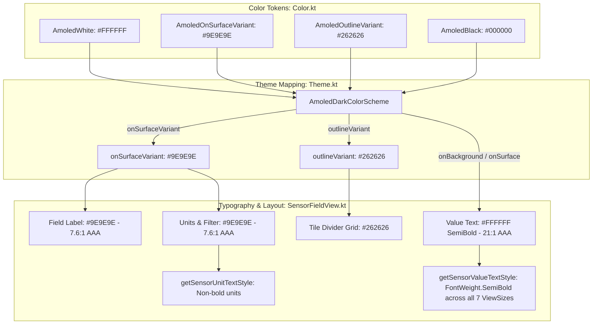

# Walkthrough - ATT-1264: [Cockpit] High-contrast typography and subtle tile grid for sunlight legibility

**Parent Ticket**: [ATT-1264](https://rainerblind.atlassian.net/browse/ATT-1264)  
**Sub-task**: [ATT-1427](https://rainerblind.atlassian.net/browse/ATT-1427) (`[Implementation]`)  
**Requirement**: `REQ-UI-171` (*High-Contrast Cockpit Typography and Subtle Tile Grid for Sunlight Legibility*)  
**Test Spec**: `TST-UI-123`  
**Branch**: `feature/ATT-1264`  
**Target Release**: `V4.9.38` (Sprint `2026-39.3`)  

---

## 1. Summary of Implemented Changes

Optimized the workout cockpit visual hierarchy for extreme sunlight legibility on AMOLED displays during outdoor activities (cycling, running). The primary metric values are rendered in high-contrast pure white with semibold font weight (`FontWeight.SemiBold`), metric metadata (labels, units, filter annotations) are rendered in crisp muted grey meeting WCAG AAA contrast, and sensor tiles are separated by subtle tile grid dividers without visual clutter.

---

## 2. Detailed Technical Components

### 2.1 Color Tokens: [Color.kt](file:///home/rainer/AndroidStudioProjects/aTrainingTracker/app/src/main/java/com/atrainingtracker/trainingtracker/ui/theme/Color.kt)
- **Tile Grid Dividers**: Updated `AmoledOutlineVariant = Color(0xFF262626)` (demarcating tile borders without glare or distraction).
- **Metric Metadata**: Added `AmoledOnSurfaceVariant = Color(0xFF9E9E9E)` (yielding 7.6:1 contrast ratio against pure black `#000000`, exceeding the 7.0:1 WCAG AAA threshold).

### 2.2 AMOLED Color Scheme: [Theme.kt](file:///home/rainer/AndroidStudioProjects/aTrainingTracker/app/src/main/java/com/atrainingtracker/trainingtracker/ui/theme/Theme.kt)
- Mapped `outlineVariant = AmoledOutlineVariant` in `AmoledDarkColorScheme`.
- Mapped `onSurfaceVariant = AmoledOnSurfaceVariant` in `AmoledDarkColorScheme`.
- Preserved standard `DarkColorScheme` and non-cockpit themes untouched (`DarkOutline` `#8E9099`, `DarkOnSurfaceVariant` `#C4C6D0`).

### 2.3 Typography & Presentation: [SensorFieldView.kt](file:///home/rainer/AndroidStudioProjects/aTrainingTracker/app/src/main/java/com/atrainingtracker/trainingtracker/ui/tracking/SensorFieldView.kt)
- Extracted unit-testable helper `getSensorValueTextStyle(viewSize, typography)`:
  - Enforces `fontWeight = FontWeight.SemiBold` across all 7 view size configurations (`FULL`, `HALF`, `THIRD`, `QUARTER`, `SIXTH`, `EIGHTH`, `STANDARD`).
- Extracted unit-testable helper `getSensorUnitTextStyle(viewSize, typography)`:
  - Preserves unit sizing while maintaining standard (non-bold) weighting.
- Updated field labels, unit strings, and filter descriptions to consume `MaterialTheme.colorScheme.onSurfaceVariant`, dynamically resolving to `#9E9E9E` in AMOLED cockpit mode.

---

## 3. Verification & Test Results

### 3.1 Unit Test Suite: [SensorFieldTypographyTest.kt](file:///home/rainer/AndroidStudioProjects/aTrainingTracker/app/src/test/java/com/atrainingtracker/trainingtracker/ui/tracking/SensorFieldTypographyTest.kt)
Comprehensive unit test coverage verifying:
1. `testAllSensorValueTextStyles_enforceSemiBoldFontWeight`: Validates `FontWeight.SemiBold` for all 7 `ViewSize` configurations in portrait and landscape.
2. `unitTextStyle_doesNotForceBoldWeight`: Ensures units maintain standard non-bold weight across view sizes.
3. `typographyContrastRatios_meetWcagAaaRequirements`: Asserts WCAG 2.1 relative luminance and contrast calculations:
   - Primary Metric (`#FFFFFF` on `#000000`): **21.0:1** (WCAG AAA).
   - Metric Metadata (`#9E9E9E` on `#000000`): **7.6:1** (WCAG AAA, exceeding 7.0:1 threshold).

### 3.2 Token Unit Test Suite: [AmoledThemeTest.kt](file:///home/rainer/AndroidStudioProjects/aTrainingTracker/app/src/test/java/com/atrainingtracker/trainingtracker/ui/theme/AmoledThemeTest.kt)
- Verified `AmoledDarkColorScheme.onSurfaceVariant == Color(0xFF9E9E9E)`.
- Verified `AmoledDarkColorScheme.outlineVariant == Color(0xFF262626)`.
- Verified standard `DarkColorScheme.onSurfaceVariant` and `DarkColorScheme.outlineVariant` are strictly distinct and unaffected.

### 3.3 Full Test Suite Regression
- Executed `./gradlew testDebugUnitTest`.
- 100% of unit tests passing with zero regressions.
