# Walkthrough - ATT-1267: [Settings] Independent Theme Selector for Workout Cockpit (Always Dark, System)

**Parent Ticket**: [ATT-1267](https://rainerblind.atlassian.net/browse/ATT-1267)  
**Sub-task**: [ATT-1411](https://rainerblind.atlassian.net/browse/ATT-1411) (`[Implementation]`)  
**Requirement**: `REQ-UI-168` (*Workout Cockpit Independent Theme Selector*), referencing `REQ-UI-106`, `REQ-UI-149`, `REQ-UI-150`, `REQ-SET-052`  
**Test Spec**: `TST-UI-120`  
**Branch**: `feature/ATT-1267`  
**Target Release**: `V4.9.38` (Sprint `2026-39.3`)  

---

## 1. Summary of Implemented Changes

Implemented an independent theme selector dedicated strictly to the workout cockpit (live telemetry and sensor views), decoupling cockpit rendering from the global Android operating system theme while preserving the ambient theme for the rest of the application.

```mermaid
graph TD
    subgraph UI Layer: DisplaySettingsDialog.kt
        DSD[DisplaySettingsDialog: AppModalBottomSheet] --> SEC[Cockpit-Design Header & Subtitle]
        SEC --> SBR["SingleChoiceSegmentedButtonRow: Systemstandard vs Immer Dunkel"]
        DSD --> ACT[AppDialogActions.SaveCancel]
        ACT -->|Save| TA_SET[TrainingApplication.setCockpitThemeMode]
        ACT -->|Cancel| DISMISS[Dismiss without mutating SharedPreferences]
    end

    subgraph State & Persistence Layer
        TA[TrainingApplication.java] -->|SharedPreferences: KEY_COCKPIT_THEME_MODE| CTM[CockpitThemeMode Enum]
        CTM --> RES[resolveEffectiveCockpitDarkTheme]
    end

    subgraph Scoped Tracking Presentation Layer: TrackingTabsScreen.kt
        TTS[TrackingTabsScreen] --> PAGER[HorizontalPager: Pages 0..N]
        PAGER -->|Page 0: Control Tab| CTS[ControlTrackingScreen: Standard Ambient Theme]
        PAGER -->|Pages 1..N: Cockpit Tabs| CTHEME[ATrainingTrackerTheme: darkTheme = isCockpitDark]
        CTHEME --> TTGC[TrackingTabGridContent: Pure Black AMOLED Telemetry]
        CTHEME --> LB[LapButton: Cockpit Theme]
    end

    subgraph Unaffected Global App Shell
        DRAWER[Navigation Drawer] --> AMB[Ambient System / Light Theme]
        HIST[History & Summaries] --> AMB
        PERIODS[Periods & Statistics] --> AMB
        DIALOGS[Settings Dialogs] --> AMB
    end
```

---

## 2. Detailed Technical Components

### 2.1 Domain Model: [CockpitThemeMode.kt](file:///home/rainer/AndroidStudioProjects/aTrainingTracker/app/src/main/java/com/atrainingtracker/trainingtracker/ui/theme/CockpitThemeMode.kt)
- Defined `enum class CockpitThemeMode(val id: String)` with `SYSTEM("system")` and `ALWAYS_DARK("always_dark")`.
- Added companion `fromId(id)` with graceful fallback to `SYSTEM`.
- Added pure function `resolveEffectiveCockpitDarkTheme(mode: CockpitThemeMode, isSystemDark: Boolean): Boolean` mapping resolution states cleanly.

### 2.2 Persistence Layer: [TrainingApplication.java](file:///home/rainer/AndroidStudioProjects/aTrainingTracker/app/src/main/java/com/atrainingtracker/trainingtracker/TrainingApplication.java)
- Added `SP_COCKPIT_THEME_MODE = "cockpit_theme_mode"` and `DEFAULT_COCKPIT_THEME_MODE = "system"`.
- Implemented `@NonNull getCockpitThemeMode()` and `setCockpitThemeMode(@NonNull CockpitThemeMode mode)`.

### 2.3 UI Presentation Layer: [DisplaySettingsDialog.kt](file:///home/rainer/AndroidStudioProjects/aTrainingTracker/app/src/main/java/com/atrainingtracker/trainingtracker/ui/settings/display/DisplaySettingsDialog.kt)
- Staged local state: `var currentThemeMode by remember { mutableStateOf(TrainingApplication.getCockpitThemeMode()) }`.
- Added Cockpit Theme section with `R.string.cockpit_theme_title` and explanatory subtitle `R.string.cockpit_theme_description`.
- Implemented Material 3 `SingleChoiceSegmentedButtonRow` with two options:
  - `Systemstandard` (`SYSTEM`)
  - `Immer Dunkel` (`ALWAYS_DARK`)
- Connected `onSave` to atomically commit both display options and cockpit theme mode.

### 2.4 Scoped Theme Injection: [TrackingTabsScreen.kt](file:///home/rainer/AndroidStudioProjects/aTrainingTracker/app/src/main/java/com/atrainingtracker/trainingtracker/ui/tracking/trackingtabs/TrackingTabsScreen.kt)
- Listens dynamically to `TrainingApplication.SP_COCKPIT_THEME_MODE` changes via `DisposableEffect` and `OnSharedPreferenceChangeListener`.
- Computes `val isCockpitDark = resolveEffectiveCockpitDarkTheme(cockpitThemeMode, isSystemDark)`.
- Scopes `ATrainingTrackerTheme(darkTheme = isCockpitDark)` strictly around:
  - Cockpit telemetry tabs (`page > 0` during active tracking, or preview/configuration views)
  - `LapButton`
- **Scope Invariant Preserved**: Page 0 (`ControlTrackingScreen`) and the outer navigation drawer remain completely untouched in the standard ambient system theme.

### 2.5 Multi-Language Localization Parity (9 Locales)
Added all 4 string keys (`cockpit_theme_title`, `cockpit_theme_description`, `cockpit_theme_system`, `cockpit_theme_always_dark`) across all 9 supported locales:
- `values/strings.xml` (EN)
- `values-de/strings.xml` (DE)
- `values-es/strings.xml` (ES)
- `values-fr/strings.xml` (FR)
- `values-it/strings.xml` (IT)
- `values-ja/strings.xml` (JA)
- `values-nl/strings.xml` (NL)
- `values-pl/strings.xml` (PL)
- `values-pt/strings.xml` (PT)

---

## 3. Automated Verification Evidence (`TST-UI-120`)

1. **Pure Domain Resolution Tests**: [CockpitThemeModeTest.kt](file:///home/rainer/AndroidStudioProjects/aTrainingTracker/app/src/test/java/com/atrainingtracker/trainingtracker/ui/theme/CockpitThemeModeTest.kt)
   - `testResolveEffectiveCockpitDarkTheme_SystemMode_LightHost_ResolvesLight()`: Passed.
   - `testResolveEffectiveCockpitDarkTheme_SystemMode_DarkHost_ResolvesDark()`: Passed.
   - `testResolveEffectiveCockpitDarkTheme_AlwaysDark_LightHost_ResolvesDark()`: Passed.
   - `testResolveEffectiveCockpitDarkTheme_AlwaysDark_DarkHost_ResolvesDark()`: Passed.
   - `testFromId_FallbackToSystem()`: Passed.

2. **Persistence & Defaults Tests**: [DisplaySettingsTest.kt](file:///home/rainer/AndroidStudioProjects/aTrainingTracker/app/src/test/java/com/atrainingtracker/trainingtracker/ui/settings/display/DisplaySettingsTest.kt)
   - `testDefaultCockpitThemeModeIsSystem()`: Passed.
   - `testUpdateCockpitThemeModeToAlwaysDark()`: Passed.
   - `testUpdateCockpitThemeModeBackToSystem()`: Passed.
   - `testInvalidCockpitThemeModeFallsBackToSystem()`: Passed.

3. **Translation Parity Enforced**: [TranslationParityTest.kt](file:///home/rainer/AndroidStudioProjects/aTrainingTracker/app/src/test/java/com/atrainingtracker/trainingtracker/localization/TranslationParityTest.kt)
   - Verified 100% translation coverage, placeholders, and XML escaping across all 9 locales: Passed (`BUILD SUCCESSFUL`).

4. **Requirement Governance**: `python3 tools/verify_requirement_governance.py`
   - Verified `REQ-UI-168` and `TST-UI-120` governance: Passed (Exit Code 0).

5. **Clean-Room Regression Suite**: `./gradlew testDebugUnitTest`
   - Full test suite passed cleanly with 0 failures: `BUILD SUCCESSFUL in 3m` (32 actionable tasks).
