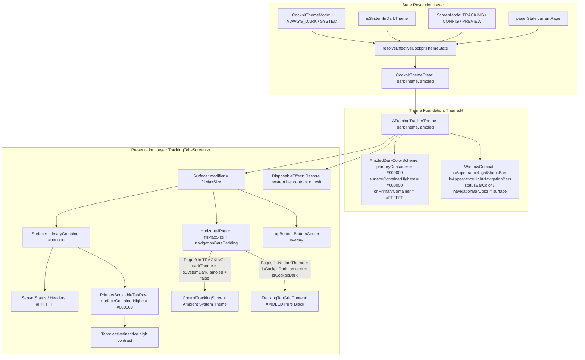

# Walkthrough - ATT-1413: [Cockpit] Comprehensive Cockpit Dark Mode: Apply dark theme to Top Bar, Tab Row, and Navigation Bar

**Parent Ticket**: [ATT-1413](https://rainerblind.atlassian.net/browse/ATT-1413)  
**Sub-task**: [ATT-1422](https://rainerblind.atlassian.net/browse/ATT-1422) (`[Implementation]`)  
**Requirements**: `REQ-UI-170` (*Comprehensive Cockpit Dark Theme*), referencing `REQ-UI-168` (*Workout Cockpit Independent Theme Selector*) and `REQ-UI-169` (*AMOLED Pure Black Cockpit Theme*)  
**Test Spec**: `TST-UI-122`  
**Branch**: `feature/ATT-1413`  
**Target Release**: `V4.9.38` (Sprint `2026-39.3`)  

---

## 1. Summary of Implemented Changes

Resolved the partial dark mode inconsistency in the live tracking cockpit (`cockpit_dark_mode_partial_top_bottom_light.png`) by unifying the entire `TrackingTabsScreen` root container under the AMOLED Pure Black theme (`#000000`). Top header, tab row, telemetry cards, and system navigation bar now render in seamless, pitch-black harmony on telemetry views, while strictly maintaining Page 0 (Control Tracking) in ambient light styling per user mandate.



---

## 2. Detailed Technical Components

### 2.1 Pure State Resolution: [CockpitThemeMode.kt](file:///home/rainer/AndroidStudioProjects/aTrainingTracker/app/src/main/java/com/atrainingtracker/trainingtracker/ui/theme/CockpitThemeMode.kt)
- Added `CockpitThemeState(val darkTheme: Boolean, val amoled: Boolean)`.
- Implemented `resolveEffectiveCockpitThemeState(screenMode, currentPage, cockpitThemeMode, isSystemDark)`:
  - Telemetry views (Pages 1..N in `TRACKING` mode, or all pages in `CONFIGURATION` / `PREVIEW` mode): evaluates to `CockpitThemeState(darkTheme = isCockpitDark, amoled = isCockpitDark)`.
  - Page 0 (Control Tracking in `TRACKING` mode): evaluates to `CockpitThemeState(darkTheme = isSystemDark, amoled = false)`, preserving ambient system styling when host OS is in light mode.

### 2.2 AMOLED Color Scheme & Window Insets: [Theme.kt](file:///home/rainer/AndroidStudioProjects/aTrainingTracker/app/src/main/java/com/atrainingtracker/trainingtracker/ui/theme/Theme.kt)
- In `AmoledDarkColorScheme`:
  - `primaryContainer = Color(0xFF000000)`
  - `onPrimaryContainer = Color(0xFFFFFFFF)`
  - `surfaceContainerHighest = Color(0xFF000000)`
- In `ATrainingTrackerTheme`:
  - Added navigation bar appearance configuration via `WindowCompat.getInsetsController(window, view).isAppearanceLightNavigationBars = !darkTheme`.
  - Added `window.navigationBarColor = colorScheme.surface.toArgb()`.
  - Guarded window operations against detached, finishing, or destroyed activities (`!activity.isFinishing && !activity.isDestroyed`).

### 2.3 Root Theme Scoping & Cleanup: [TrackingTabsScreen.kt](file:///home/rainer/AndroidStudioProjects/aTrainingTracker/app/src/main/java/com/atrainingtracker/trainingtracker/ui/tracking/trackingtabs/TrackingTabsScreen.kt)
- Enclosed the root `Surface(modifier = Modifier.fillMaxSize())` within `ATrainingTrackerTheme(darkTheme = cockpitThemeState.darkTheme, amoled = cockpitThemeState.amoled)`.
- Removed redundant nested `ATrainingTrackerTheme` wrappers around `TrackingTabGridContent` and `LapButton`.
- Added unmount cleanup via `DisposableEffect(context, isSystemDark)` ensuring status and navigation bar appearance flags cleanly revert to ambient mode (`!isSystemDark`) upon screen exit.

---

## 3. Verification & Test Results

### 3.1 Unit Test Suite: [TrackingThemeResolutionTest.kt](file:///home/rainer/AndroidStudioProjects/aTrainingTracker/app/src/test/java/com/atrainingtracker/trainingtracker/ui/tracking/TrackingThemeResolutionTest.kt)
Added comprehensive unit tests covering all 8 test cases from `TST-UI-122`:
1. `testPage0InTrackingModeWithAlwaysDarkAndSystemLight_remainsLight`: Asserts Page 0 remains light under `ALWAYS_DARK` when device is in light mode.
2. `testPage1InTrackingModeWithAlwaysDarkAndSystemLight_rendersAmoledDark`: Asserts Page 1 renders in AMOLED pure black.
3. `testPage0InTrackingModeWithAlwaysDarkAndSystemDark_rendersStandardDark`: Asserts Page 0 renders in dark theme without AMOLED when system is dark.
4. `testPage1InTrackingModeWithSystemModeAndSystemLight_remainsLight`: Asserts telemetry remains light under `SYSTEM` mode when device is in light mode.
5. `testPage1InTrackingModeWithSystemModeAndSystemDark_rendersAmoledDark`: Asserts telemetry renders AMOLED dark under `SYSTEM` mode when device is in dark mode.
6. `testPage0InConfigurationModeWithAlwaysDark_rendersAmoledDark`: Asserts configuration mode renders AMOLED dark across all tabs.
7. `testPage0InPreviewModeWithAlwaysDark_rendersAmoledDark`: Asserts preview mode renders AMOLED dark across all tabs.
8. `testRapidPageTogglingSequence_resolvesDeterministically`: Asserts deterministic state toggling (0 -> 1 -> 0 -> 2) without state drift.

### 3.2 Token Unit Test Suite: [AmoledThemeTest.kt](file:///home/rainer/AndroidStudioProjects/aTrainingTracker/app/src/test/java/com/atrainingtracker/trainingtracker/ui/theme/AmoledThemeTest.kt)
- Verified `AmoledDarkColorScheme.primaryContainer == Color(0xFF000000)`.
- Verified `AmoledDarkColorScheme.onPrimaryContainer == Color(0xFFFFFFFF)`.
- Verified `AmoledDarkColorScheme.surfaceContainerHighest == Color(0xFF000000)`.
- Verified `DarkColorScheme.primaryContainer` remains unaffected (`BabyBlueEyeInverse` / `Color(0xFF001A41)`).

### 3.3 Clean-Room Full Suite Regression
Executed:
```bash
./gradlew testDebugUnitTest
```
Result: **BUILD SUCCESSFUL in 3m 37s**, 32 actionable tasks, 100% tests passed.

---

## 4. Invariant Compliance Audit

- **OLED Power Optimization**: True `#000000` pitch black across the entire screen (header, tab bar, telemetry grid, and navigation bar) on telemetry pages.
- **Page 0 Ambient Isolation**: Control Tracking remains in ambient system theme when device is in light mode per user mandate.
- **Global App Shell Stability**: Drawer, History, Periods, Settings Dialogs remain in ambient system theme.
- **Window Lifecycle Safety**: All window inset manipulations guarded against activity finishing/destruction.
