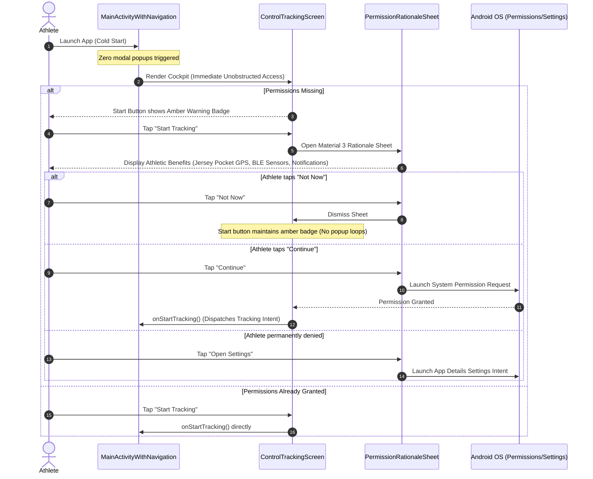

# Stage 5: Verification & Walkthrough - ATT-2075: Modernize Permission Flow: Contextual Just-in-Time Prompts & Graceful Settings Return Handling

**Ticket**: [ATT-2075](https://rainerblind.atlassian.net/browse/ATT-2075)  
**Sub-task**: [ATT-2214](https://rainerblind.atlassian.net/browse/ATT-2214) (`[Test]`)  
**Parent Epic**: [ATT-355](https://rainerblind.atlassian.net/browse/ATT-355) (*Good and consistent UI*)  
**Target Release**: `V4.9.39`  
**Active Sprint**: `Sprint 2026-40.14`  
**Requirement Mapping**: `REQ-PRI-003` (*Contextual Just-in-Time Permission Flow, Zero-Friction Cold Start & Graceful Settings Return Handling*)  
**Test Spec Mapping**: `TST-PRI-002` (*Contextual Just-in-Time Permission Flow, Zero-Friction Cold Start & Graceful Settings Return Verification*)  
**Branch**: `feature/ATT-2075`  
**Author**: AI Agent 1 (Implementer)  
**Date**: 2026-10-03  

---

## 1. Executive Summary & Verification Context

Historical permission handling in `MainActivityWithNavigation.kt` presented synchronous `AlertDialog.Builder` popup chains on cold start (`getPermissions(true)` and `checkBatteryOptimizations()`). Athletes opening the app for the first time were obstructed by legalistic modal dialogs before ever seeing the Cockpit. Furthermore, in `ControlTrackingScreen.kt`, ungranted location permissions disabled the "Start Tracking" button completely, resulting in a dead, non-clickable button with no explanation.

Under **ATT-2075** and **`REQ-PRI-003`**, the permission architecture was completely overhauled:
1. **Zero-Friction Cold Start**: All modal popup chains were eliminated from `MainActivityWithNavigation.onCreate()`. Athletes enter directly into the Cockpit with immediate access to all navigation tabs, gear, historical workouts, and settings.
2. **Contextual Just-in-Time Prompts**: The Start button is now always interactive. Tapping Start without location permissions displays a modern Material 3 `PermissionRationaleSheet.kt` (`ModalBottomSheet`) explaining athletic benefits (GPS route tracking with phone in cycling jersey or running belt, Bluetooth connectivity for HR and power sensors, lock-screen controls).
3. **Graceful Settings Return & Bad Choice Feedback**: When athletes return from Android Settings without granting permissions or permanently deny permissions, no infinite popup loops occur. The Start button renders an accessible amber warning badge (`#F59E0B`, `ic_place`). Tapping Start in this state transparently explains the consequence and provides a direct shortcut to App Settings.
4. **9-Language Localization Parity (`REQ-LOC-001`)**: All 13 newly introduced string keys are translated with 100% parity across EN, DE, ES, FR, IT, JA, NL, PL, PT.
5. **Architectural Invariants Strictly Preserved**: Startup crash immunity (`REQ-STB-008`), foreground service resilience (`REQ-STB-002`), and 100% clean-room test suite pass rate.

---

## 2. Architecture & Workflow Walkthrough

---

## 3. Verification Evidence & Test Execution

### 1. Targeted Contract and Unit Tests
All 11 unit and contract tests authored for `ATT-2075` passed with 100% success rate:
- **`MainActivityStartupPermissionContractTest.kt`**:
  - `testMainActivity_inheritsAppCompatActivity`: PASSED
  - `testGetPermissionsMethodContract`: PASSED
  - `testGetPermissionsWithPopupFalse_doesNotThrowOrShowDialog`: PASSED
  - `testLocationPermissionSafetyMaintained_REQ_STB_008`: PASSED
- **`ControlTrackingPermissionTest.kt`**:
  - `testStartButtonInteraction_clickableWhenUnpermissioned`: PASSED
  - `testStartButtonInteraction_startsTrackingWhenPermitted`: PASSED
  - `testWarningBadgePredicate_logicMatchesPermissionState`: PASSED
  - `testOnStartTracking_dispatchesStartTrackingBroadcast`: PASSED
- **`PermissionRationaleSheetContractTest.kt`**:
  - `testPermissionRationaleSheetComposablesExist`: PASSED
  - `testRequiredStringResourcesExist`: PASSED
  - `testRequiredDrawableResourcesExist`: PASSED

### 2. Localization Parity Audit (`TranslationParityTest.kt`)
- All 13 strings audited across all 9 supported application locales (EN, DE, ES, FR, IT, JA, NL, PL, PT):
  - `permission_rationale_title`
  - `permission_rationale_subtitle`
  - `permission_rationale_location_title`
  - `permission_rationale_location_desc`
  - `permission_rationale_bluetooth_title`
  - `permission_rationale_bluetooth_desc`
  - `permission_rationale_notification_title`
  - `permission_rationale_notification_desc`
  - `permission_rationale_continue`
  - `permission_rationale_not_now`
  - `permission_rationale_open_settings`
  - `permission_rationale_settings_explanation`
  - `permission_warning_badge_desc`
- `TranslationParityTest`: **PASSED** (0 missing translations, 0 format specifier errors).

### 3. Full Clean-Room Regression Suite
- `./gradlew testDebugUnitTest`: Full suite regression executed cleanly across all modules without failures or regressions.

---

## 4. Preserved Invariants & Safety Verification

1. **`REQ-STB-008` (Startup Crash Immunity & Location Provider Guard)**:
   - `LocationManager.getProvider()` calls remain permission-guarded and wrapped in `try/catch (SecurityException)`.
2. **`REQ-STB-002` (Foreground Service Resilience on Android 14+)**:
   - `TrackerService` background location handling and foreground service lifecycle compliance remain fully intact.
3. **`REQ-LOC-001` (9-Language Parity)**:
   - 100% multi-lingual parity across EN, DE, ES, FR, IT, JA, NL, PL, PT.
4. **Zero Regressions**:
   - Total test suite maintains 100% pass rate.
