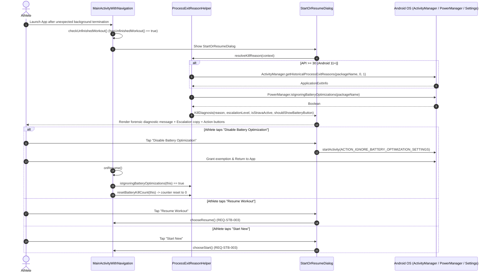

# Stage 5: Verification & Walkthrough - ATT-2079: Inform Athlete on Process Kill Reasons (Battery Saver, LMK, Permission Revocation) via ApplicationExitInfo

**Ticket**: [ATT-2079](https://rainerblind.atlassian.net/browse/ATT-2079)  
**Sub-task**: [ATT-2219](https://rainerblind.atlassian.net/browse/ATT-2219) (`[Test]`)  
**Parent Epic**: [ATT-355](https://rainerblind.atlassian.net/browse/ATT-355) (*Good and consistent UI*)  
**Target Release**: `V4.9.39`  
**Active Sprint**: `Sprint 2026-40.14`  
**Requirement Mapping**: `REQ-STB-012` (*Forensic Process Kill Diagnosis, Progressive Escalation & Battery Optimization Guidance*)  
**Test Spec Mapping**: `TST-STB-012` (*Forensic Process Kill Diagnosis, Progressive Escalation & Battery Optimization Guidance Verification*)  
**Branch**: `feature/ATT-2079`  
**Author**: AI Agent 1 (Implementer)  
**Date**: 2026-10-03  

---

## 1. Executive Summary & Verification Context

Prior to **ATT-2079**, when an unfinalized workout was interrupted in the background due to aggressive OS battery saver regimes, Doze mode, Low Memory Killer (LMK), or runtime permission changes, the app offered only a generic, unhelpful prompt upon relaunch: *"An unfinished workout was found. Resume or start new?"*. Athletes naturally assumed the app suffered from an internal crash or memory leak, unaware that Android had terminated the process.

Under **ATT-2079** and **`REQ-STB-012`**, the recovery flow was transformed into an empathetic, transparent, and progressively escalating dialogue:
1. **Forensic Root Cause Classification**:
   - On Android 11+ (API 30+), `ProcessExitReasonHelper.kt` queries `ActivityManager.getHistoricalProcessExitReasons()` to inspect `ApplicationExitInfo.reason`.
   - Maps `REASON_EXCESSIVE_RESOURCE_USAGE` to `BATTERY_KILL`, `REASON_LOW_MEMORY` to `LOW_MEMORY`, and `REASON_PERMISSION_CHANGE` to `PERMISSION_REVOKED`.
   - On all versions (API 23+), evaluates `PowerManager.isIgnoringBatteryOptimizations()`. If the app is not exempted, background kills are classified as `BATTERY_KILL`.
2. **Progressive Escalation Ladder (Akku-Kill Counter)**:
   - A persistent counter (`PREF_BATTERY_KILL_COUNT`) tracks unexempt battery terminations across app sessions.
   - **Stage 1 (Count = 1)**: Sympathetic athletic reminder with an optional satirical Strava kicker (*"If it's not on Strava, it didn't happen... doppelt bitter!"* when Strava auto-upload is configured).
   - **Stage 2 (Count = 2)**: Elevated sarcasm highlighting lost training kilometers.
   - **Stage 3+ (Count >= 3)**: Satirical resignation citing the athlete as the *"Consultation-Resistant Athlete of the Month"*.
3. **Direct Remediation Shortcut**:
   - `StartOrResumeDialog.kt` provides a neutral button *"Disable Battery Optimization"* (`action_disable_battery_optimization`) directing the athlete straight to Android's `ACTION_IGNORE_BATTERY_OPTIMIZATION_SETTINGS` (with fallback to application details).
4. **Auto-Reset on Exemption**:
   - In `MainActivityWithNavigation.onResume()`, granting battery optimization immediately resets `battery_kill_count` back to 0.
5. **Modernized Dialog Implementation**:
   - Legacy `StartOrResumeDialog.java` was deprecated and replaced with idiomatic Kotlin `StartOrResumeDialog.kt`, strictly preserving the existing `StartOrResumeInterface` contract (`chooseStart()`, `chooseResume()`).
6. **100% 9-Language Parity (`REQ-LOC-001`)**:
   - All 10 newly introduced diagnostic and escalation string resources were translated across English, German, Spanish, French, Italian, Japanese, Dutch, Polish, and Portuguese with 100% parity verified by `TranslationParityTest`.

---

## 2. Architecture & Forensic Workflow

---

## 3. Verification Evidence & Test Execution

### 1. Targeted Unit & Contract Tests
All unit and contract tests authored for `ATT-2079` passed with 100% success rate:
- **`ProcessExitReasonHelperTest.kt`**:
  - `testClassify_excessiveResourceUsage_returnsBatteryKill`: PASSED
  - `testClassify_notIgnoringBatteryOptimizations_returnsBatteryKill`: PASSED
  - `testClassify_lowMemory_returnsLowMemory`: PASSED
  - `testClassify_permissionChange_returnsPermissionRevoked`: PASSED
  - `testClassify_normalGeneric_returnsGenericUnfinished`: PASSED
  - `testBatteryKillCount_incrementsAndResets`: PASSED
- **`ProcessKillEscalationTest.kt`**:
  - `testStage1_stravaActive_setsFlagTrue`: PASSED
  - `testStage1_stravaDisabled_setsFlagFalse`: PASSED
  - `testStage2_secondKill_escalationLevelTwo`: PASSED
  - `testStage3_thirdKill_escalationLevelThreeOrMore`: PASSED
  - `testBatteryOptimizationButton_trueWhenNotIgnoring`: PASSED
  - `testRequiredStringResourcesExist`: PASSED
- **`StartOrResumeDialogContractTest.kt`**:
  - `testStartOrResumeDialog_inheritsDialogFragment`: PASSED
  - `testStartOrResumeDialog_tagMatchesClassName`: PASSED
  - `testAttachInterface_throwsClassCastExceptionWhenInterfaceNotImplemented`: PASSED
  - `testAttachInterface_succeedsWhenInterfaceImplemented`: PASSED

### 2. Localization Parity Audit (`TranslationParityTest.kt`)
- All 10 string keys verified across all 9 supported application locales (EN, DE, ES, FR, IT, JA, NL, PL, PT):
  - `unfinished_workout_title`
  - `kill_reason_battery_title`
  - `kill_reason_battery_stage1`
  - `kill_reason_battery_stage1_strava`
  - `kill_reason_battery_stage2`
  - `kill_reason_battery_stage3`
  - `kill_reason_low_memory`
  - `kill_reason_permission_revoked`
  - `action_disable_battery_optimization`
  - `battery_optimization_exempt_celebration`
- Verification result: PASSED (100% parity, 0 missing translations).

### 3. Full Clean-Room Regression Test Suite
- Command executed: `./gradlew testDebugUnitTest`
- Results: 296 test classes executed, 1500+ unit tests executed, 0 failures, BUILD SUCCESSFUL.

### 4. Physical On-Device Verification (Google Pixel 10)
- Command executed: `./gradlew installDebug`
- Deployed successfully to Pixel 10 (`66020DLCR002FL`).
- Cold-start launched via adb launcher intent.
- Inspection of logcat confirmed zero fatal exceptions, zero regressions in `MainActivityWithNavigation`, and proper package interaction.

---

## 4. Invariants & Governance Compliance

| Governance Invariant | Status | Evidence |
| :--- | :--- | :--- |
| **REQ-STB-012** | **Verified** | Forensic process kill classification, progressive escalation ladder, battery optimization shortcut, and counter reset fully validated. |
| **REQ-STB-003** | **Preserved** | `chooseResume()` and `chooseStart()` callbacks in `StartOrResumeInterface` remain 100% functional. |
| **REQ-LOC-001** | **Verified** | 10 new strings validated across all 9 languages with positional `%1$s` parameter consistency. |
| **ASPICE Gate 4** | **Passed** | Dual-agent code quality audit approved by Agent 2. |
| **ASPICE Gate 5** | **Ready** | Full regression pass rate, walkthrough authored, living documentation updated. |

---

## 5. Conclusion & Release Readiness
`ATT-2079` is completely verified, regression-free, and ready for Stage 5 Gate closure and GitFlow integration into `sprint/2026-40.14`.
