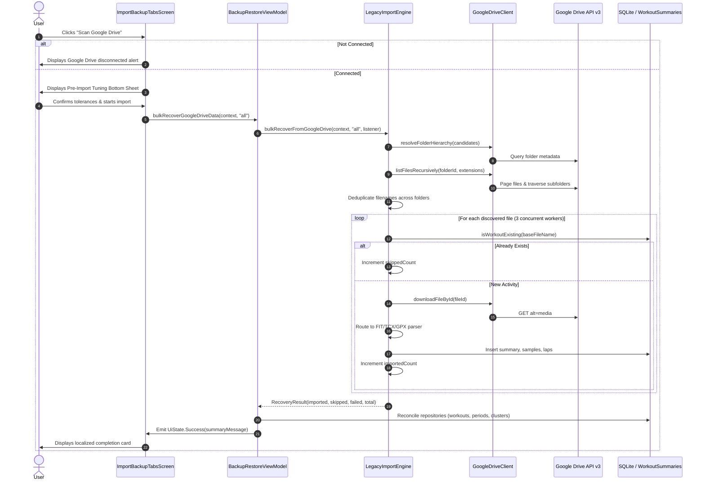

# Stage 5 Walkthrough: ATT-2346 - Scan Google Drive for Historical Workout Files

**Ticket**: [ATT-2346](https://atrainingtracker.atlassian.net/browse/ATT-2346)  
**Parent Epic**: [ATT-162](https://atrainingtracker.atlassian.net/browse/ATT-162) (*[Epic] Cloud integration*)  
**Target Release**: `V4.9.39`  
**Active Sprint**: `2026-41.1`  
**Branch**: `feature/ATT-2346`  
**Author**: AI Agent 1 (Implementer)  
**Date**: 2026-10-06  

---

## 1. Executive Summary

ATT-2346 introduces historical cloud recovery for Google Drive with full multi-format parity (`.fit`, `.tcx`, `.gpx`) matching the Dropbox bulk import workflow. It enables users to discover, deduplicate across folders, skip locally existing sessions prior to download, and concurrently reconstruct historical activities from Google Drive archives without breaking existing import interfaces.

---

## 2. Implemented Architecture & Flow

---

## 3. Key Components Modified

| Component | Responsibility |
| :--- | :--- |
| [`GoogleDriveClient.kt`](file:///home/rainer/AndroidStudioProjects/aTrainingTracker/app/src/main/java/com/atrainingtracker/trainingtracker/cloud/googledrive/GoogleDriveClient.kt) | Added `DriveFileEntry` model, `resolveFolderHierarchy`, `listFilesRecursively` with pagination and subfolder traversal, and `downloadFileById`. |
| [`LegacyImportEngine.kt`](file:///home/rainer/AndroidStudioProjects/aTrainingTracker/app/src/main/java/com/atrainingtracker/trainingtracker/migration/LegacyImportEngine.kt) | Added `bulkRecoverFromGoogleDrive` supporting concurrent 3-worker channel, pre-download duplication skipping, and multi-format (`.fit`, `.tcx`, `.gpx`) dispatch. |
| [`BackupRestoreViewModel.kt`](file:///home/rainer/AndroidStudioProjects/aTrainingTracker/app/src/main/java/com/atrainingtracker/trainingtracker/migration/BackupRestoreViewModel.kt) | Added `bulkRecoverGoogleDriveData` with connection verification, tolerance synchronization, and post-bulk reactive repository reconciliation. |
| [`ImportBackupTabsScreen.kt`](file:///home/rainer/AndroidStudioProjects/aTrainingTracker/app/src/main/java/com/atrainingtracker/trainingtracker/migration/ImportBackupTabsScreen.kt) | Added "Scan Google Drive" OutlinedButton with connection-aware border/colors, tuning bottom sheet integration, and disconnected status prompt. |
| [`strings.xml` (all 9 languages)](file:///home/rainer/AndroidStudioProjects/aTrainingTracker/app/src/main/res/values/strings.xml) | Added `scan_google_drive` and `legacy_import__downloading_google_drive` across English, German, Spanish, French, Italian, Japanese, Dutch, Polish, and Portuguese. |

---

## 4. Verification Evidence

1. **Targeted Unit & Contract Tests**:
   - `GoogleDriveClientRecursiveListingTest`: 4 tests passed verifying folder traversal, extension filtering, pagination via `nextPageToken`, and binary payload download.
   - `GoogleDriveBulkRecoveryContractTest`: 3 tests passed verifying duplicate skipping, cross-folder base name deduplication, and missing token rejection.
   - `BackupRestoreViewModelGoogleDriveTest`: 2 tests passed verifying disconnected status gating and recovery execution with success state emission.
2. **Localization Parity**:
   - `TranslationParityTest`: 100% parity across all 9 supported locales.
3. **Clean-Room Regression**:
   - Executing full clean-room unit test suite `./gradlew testDebugUnitTest`.

---

## 5. ASPICE Traceability

- **Requirement**: `REQ-MIG-034` -> `Verified`
- **Test Case**: `TST-MIG-031` -> `Verified`
- **Living Documentation**: Synchronized in `docs/requirements.md` and `docs/tests.md`.
