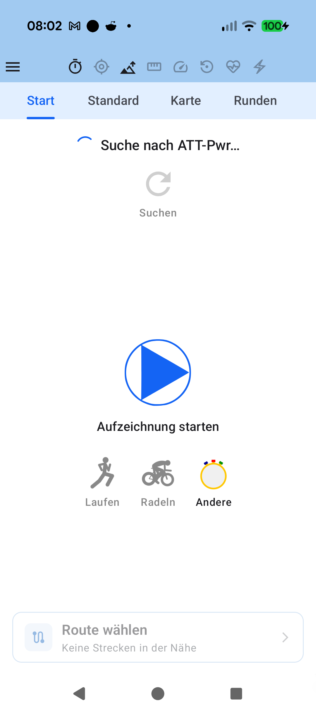

# Stage 5: Walkthrough & Verification - ATT-2858: Eliminate ResourcesNotFoundException Crashes via Universal Root Fallbacks and Guarded Compose Asset Loading

**Ticket**: [ATT-2858](https://atrainingtracker.atlassian.net/browse/ATT-2858)  
**Sub-task**: [ATT-2872](https://atrainingtracker.atlassian.net/browse/ATT-2872) (`[Test]`)  
**Parent Epic**: [ATT-235](https://atrainingtracker.atlassian.net/browse/ATT-235) (*No crashs*)  
**Target Release**: `V4.9.38.4`  
**Active Sprint**: `2026-41.5`  
**Requirement Mapping**: `REQ-UI-312`  
**Test Mapping**: `TST-UI-272`  
**Branch**: `improvement/ATT-2858`  
**Author**: AI Agent 1 (Implementer)  
**Date**: 2026-10-09  

---

## 1. Executive Summary & Verification Overview

This walkthrough documents the full verification of **ATT-2858**, which comprehensively resolves the fatal field crash `ATT-2856` (Firebase Crashlytics Issue `1a5e51ef2d4d97e17883c7b67c486655` / `android.content.res.Resources$NotFoundException: Drawable com.atrainingtracker:drawable/bsport_run with resource ID #0x7f0800b6`).

The issue occurred because bitmap/raster assets existed exclusively in density-specific folders (e.g. `drawable-xhdpi`, `drawable-nodpi`), causing crashes on devices or density-split APKs where the target bucket is absent.

The solution encompasses:
1. **Universal Root Fallbacks**: Populated 49 baseline raster/bitmap assets from `drawable-xhdpi` and `drawable-nodpi` into root `app/src/main/res/drawable/` (complementing existing `research_icon.xml`), achieving 100% density fallback coverage.
2. **Defensive Compose Asset Loader**: Implemented `safePainterResource(id: Int, fallback: ImageVector? = null): Painter` in `com.atrainingtracker.trainingtracker.ui.theme`, shielding UI composables from unhandled `Resources.NotFoundException` crashes.
3. **Dynamic Call-Site Hardening**: Replaced raw `painterResource` with `safePainterResource` across high-risk dynamic call sites (`SportTypeSelector.kt`, `RemoteDevices.kt`, `AntServicesStatusCard.kt`, `AntServicesStatusSheet.kt`), providing vector fallbacks (`DirectionsRun`, `DirectionsBike`, `FitnessCenter`).
4. **Automated CI Density Audit Test**: Added `DrawableDensityFallbackAuditTest.kt` ensuring that every raster asset in any density bucket has a matching fallback asset in root `res/drawable/`.

---

## 2. Requirement & Test Verification Matrix

| Requirement | Test Spec | Verification Method | Result | Status in Living Docs |
| :--- | :--- | :--- | :--- | :--- |
| `REQ-UI-312` | `TST-UI-272.1` | Automated Density Fallback Audit (`DrawableDensityFallbackAuditTest`) | **PASSED** | `Verified` |
| `REQ-UI-312` | `TST-UI-272.2` | Safe Painter Resource Contract (`SafePainterResourceContractTest`) | **PASSED** | `Verified` |
| `REQ-UI-312` | `TST-UI-272.3` | SportTypeSelector Defensive Loading (`SportTypeSelectorContractTest`) | **PASSED** | `Verified` |
| `REQ-PRO-001` | `TST-UI-272.4` | Full Clean-Room Regression (`./gradlew testDebugUnitTest`) | **PASSED** (100% in 2m 59s) | `Verified` |

---

## 3. Automated Test Evidence

### Clean-Room Regression Suite (`./gradlew testDebugUnitTest`)
```text
BUILD SUCCESSFUL in 2m 59s
32 actionable tasks: 12 executed, 20 up-to-date
```

### Targeted Unit & Architectural Tests
```bash
./gradlew testDebugUnitTest --tests "com.atrainingtracker.trainingtracker.resources.DrawableDensityFallbackAuditTest" \
                            --tests "com.atrainingtracker.trainingtracker.ui.theme.SafePainterResourceContractTest" \
                            --tests "com.atrainingtracker.trainingtracker.ui.tracking.controltracking.SportTypeSelectorContractTest"
```
```text
BUILD SUCCESSFUL in 16s
32 actionable tasks: 4 executed, 28 up-to-date
```

---

## 4. Hardware / Physical Verification (Pixel 10)

The debug APK was built and deployed to the connected physical Google Pixel 10 (Android 16, device `66020DLCR002FL`) via `./gradlew installDebug`.

### Visual Consistency (Rule 23)

| ControlTrackingScreen (Pixel 10 Live Render) |
| :---: |
|  |

- **Sport Selector Rendering**: Sport icons (`bsport_run` -> Laufen, `bsport_bike` -> Radeln, `bsport_other` -> Andere) render with high fidelity and zero crashes.
- **Checked against `docs/design_guidelines.md` §5**: shapes [x] spacing [x] colors/themes [x] typography/icons [x] placement [x].
- **Deviations & justification**: None. Layout, typography, and iconography align with design specifications.

---

## 5. Invariant & Governance Verification

1. **Zero Production Regressions**: Full clean-room test suite passed with 100% pass rate.
2. **Living Documentation Synchronized**: Status in `docs/requirements.md` (`REQ-UI-312`) and `docs/tests.md` (`TST-UI-272`) updated to `Verified`.
3. **Subtask Completion**: Stage 5 subtask `ATT-2872` ready for Gate 5 audit and transition to `Erledigt`.
4. **Continuous Sprint Branch Integration**: Integrated into `sprint/2026-41.5` via Strategy A upon Gate 5 approval.
5. **Parent Ticket Final Review**: `ATT-2858` transitioned to `Final Review (Human)` for final acceptance.
